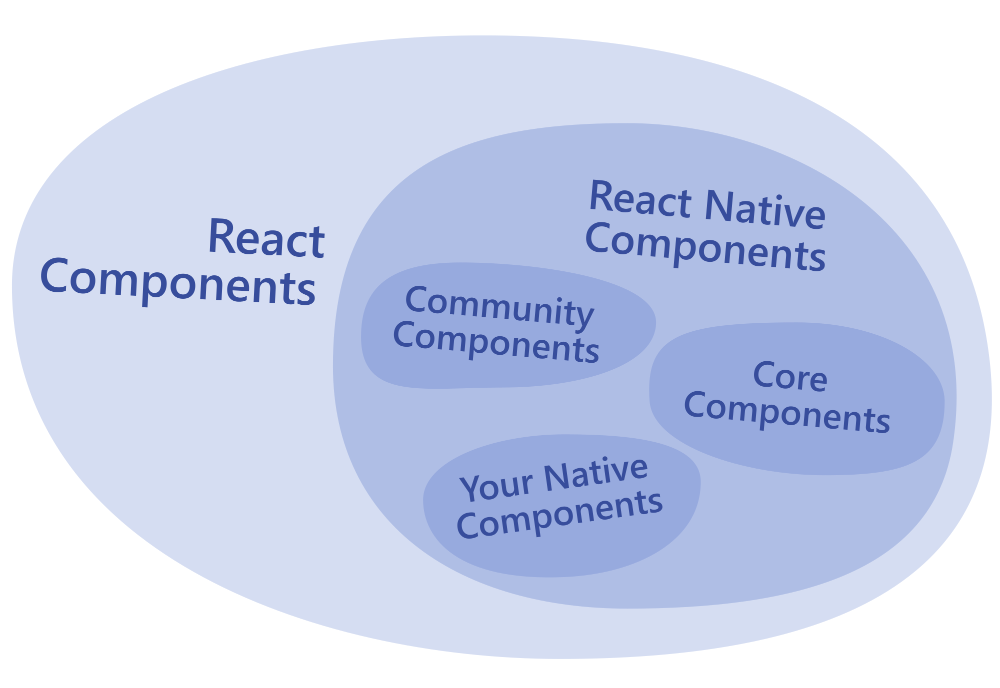

# [React Native](https://reactnative.dev/)

* [GitHub](https://github.com/facebook/react-native)
* [React](https://reactjs.org/)
* [Expo](https://expo.dev/) full-stack React Native framework
* [Expo Go](https://expo.dev/client) Expo app for iOS and Android
* [React Native packages registry](https://reactnative.directory/)
* [React Navigation](https://reactnavigation.org/)
* [React Native Cross-Platform WebView](https://github.com/react-native-webview/react-native-webview)
* online emulators: https://appetize.io/
* playground: https://snack.expo.dev/

## Other Resources

* https://github.com/ReactNativeNews/React-Native-Apps
* https://github.com/gronxb/webview-bridge
* https://infinite.red/ignite

| **React Native UI Component** | **Android View** | **iOS View** | **Web Analog** | **Description** |
| --- | --- | --- | --- | --- |
| `<View>` | `<ViewGroup>` | `<UIView>` | A non-scrolling `
` | A container that supports layout with flexbox, style, some touch handling, and accessibility controls |
| `<Text>` | `<TextView>` | `<UITextView>` | `
` | Displays, styles, and nests strings of text and even handles touch events |
| `<Image>` | `<ImageView>` | `<UIImageView>` | `` | Displays different types of images |
| `<ScrollView>` | `<ScrollView>` | `<UIScrollView>` | `
` | A generic scrolling container that can contain multiple components and views |
| `<TextInput>` | `<EditText>` | `<UITextField>` | `<input type="text">` | Allows the user to enter text |

React Native uses [Metro](https://metrobundler.dev/) to build your JavaScript code and assets.

`TouchableOpacity` 是 **React Native (RN)** 里**最常用的点击交互组件**，专门用来给**没有点击效果的元素**（比如 View、Text、Image）添加**点击功能 + 点击变暗的动画效果**。

简单说：**它就是一个带透明度动画的可点击容器**

- 核心属性：`onPress`（点击事件）、`activeOpacity`（透明度）
- 注意：**只能包裹一个子元素**

