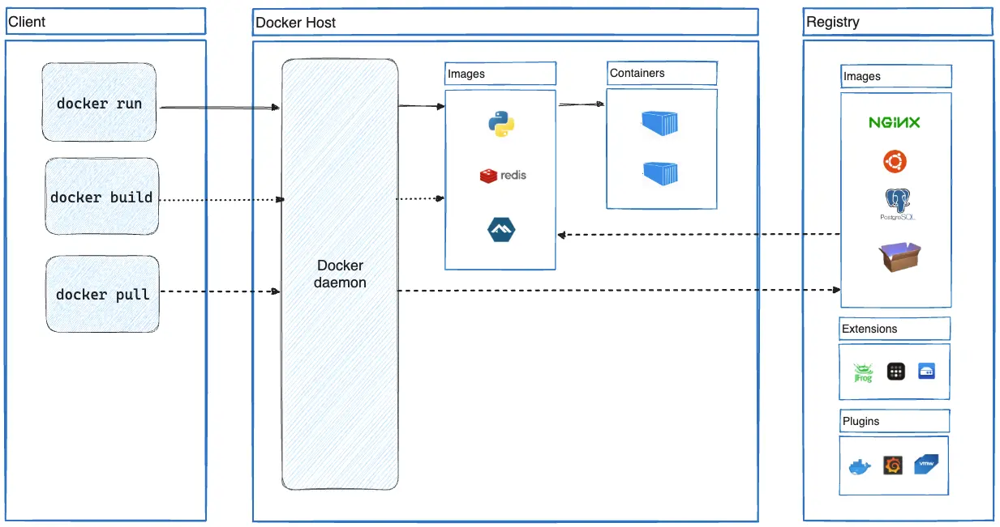
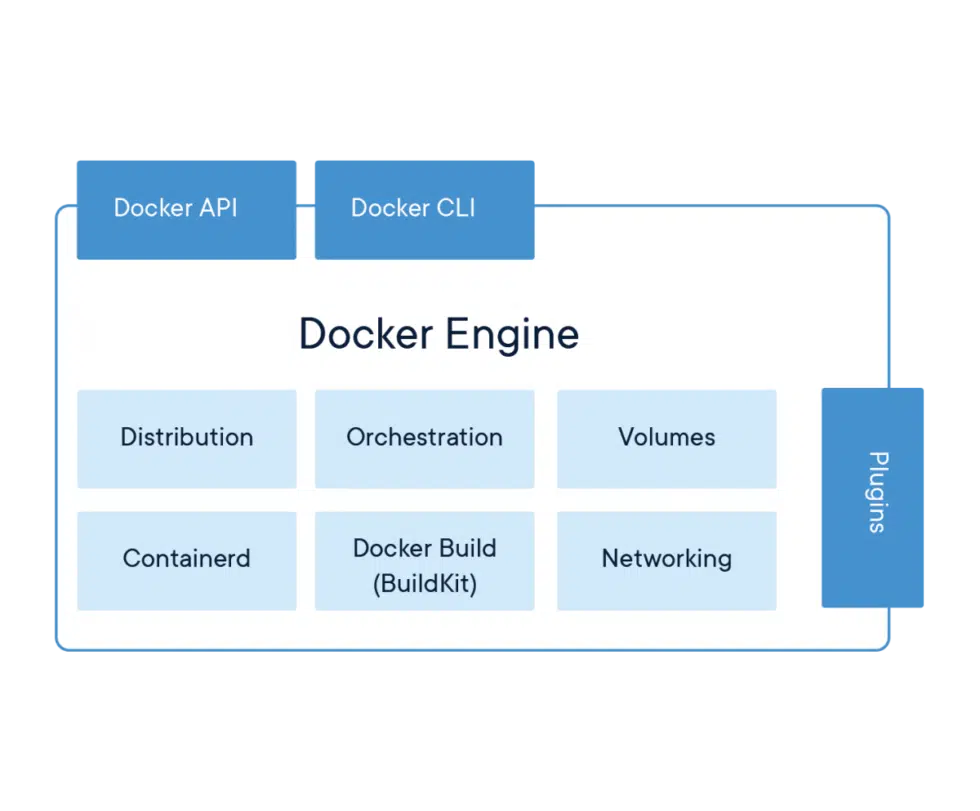

# Docker Architecture

## 相关概念

- 镜像(Image)：软件打包好的镜像
- 容器(Container)：镜像启动后的实例称为一个容器；容器是独立运行的一个或一组应用
- 仓库(Registry)：用来保存各种打包好的软件镜像
- 一个容器就是一个独立的虚拟操作系统，互不影响，而镜像就是这个操作系统的安装包
- 类似面向对象程序设计中的类和实例，镜像是静态的定义，容器是镜像运行时的实体
- 镜像本身是可读的，启动镜像时，Docker会在镜像的最上一层创建一个可写层

### [**Images**](https://docs.docker.com/get-started/overview/#images)

An image is a read-only template with instructions for creating a Docker container.

### [**Containers**](https://docs.docker.com/get-started/overview/#containers)

A container is a runnable instance of an image.

## 镜像的命名规则

- 镜像名包括命名空间和仓库名
- 标签用于区分不同版本的镜像

## 容器的状态

- 已创建（created）、重启中（restarting）、运行中（running）、已暂停（paused）和已退出（exited）
- 容器可以被创建、启动、运行、停止、删除、暂停