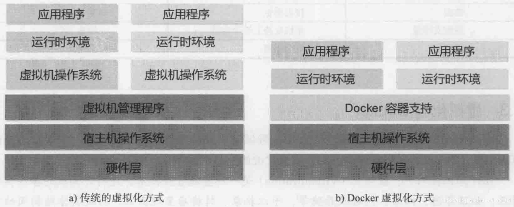
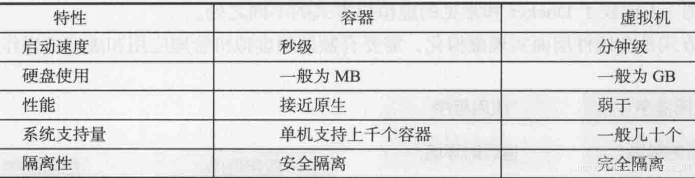
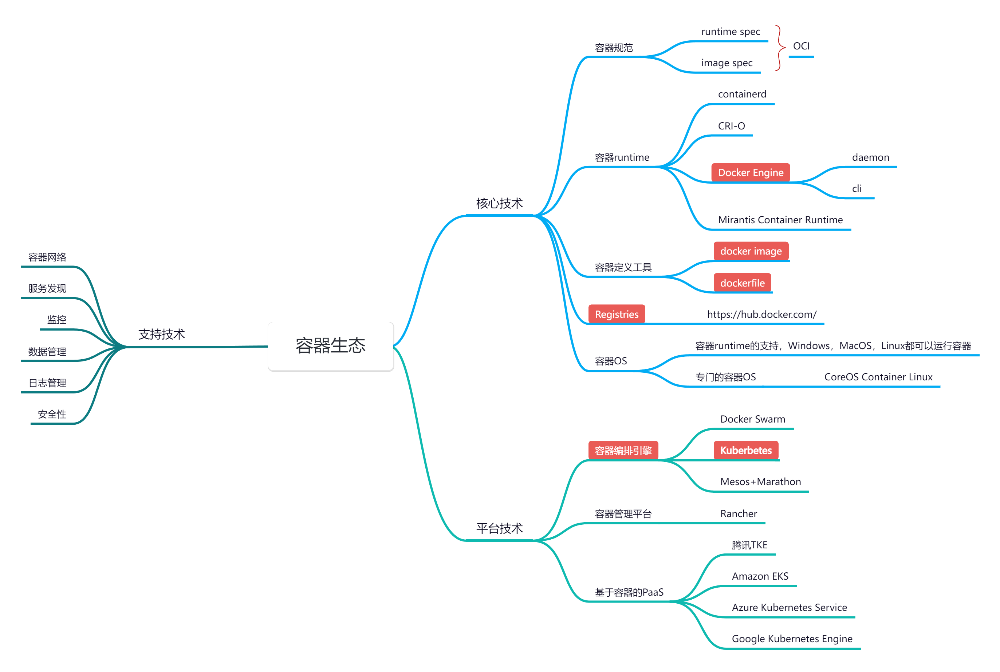

# Docker

[Docker: Accelerated Container Application Development](https://www.docker.com/)

*"Debug your app, not your environment."*

*"Develop faster. Run anywhere."*

- 官方文档：[https://docs.docker.com/](https://docs.docker.com/)
- 官方桌面客户端：[https://www.docker.com/products/docker-desktop/](https://www.docker.com/products/docker-desktop/)
- 官方镜像仓库：[https://hub.docker.com/](https://hub.docker.com/)
- [http://dockerhub.com/](http://dockerhub.com/) 301 Moved Permanently
- [docker cheatsheet](https://docs.docker.com/get-started/docker_cheatsheet.pdf)
- 学习仓库：https://github.com/zlx01/ok-docker

## **What is Docker?**

先看官方文档怎么说。

> Docker is an open platform for developing, shipping, and running applications.
> 

> **Accelerate how you build, share, and run applications**
> 

> Docker helps developers build, share, run, and verify applications anywhere — without tedious environment configuration or management.
> 
- 应用容器引擎

### **Build**

- **Spin up new environments quickly**
  
    Develop your own unique applications with Docker images and create multiple containers using Docker Compose.
    
- **Integrate with your existing tools**
  
    Docker works with all development tools such as VS Code, CircleCI, and GitHub.
    
- **Containerize applications for consistency**
  
    Run in any environment consistently from on-premises Kubernetes to AWS ECS, Azure ACI, Google GKE, and more.
    

### **Share**

- **Build with verified, trusted content**
  
    Visit Docker Hub to browse Docker Trusted Content from our verified publishers or Docker Official Images.
    
- **Collaborate with your team**
  
    Pull and publish images from Hub for easy sharing between team members, organizations, or the broader community.
    
- **Secure your workspaces**
  
    Ensure best practices with image access management, registry access management, and private repositories.
    

### **Run**

- **Cross-Platform Reliability**
  
    Ensure your applications run consistently across various environments, fostering reliability and eliminating compatibility issues.
    
- **Versatile Development Experience**
  
    Work in isolated containers with support for multiple languages, reducing conflicts between dependencies and providing a flexible development experience.
    
- **Effortless Deployment**
  
    Simplify your development process with streamlined deployment using a single command. Save time and effort while managing your applications seamlessly.
    

### **Verify**

- **Stay vigilant with unified analysis**
  
    Address security issues before they hit production through a complete view of the software supply chain.
    
- **Do more with streamlined workflows**
  
    Build more efficiently with recommended remediation, resulting in simplified development processes.
    
- **Act quickly on prioritized actions**
  
    Follow key insights aligned with policy guardrails to stay ahead of security issues before they occur.
    

## 虚拟化技术

- 将计算机的各种硬件资源，例如CPU、内存、磁盘以及网络等，看做资源池，系统管理员可以对其进行重新分配，而不用考虑底层物理硬件
- 虚拟化技术解决的问题：1.高性能计算机硬件的产能过剩；2.把老旧的计算机硬件重新组合，作为一个整体的资源来用，化零为整。
- Linux平台的虚拟化产品：KVM，Xen，VMWare，VirtualBox
- Windows平台的虚拟化产品：Hyper V，VMWare，VirtualBox
- 虚拟化系统可以在宿主机上虚拟化出一套完整的硬件基础设施，配以操作系统，相当于虚拟出一台计算机
- 虚拟机对底层系统来说，就是一个文件。
- 虚拟机之间是相互隔离的。
- 虚拟化技术的缺点：资源占用多，一个虚拟机实例需要完整的操作系统及其附属应用，实际可能只需要部分功能和应用；冗余步骤多，启动慢

## 容器技术

- 容器，是一种轻量级的操作系统级的虚拟化，可以让用户在一个资源隔离的进程中运行应用及其依赖项。运行应用程序所必须的组件都讲打包成一个镜像并可以复用。

## docker与虚拟机的比较

## 为什么需要docker？

- 解决的问题：开发环境和生产环境的一致性（依赖，版本，配置，网络。。。）
- 跨平台容易，方便部署，扩展，迁移。
- 一次构建、随处运行（**Build once，Run everywhere**）
- 举例：一般通过LAMP搭建网站时，往往需要很多配置环境的操作，当迁移系统到其他云平台时，需要重新部署和调试，而有了容器技术来打包应用，迁移系统就变得在新的云平台上启动容器那么简单了

## docker在DevOps（开发/运维）中的优势？

- 敏捷：更快速的交付和部署
- 提高生产力：容器可以看做一个微服务，容器之间相互独立，可以独立升级，避免跨服务的依赖和冲突
- 节省资源：不需要额外的虚拟化管理程序支持
- 安全：容器之间的进程是相互隔离的（使用沙箱技术）

## 容器生态

### OCI （Open Container Initiative/开放容器标准）

* OCI Image Spec：容器镜像标准
* OCI Runtime Spec：容器运行标准

