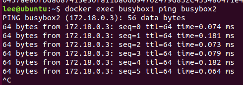

# Docker Network

```bash
docker network create -d bridge snet1
docker network ls

docker run -itd --name busybox1 --network snet1 busybox
docker run -itd --name busybox2 --network snet1 busybox

docker exec busybox1 ping busybox2
```



## **I want to connect from a container to a service on the host**

在容器内使用 `host.docker.internal`  这个域名即可访问主机网络

```bash
python -m http.server 8000
```

```bash
docker run --rm -it alpine sh
# apk add curl
# curl http://host.docker.internal:8000
# exit
```
