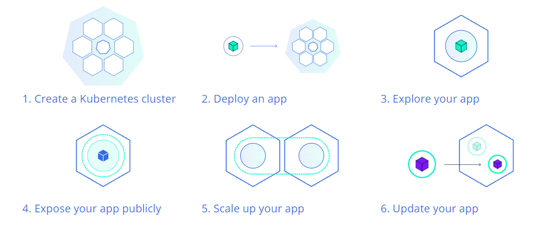
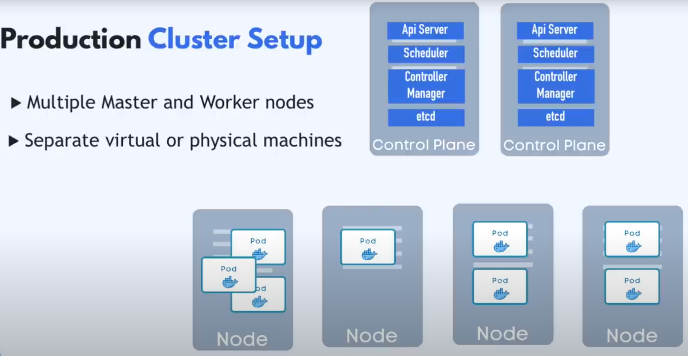
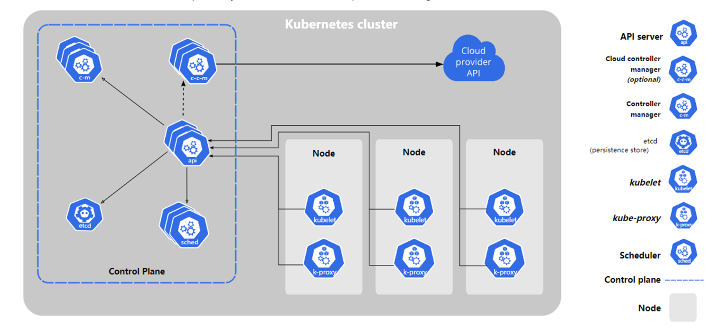
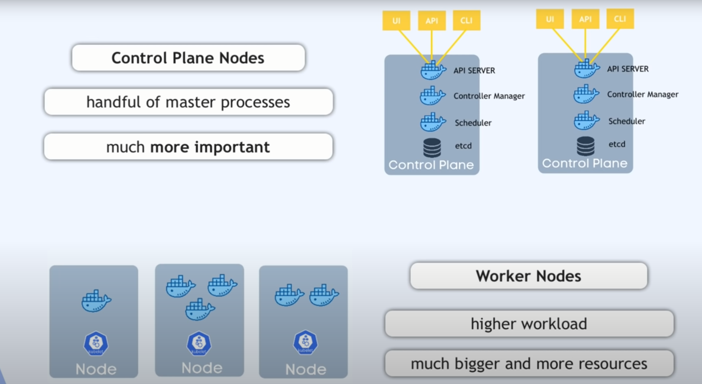
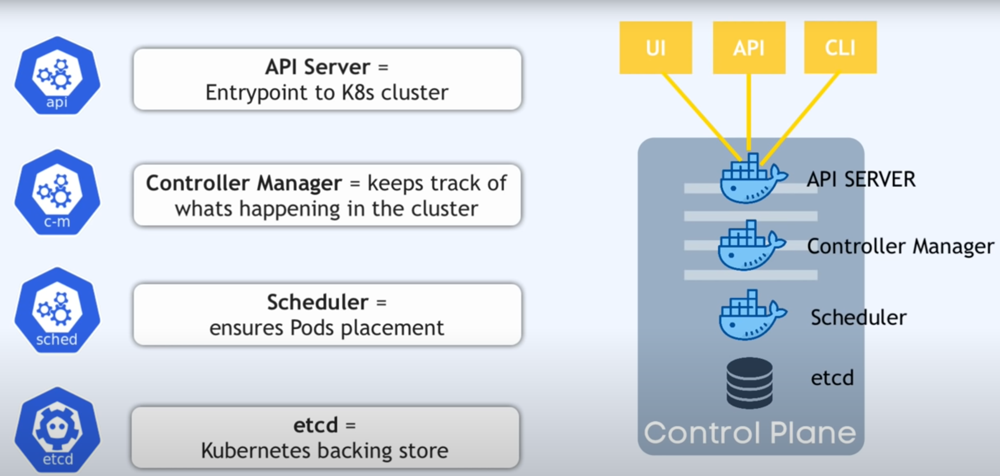
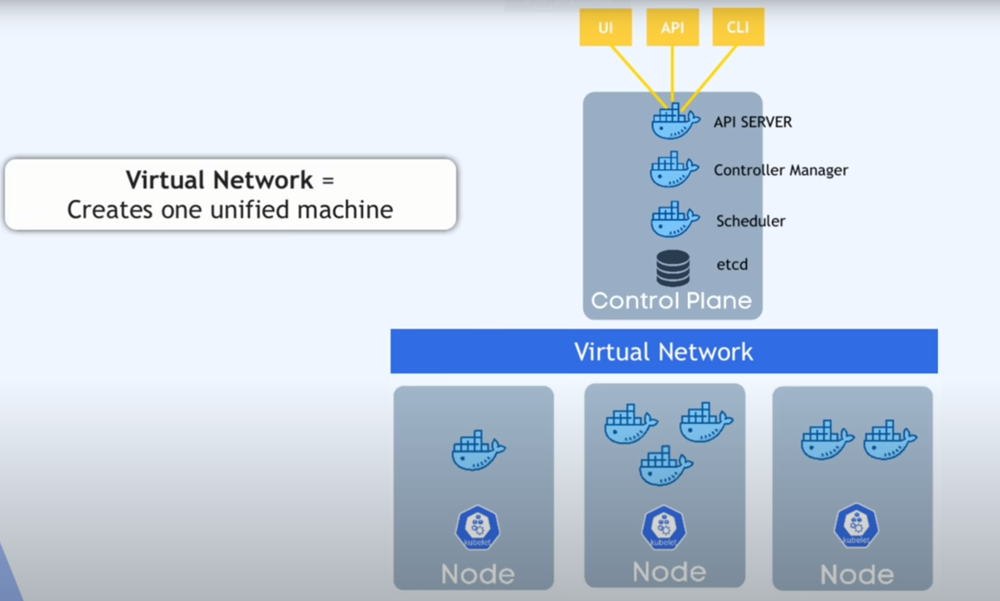
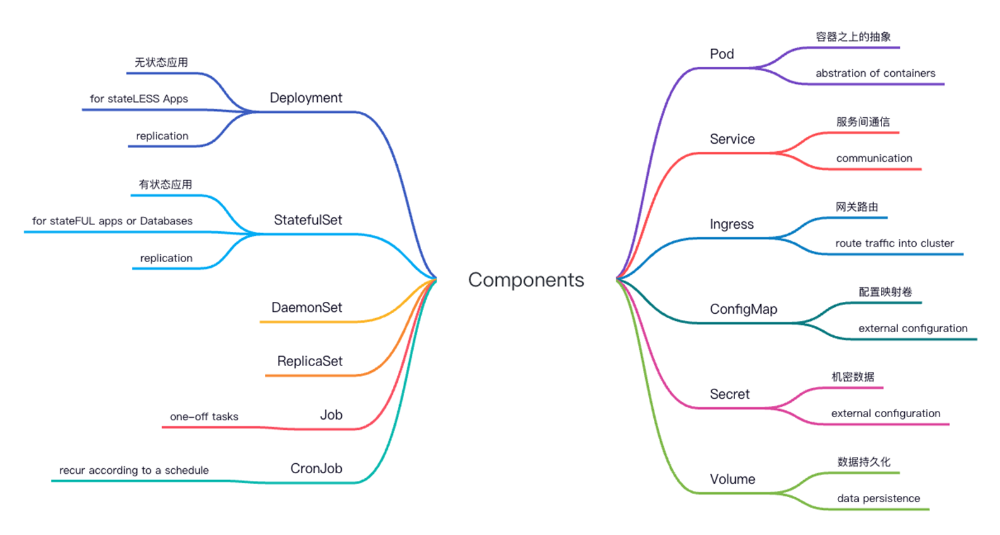

# Kubernetes Architecure

**Kubernetes Basics Modules**

## Kubernetes cluster

### Node

virtual or physical machine

### control plane

### etcd

holds the current status of any k8s  component

## Main Kubernetes Components

### Pod

- Smallest unit in Kubernetes.
- Abstraction over container.
- Usually 1 Application per Pod
- Each Pod gets its own IP address
- New IP address on re-creation（Pods are ephemeral）
- Internal service(service-name:ip)
- External service(node-ip:port)

### Service

- communication
- Permanent IP address
- Lifecycle of Pod and Service not connected

## Ingress

- route traffice into cluster
- 绑定域名和服务

### ConfigMap

- external configuration of your application
- for non-confidential data only

### Secret

- external configuration of your application
- for secret data

### Volume

- used for darta persistence

### Deployment

- Define blueprint for Pods
- Abstraction of Pods
- for stateless apps
- replication

### StatefulSet

- for statefull apps or databases
- DB are often hosted outside of Kubernetes cluster
- replication

### DaemonSet
