# Examples

### 部署nginx

```bash
kubectl create deployment hello-nginx --image=nginx
```

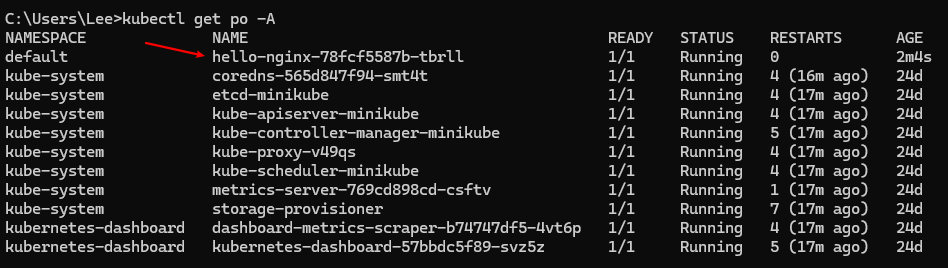

查看dashboard

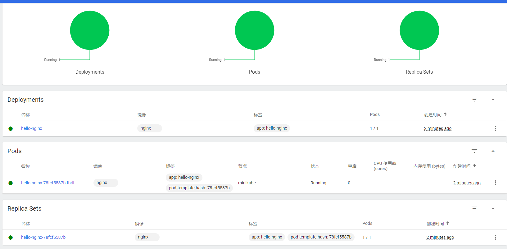

### 暴露服务（NodePort）

> NodePort, as the name implies, opens a specific port, and any traffic that is sent to this port is forwarded to the service.
> 

> The network is limited if using the Docker driver on Darwin, Windows, or WSL, and the Node IP is not reachable directly.
> 
> 
> Running minikube on Linux with the Docker driver will result in no tunnel being created.
> 

```bash
kubectl expose deployment hello-nginx --type=NodePort --port=80

# Check Node Port
kubectl get services hello-nginx

# Run service tunnel
minikube service hello-nginx
```

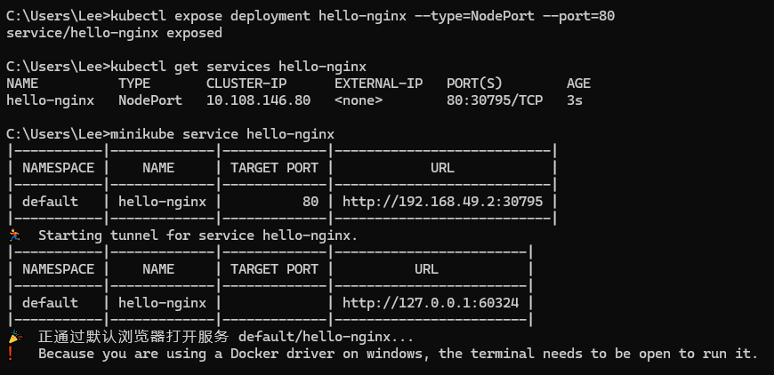

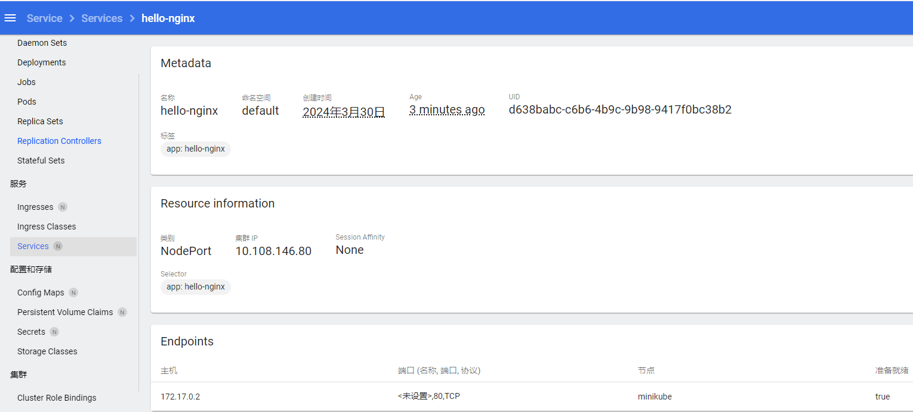

浏览器访问 [http://127.0.0.1:60324/](http://127.0.0.1:60324/)

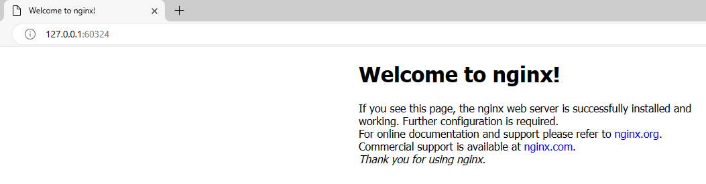

或者自定义转发

```bash
kubectl port-forward service/hello-nginx 8020:80
```

浏览器访问 [http://localhost:8020/](http://localhost:8020/)

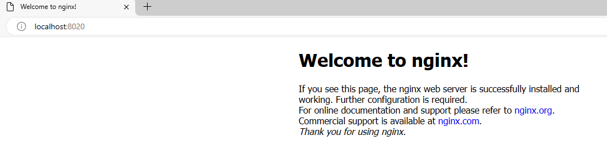

### 暴露服务（LoadBalancer）

> each service gets its own IP address.
> 

```bash
kubectl create deployment balanced --image=nginx

# 这里没写target-port，默认和port一样是80
kubectl expose deployment balanced --type=LoadBalancer --port=80

minikube tunnel
```

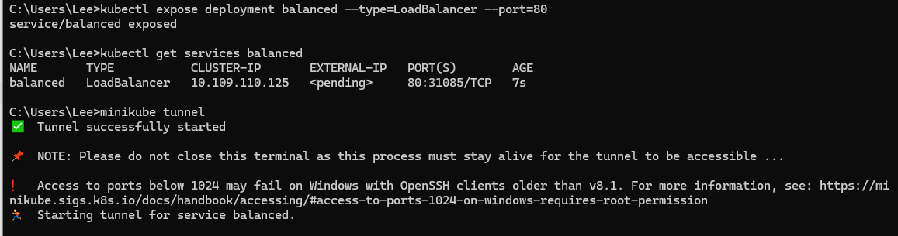

浏览器访问 [http://127.0.0.1:80/](http://127.0.0.1:8030/)

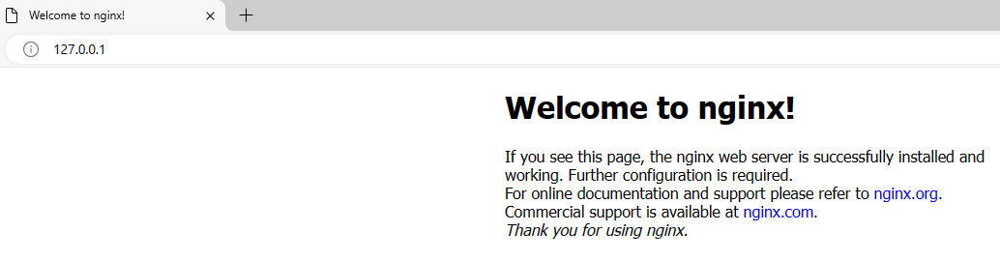

换个端口

```bash
kubectl expose deployment balanced --type=LoadBalancer --port=8030 --target-port=80 --name=balanced-8030

minikube tunnel
```

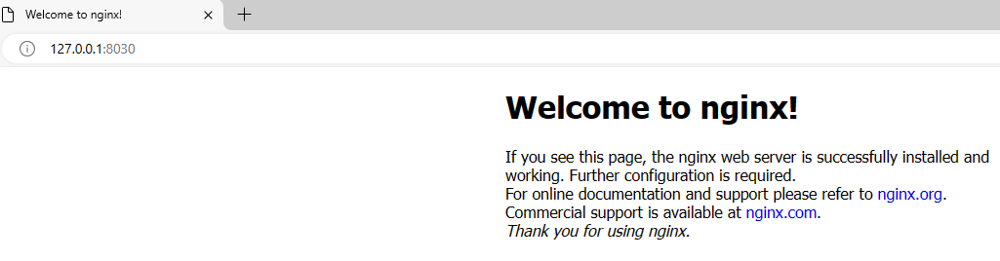

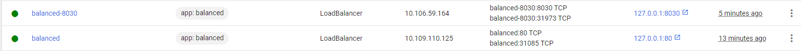

## 暴露服务（Ingress）

先启用 ingress 插件

```bash
minikube addons enable ingress
```

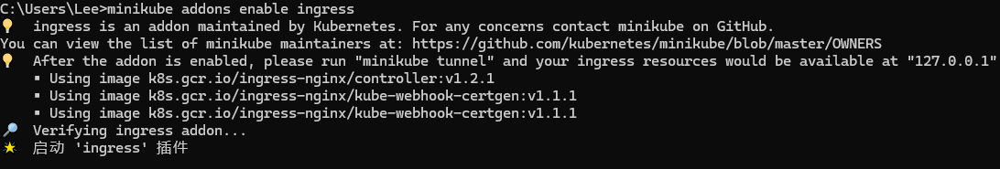

```bash
kubectl apply -f https://storage.googleapis.com/minikube-site-examples/ingress-example.yaml
```

yaml文件内容如下：

```yaml
kind: Pod
apiVersion: v1
metadata:
  name: foo-app
  labels:
    app: foo
spec:
  containers:
    - name: foo-app
      image: 'kicbase/echo-server:1.0'
---
kind: Service
apiVersion: v1
metadata:
  name: foo-service
spec:
  selector:
    app: foo
  ports:
    - port: 8080
---
kind: Pod
apiVersion: v1
metadata:
  name: bar-app
  labels:
    app: bar
spec:
  containers:
    - name: bar-app
      image: 'kicbase/echo-server:1.0'
---
kind: Service
apiVersion: v1
metadata:
  name: bar-service
spec:
  selector:
    app: bar
  ports:
    - port: 8080
---
apiVersion: networking.k8s.io/v1
kind: Ingress
metadata:
  name: example-ingress
spec:
  rules:
    - http:
        paths:
          - pathType: Prefix
            path: /foo
            backend:
              service:
                name: foo-service
                port:
                  number: 8080
          - pathType: Prefix
            path: /bar
            backend:
              service:
                name: bar-service
                port:
                  number: 8080
---
```

其中包含了两个Pod和两个Service的定义，以及一个Ingress资源。这些资源共同定义了一个简单的Kubernetes应用程序，其中有两个应用（foo-app和bar-app）分别通过两个Service（foo-service和bar-service）暴露，并且通过Ingress资源可以根据URL路径（/foo和/bar）来路由到相应的服务。

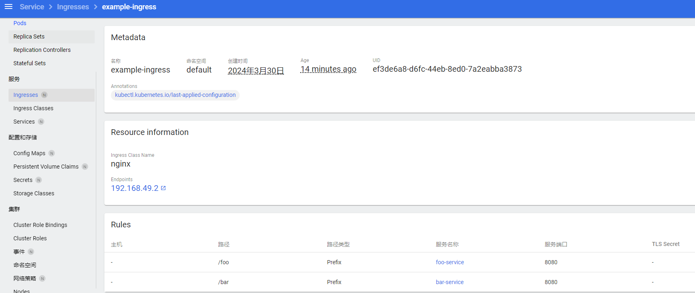

```yaml
kubectl get ingress

minikube tunnel
```

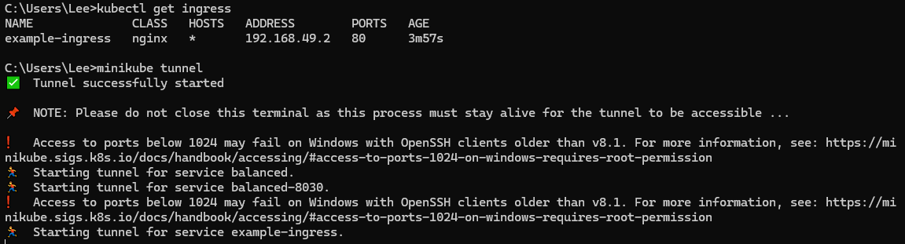

因为 balanced 这个服务占用了80端口，所以访问 [localhost/foo](http://localhost/foo) 会遇到 404。删掉这个服务再访问。

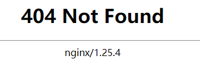

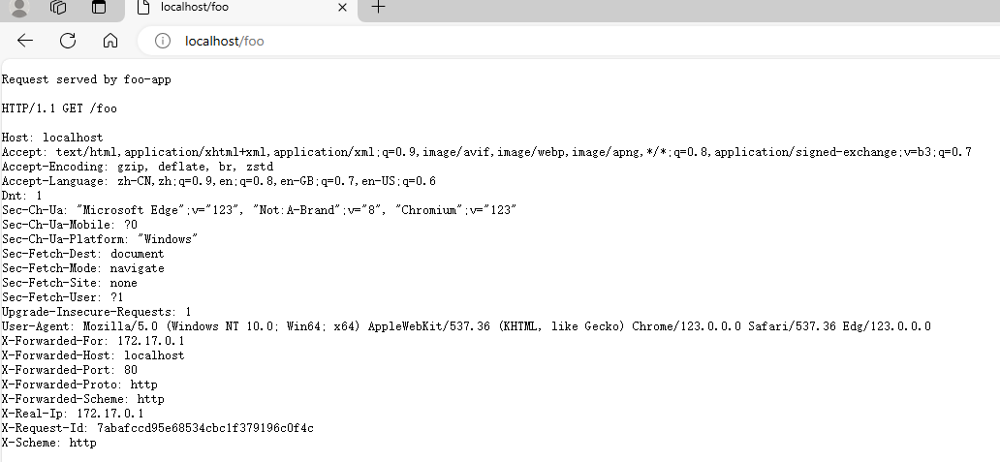

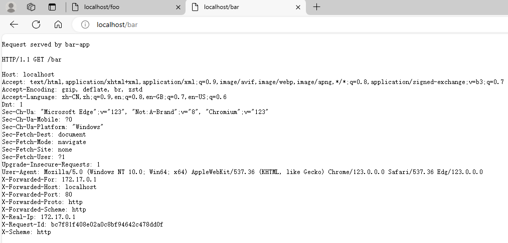

## Scale

```bash
kubectl scale deployments/hello-nginx --replicas=3
```

There are several ways to set environment variables for a Docker container in Kubernetes, including: Dockerfile, kubernetes.yml, Kubernetes ConfigMaps, and Kubernetes Secrets.

ConfigMaps and Secrets is that they can be re-used across multiple containers
