# Rancher

Rancher 是一个 Kubernetes 管理工具。管理现有集群（Rancher Kubernetes Engine（RKE）或云 Kubernetes 服务（例如 GKE、AKS 和 EKS）创建 Kubernetes 集群），或者创建新的集群。Run Kubernetes Everywhere

统一所有集群的身份验证和 RBAC。

为集群和资源提供更精细的监控和告警。

**日志管理**

**监控：Prometheus**

**告警**

通过应用商店（Application Catalog）直接集成 Helm。

对接外部外部 CI/CD 系统。


• **管理项目**：项目由集群中多个命名空间和访问控制策略组成，是 Rancher 中的一个概念，Kubernetes 中并没有这个概念。你可以使用项目实现以组为单位，管理多个命名空间，并进行 Kubernetes 相关操作。Rancher UI 提供用于[项目管理](https://ranchermanager.docs.rancher.com/zh/pages-for-subheaders/manage-projects)和[项目内应用管理](https://ranchermanager.docs.rancher.com/zh/pages-for-subheaders/kubernetes-resources-setup)的功能。

**VMware 虚拟机三种网络模式详解**

[https://www.cnblogs.com/cnjavahome/p/11266931.html](https://www.cnblogs.com/cnjavahome/p/11266931.html)

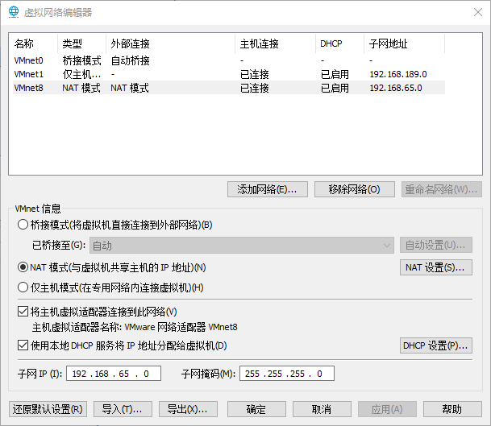

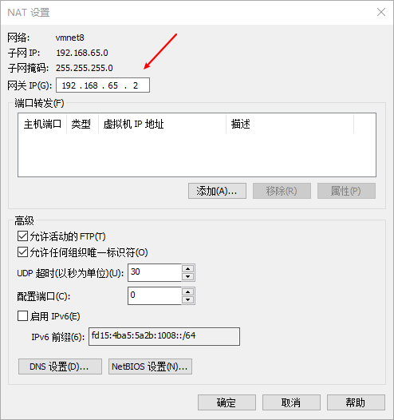

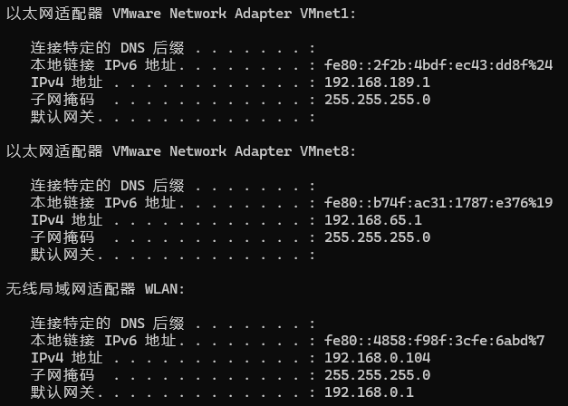

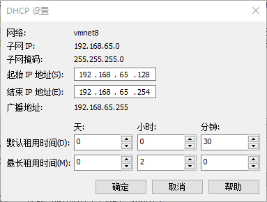

设置静态ip   参考[https://www.cnblogs.com/telwanggs/p/10882369.html](https://www.cnblogs.com/telwanggs/p/10882369.html)

rancher server

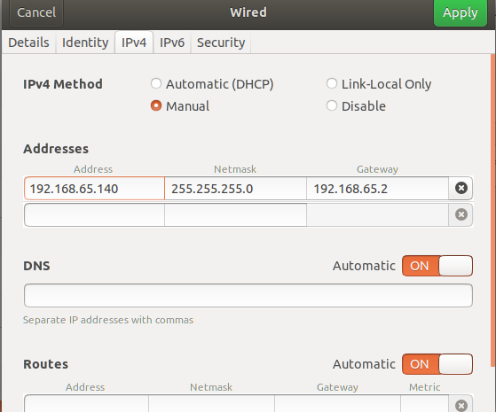

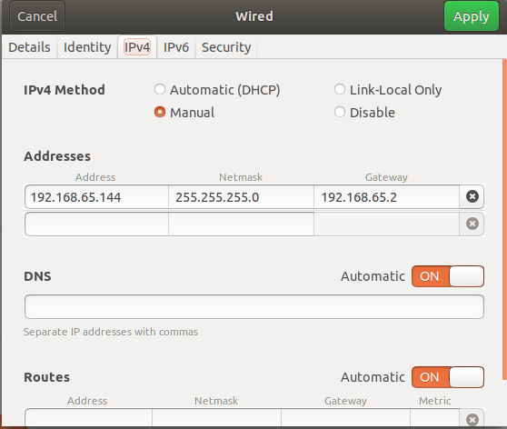

k8s master 

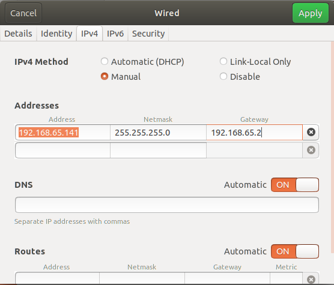

k8s node1

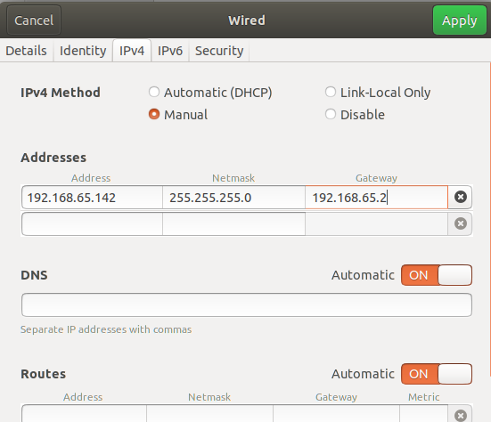

k8s node2

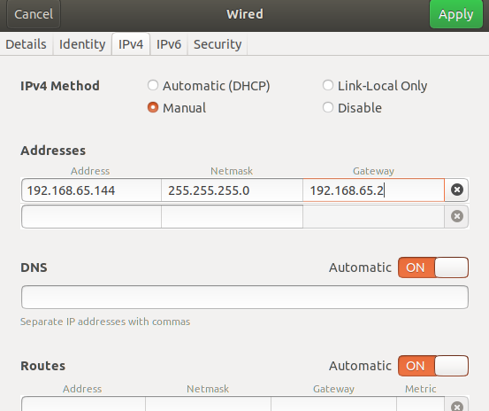

sudo apt install net-tools

- 安装openssh-client：`sudo apt install openssh-client`
- 安装openssh-server：`sudo apt install openssh-server`
- 启动ssh-server：`sudo /etc/init.d/ssh start`
- 确认ssh-server工作正常：`netstat -tpl`

```bash
docker run -d --restart=unless-stopped \
  -p 80:80 -p 443:443 \
  -v /opt/data/rancher_data:/var/lib/rancher
  --privileged \
  rancher/rancher:latest
  
  
```

```bash
docker run -d --restart=unless-stopped -p 80:80 -p 443:443 -v /opt/data/rancher_data:/var/lib/rancher --privileged rancher/rancher:latest
```

卡在拉取镜像

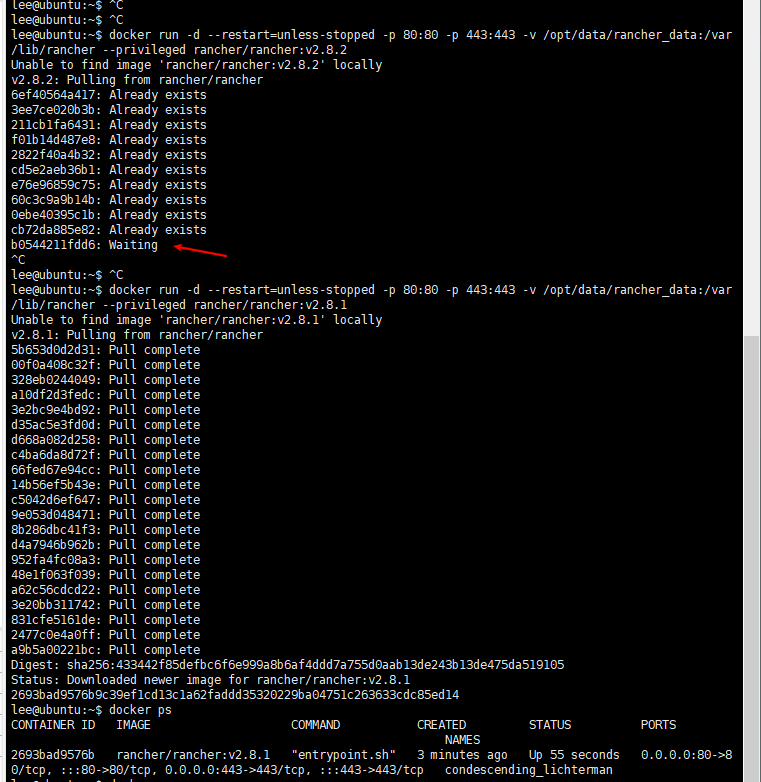

不用latest，使用 v2.8.1 版本

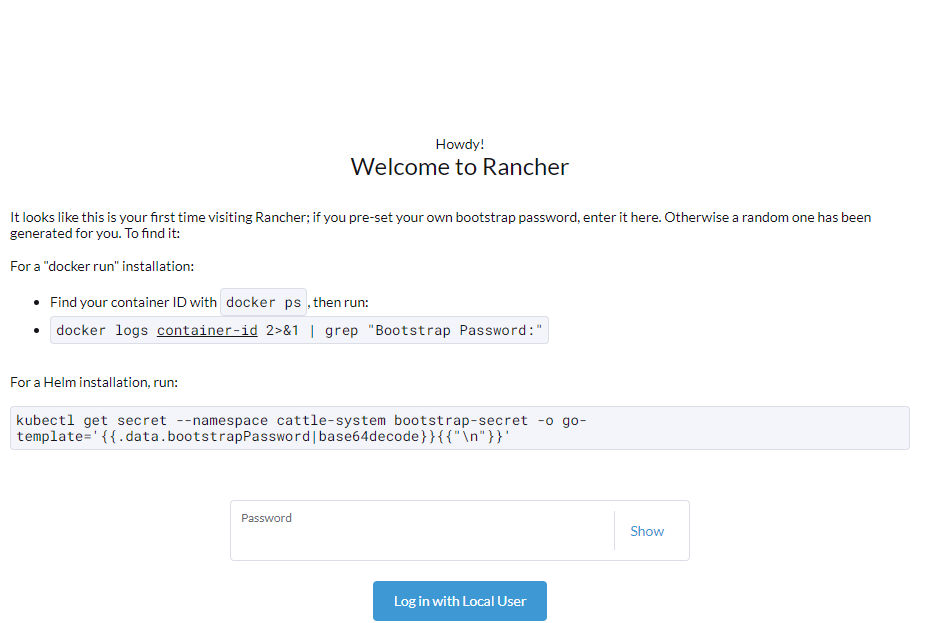

```bash
docker logs  2693bad9576b  2>&1 | grep "Bootstrap Password:"
```

aK4TihQLT52ULa1v

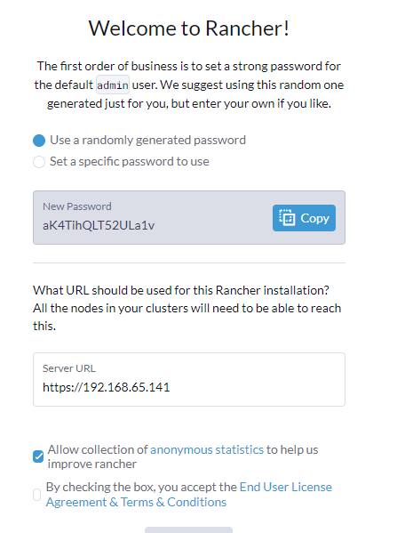

**curl -LO https://dl.k8s.io/release/v1.29.3/bin/linux/amd64/kubectl**

sudo install -o root -g root -m 0755 kubectl /usr/local/bin/kubectl

sudo dpkg -i cri-dockerd_0.3.12.3-0.ubuntu-bionic_amd64.deb

```
sudo apt-get update
sudo apt-get install -y kubelet kubeadm 
# 标记软件包以保留其当前版本，防止它们在系统更新时被自动升级。
sudo apt-mark hold kubelet kubeadm  
```

```
cat >> /etc/hosts << EOF
192.168.65.142 k8smaster
192.168.65.143 k8snode1
192.168.65.144 k8snode2
EOF
```

sudo kubeadm init --cri-socket unix:///var/run/cri-dockerd.sock
