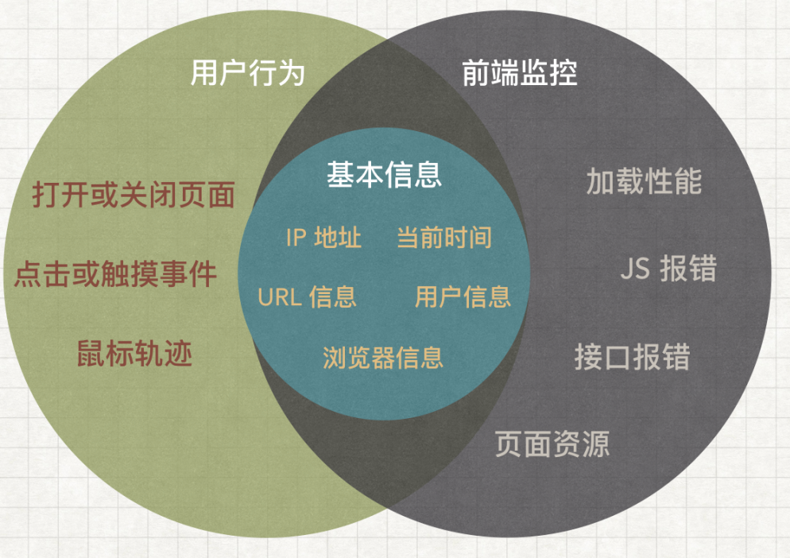

# RUM

RUM（Real User Monitoring）是指对真实用户在使用应用程序时的行为和性能进行监控和分析的技术。通过RUM，开发者可以收集用户在应用程序中的交互数据、性能指标和错误信息，从而更好地了解用户体验并优化应用程序的性能。

## [sentry](https://sentry.io/)

## [Grafana Faro](https://grafana.com/oss/faro/)

