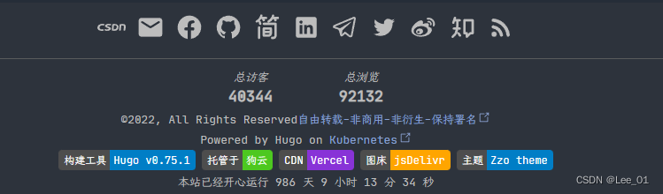

# Static Site Generator

## **Blog**

### [**hexo**](https://hexo.io/zh-cn/)

### [**hugo**](https://gohugo.io/)

### [**jekyll**](https://jekyllrb.com/)

## **Documentation**

### [**gitbook**](https://www.gitbook.com/)

### [**vuepress**](https://vuepress.vuejs.org/)

### [**vitepress**](https://vitepress.vuejs.org/)

### [**rspress**](https://rspress.dev/)

### [**docsify**](https://docsify.js.org/)

### [**docute**](https://docute.egoist.dev/)

### [**docusaurus**](https://docusaurus.io/)

## **Tools**

### **Image hosting service**

- [图壳](https://imgkr.com/)
- GitHub + jsdelivr + PicGo
- 各大云服务对象存储cos

### **Discussion**

- [disqus](https://disqus.com/)

### **Search**

- [algolia](https://www.algolia.com/) 非常好用
- [typesense](https://typesense.org/)

### **Badge**

- [bandage](https://shields.io/) 一般用于开源项目，统计 star, fork, issues, pull request, release, deploy, visitors

### **Analytics**

- [Google Analytics](https://marketingplatform.google.com/about/analytics/)

### **Code Image**

- [https://www.codepng.app/](https://www.codepng.app/)
- [https://carbon.now.sh/](https://carbon.now.sh/)

---

## **Hexo**

NexT主题：

- [https://theme-next.js.org/](https://theme-next.js.org/)
- [https://github.com/next-theme/hexo-theme-next](https://github.com/next-theme/hexo-theme-next)

### **参考文章**

- [https://www.cnblogs.com/liuxianan/p/build-blog-website-by-hexo-github.html](https://www.cnblogs.com/liuxianan/p/build-blog-website-by-hexo-github.html)
- [https://www.jianshu.com/p/f054333ac9e6](https://www.jianshu.com/p/f054333ac9e6)
- [https://www.cnblogs.com/ECJTUACM-873284962/category/1198838.html](https://www.cnblogs.com/ECJTUACM-873284962/category/1198838.html)

### **live2d**

- [https://www.cnblogs.com/wangyuehan/p/9860371.html](https://www.cnblogs.com/wangyuehan/p/9860371.html)
- [https://www.jianshu.com/p/3a6342e16e57](https://www.jianshu.com/p/3a6342e16e57)
- [https://www.jianshu.com/p/a7f4a42e4b49](https://www.jianshu.com/p/a7f4a42e4b49)
- [https://github.com/fghrsh/live2d_api](https://github.com/fghrsh/live2d_api)
- [https://github.com/evgo2017/vue-live2d](https://github.com/evgo2017/vue-live2d)
- [https://github.com/evgo2017/live2d-static-api](https://github.com/evgo2017/live2d-static-api)
- [https://live2d.fghrsh.net/demo/1.4.2/waifu-tips.html](https://live2d.fghrsh.net/demo/1.4.2/waifu-tips.html)

## **Deployment**

### **1. GitHub Pages**

### **2. GitLab Pages**

### **3. [vercel](https://vercel.com/)**

### **4. [netlify](https://www.netlify.com/)**

## **Domain**

- 域名注册
    - [freessl](https://freessl.org/)
- 域名解析
- 域名备案
