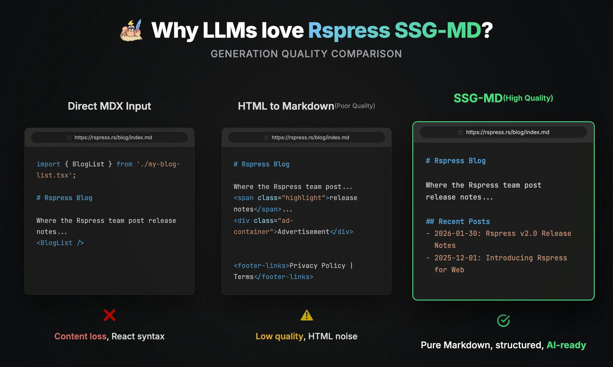

# [Rspress](https://rspress.rs/)

> Rspress is a **static site generator** built with **Rust**, designed to be fast and efficient.

## Features

* support for MDX
* Built-in full-text search
* AI-friendly

## Static Site Generation to Markdown (SSG-MD)

> 将你的页面渲染为 Markdown 文件，而非 HTML 文件，并生成 llms.txt 及 llms-full.txt 相关文件，便于大模型理解和使用你的技术文档。

| 类比项           | SSG                                        | SSG-MD                             |
| :--------------- | :----------------------------------------- | :--------------------------------- |
| **全称**         | Static Site Generation                     | Static Site Generation to Markdown |
| **优化目标**     | SEO（搜索引擎优化）                        | GEO（生成式引擎优化）              |
| **面向对象**     | 搜索引擎爬虫                               | 大语言模型 / 向量化检索系统        |
| **索引文件**     | [`sitemap.xml`](https://www.sitemaps.org/) | [`llms.txt`](https://llmstxt.org/) |
| **完整内容文件** | -                                          | `llms-full.txt`                    |
| **核心实现**     | `renderToString`                           | `renderToMarkdownString`           |
| **访问方式**     | `/guide/start/introduction.html`           | `/guide/start/introduction.md`     |

## llms.txt

> [`llms.txt`](https://llmstxt.org/) 是一种新兴的标准化文件格式，放置于网站根目录，帮助大语言模型更好地理解和使用网站内容。
>
> 由于 LLM 的上下文窗口有限，无法处理整个网站的 HTML 内容，而将复杂的 HTML（包含导航、广告、JavaScript）转换为纯文本既困难又不精确。`llms.txt` 使用 Markdown 格式提供网站的结构化索引，包含页面 URL 及其内容描述，让 AI 能够快速定位和理解关键信息。
>
> 简单来说：
>
> - `sitemap.xml` → 给搜索引擎看的"网站地图"
> - `llms.txt` → 给 AI 看的"文档目录"

