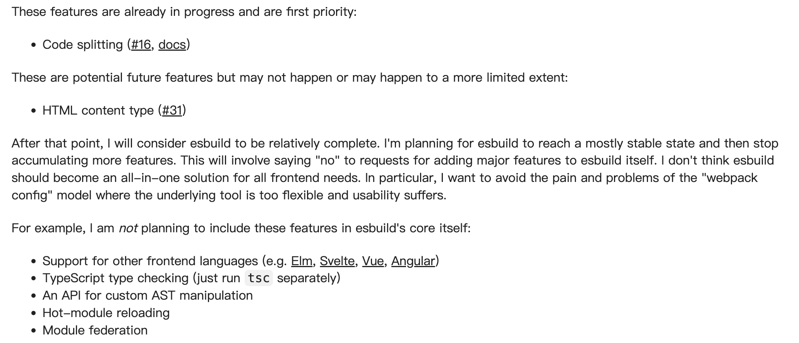

# [esbuild](https://esbuild.github.io/)

* written in Go

## [Why is esbuild fast?](https://esbuild.github.io/faq/#why-is-esbuild-fast)

* It's written in Go and compiles to native code.
* Parallelism is used heavily.
* Everything in esbuild is written from scratch.
* Memory is used efficiently.

> - **Go 语言优势**：esbuild 由 Go 编写并编译为原生代码，而多数其他打包工具基于 JavaScript。JS 工具每次运行需 JIT 解析，而 esbuild 可直接执行，且 Go 天生支持线程内存共享，并行效率远超 JS（JS 线程需数据序列化，垃圾回收也更占资源）。
> - **高度并行化**：内部算法设计充分利用 CPU 核心，解析和代码生成阶段（占主要工作）完全并行，多入口点共享相同库时可高效分配工作。
> - **自研组件**：未使用第三方库，从设计初期注重性能，数据结构一致避免转换开销。例如，自研 TypeScript 解析器避免官方 TS 编译器的低效（如多态对象、动态属性访问、不必要的类型检查）。
> - **高效内存使用**：AST 仅经 3 次处理（词法分析 / 解析、绑定 / 转换、压缩 / 生成代码），最大化 CPU 缓存利用；Go 的内存布局紧凑（如布尔值占 1 字节，对象嵌入避免额外分配），比 JS 更高效。

## 为什么生产不用esbuild？

## [Bundle Size Analyzer](https://esbuild.github.io/analyze/)

* Treemap Chart :+1:
* Sunburst Chart
* Flame Chart

## Reference

* https://juejin.cn/column/7285233095058718756
