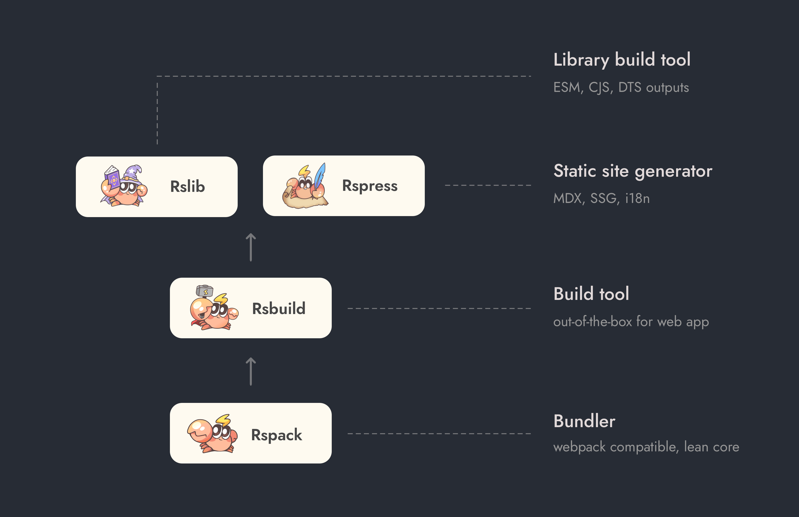

# [Rspack](https://rspack.dev/)

> A fast Rust-based web bundler
> 基于 Rust 的高性能 Web 打包工具

## 功能

### Languages and Frameworks

HtmlWebpackPlugin  HtmlRspackPlugin

### Code Splitting

### Tree Shaking

### Plugins

### Module Federation

### Asset Management

| webpack       | rspack             | note                                   |
| ------------- | ------------------ | -------------------------------------- |
|               | `'asset'`          | 根据条件自动选择策略，8Kb              |
| `url-loader`  | `'asset/inline'`   | 将资源转换为 DataURI，使用 Base64 编码 |
| `file-loader` | `'asset/resource'` | 将资源转换为单独的文件                 |
| `raw-loader`  | `'asset/source'`   | 将资源文件转为字符串导出               |

### Loaders

### HMR

### Dev Server

### Parallel Builds

### SWC

### Lightning CSS

### JavaScript API

## Rstack

* Rspack
* Rsbuild
* Rspress
* Rsdoctor
* Rslib

