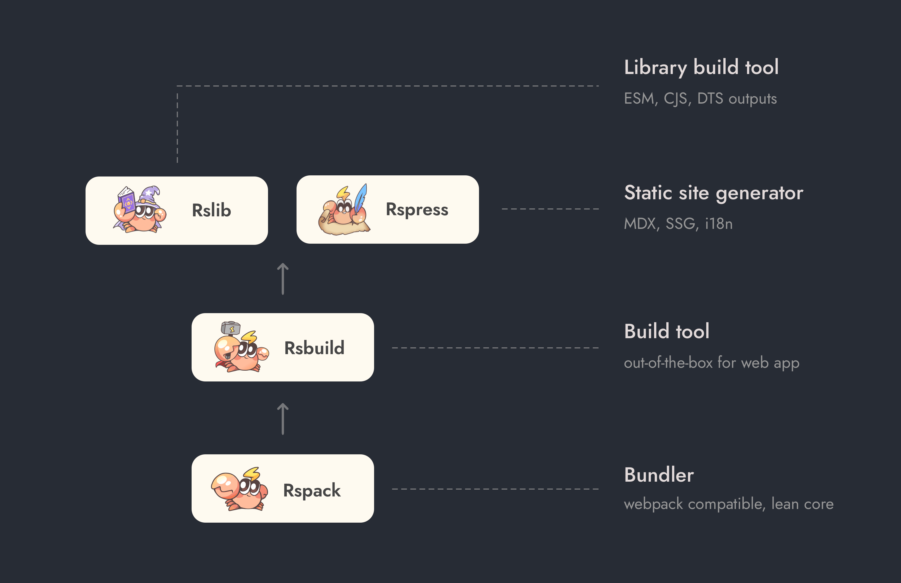

# [Rspack](https://rspack.rs/)

> A fast Rust-based web bundler.基于 Rust 的高性能 Web 打包工具。

## Rspack Ecosystem

| 名称                                                  | 描述           |
| ----------------------------------------------------- | -------------- |
| [Rspack](https://github.com/web-infra-dev/rspack)     | 打包工具       |
| [Rsbuild](https://github.com/web-infra-dev/rsbuild)   | 构建工具       |
| [Rslib](https://github.com/web-infra-dev/rslib)       | 库开发工具     |
| [Rspress](https://github.com/web-infra-dev/rspress)   | 静态站点生成器 |
| [Rsdoctor](https://github.com/web-infra-dev/rsdoctor) | 构建分析工具   |
| [Rstest](https://github.com/web-infra-dev/rstest)     | 测试框架       |
| [Rslint](https://github.com/web-infra-dev/rslint)     | 代码检查工具   |



## Installation

```bash
npm create rspack@latest
```

核心依赖：`@rspack/core` `@rspack/cli` `@rspack/dev-server`

## 功能

### Languages and Frameworks

HtmlWebpackPlugin  HtmlRspackPlugin


### Code Splitting


### Tree Shaking


### Plugins


### Module Federation


### Asset Management

| webpack       | rspack             | note                                   |
| ------------- | ------------------ | -------------------------------------- |
|               | `'asset'`          | 根据条件自动选择策略，8Kb              |
| `url-loader`  | `'asset/inline'`   | 将资源转换为 DataURI，使用 Base64 编码 |
| `file-loader` | `'asset/resource'` | 将资源转换为单独的文件                 |
| `raw-loader`  | `'asset/source'`   | 将资源文件转为字符串导出               |


### Loaders


### HMR


### Dev Server


### Parallel Builds


### SWC


### Lightning CSS


### JavaScript API


