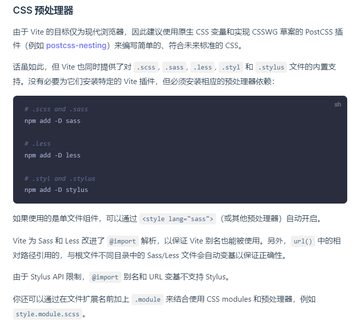

# [vite](https://vitejs.dev/)

Fast!

## 开发配置

### 需自己安装css预处理器依赖

## FAQ

### [为什么生产打包要用 Rollup 而不用 esbuild ？](https://github.com/vitejs/vite/discussions/7622)

* esbuild 功能不完善，如不支持 tree-shaking、代码分割等。
* esbuild 的插件生态不如 Rollup 丰富

