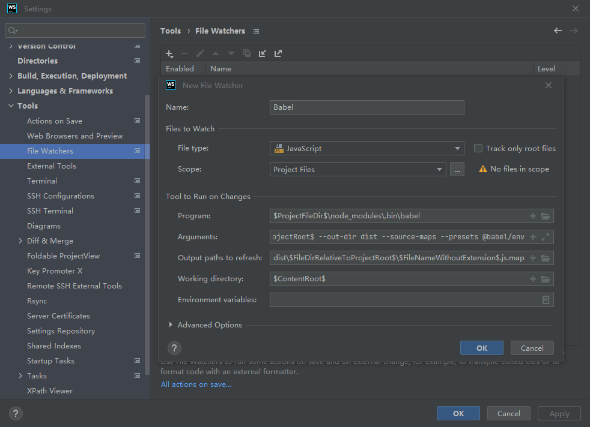
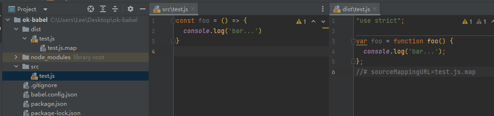

# [Babel](https://babeljs.io/)

Babel is a JavaScript compiler.

## use babel in browser

<code>
<iframe src="https://codesandbox.io/embed/jovial-currying-dd38wm?fontsize=14&hidenavigation=1&theme=dark&view=editor"
     style="width:100%; height:500px; border:0; border-radius: 4px; overflow:hidden;"
     title="jovial-currying-dd38wm"
     allow="accelerometer; ambient-light-sensor; camera; encrypted-media; geolocation; gyroscope; hid; microphone; midi; payment; usb; vr; xr-spatial-tracking"
     sandbox="allow-forms allow-modals allow-popups allow-presentation allow-same-origin allow-scripts"
 ></iframe>
</code>

## use babel in cli

1. install dependencies


```bash
npm install --save-dev @babel/preset-env 
npm install --save-dev @babel/cli
```

2. babel.config.json

```json
{
  "presets": ["@babel/preset-env"]
}
```

3. compile index.js

```js
const foo = () => {
  const element = document.createElement('div');
  element.innerHTML = "Hello World";
  document.body.appendChild(element);
}
foo();
```

```bash
npx babel index.js --out-file compiled.js
```

## use babel in WebStorm

1. install dependencies


```bash
npm install --save-dev @babel/preset-env 
npm install --save-dev @babel/cli
```

2. babel.config.json

```json
{
  "presets": ["@babel/preset-env"]
}
```

3. webstorm settings



4. auto compilation



## use babel in webpack

webpack.config.js

```js
const path = require('path');

module.exports = {
  entry: './src/index.js',
  output: {
    path: path.resolve(__dirname, 'dist'),
    filename: 'main.js',
  },
  mode: 'development'
};
```

入口文件 index.js

```js
const foo = () => {
  const element = document.createElement('div');
  element.innerHTML = "Hello World";
  document.body.appendChild(element);
}

foo();
```

webpack打包之后部分代码如下，可以看到还保留 ES6 的语法。

```js
eval("const foo = () => {\r\n  const element = document.createElement('div');\r\n  element.innerHTML = \"Hello World\";\r\n  document.body.appendChild(element);\r\n}\r\n\r\nfoo();\r\n\n\n//# sourceURL=webpack://hello/./src/index.js?");
```

接下来加入 [babel-loader](https://github.com/babel/babel-loader)

1. install dependencies

```bash
npm install --save-dev @babel/preset-env 
npm install --save-dev @babel/core
npm install --save-dev babel-loader
```

2. webpack.config.js

```js
{
  // ...
  module: {
    rules: [
      {
        test: /\.m?js$/,
        exclude: /node_modules/,
        use: {
          loader: "babel-loader",
          options: {
            presets: ['@babel/preset-env']
          }
        }
      }
    ]
  }
}
```

3. 观察打包后的代码

```js
eval("var foo = function foo() {\n  var element = document.createElement('div');\n  element.innerHTML = \"Hello World\";\n  document.body.appendChild(element);\n};\n\nfoo();\n\n//# sourceURL=webpack://hello/./src/index.js?");
```

## Configuration File Types

* Project-wide configuration
  * :+1: `babel.config.*` files, with the following extensions: `.json`, `.js`, `.cjs`, `.mjs`.
* File-relative configuration
  * `.babelrc.*` files, with the following extensions: `.json`, `.js`, `.cjs`, `.mjs`.
  * `.babelrc` file, with no extension.
  * `package.json` files, with a `"babel"` key.

> babel.config.js 和 .babelrc 或 package.json 中的 babel 字段不同，这个配置文件不会使用基于文件位置的方案，而是会一致地运用到项目根目录以下的所有文件，包括 node_modules 内部的依赖。

## presets

* 预定义的babel配置
* 最常用：`@babel/preset-env` 转换最新的JavaScript语法

## plugins

* 本质上是一个函数
* 更小粒度的转换，专注于某个语法

## Other

* Babel 默认只转换新的 JavaScript syntax，而不转换新的 API

* 一般要忽略 dist 中的js

  ```js
  {
    ignore: [
      'dist/*.js'
    ]
  }
  ```

  

