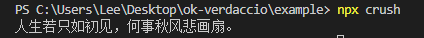
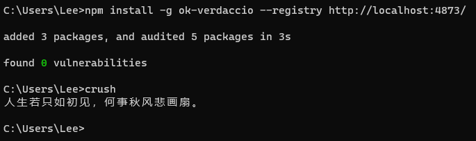
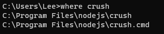

# bin

> A lot of packages have one or more executable files that they'd like to install into the PATH. npm makes this pretty easy (in fact, it uses this feature to install the "npm" executable.)
>
> To use this, supply a `bin` field in your package.json which is a map of command name to local file name. On install, npm will symlink that file into `prefix/bin` for global installs, or `./node_modules/.bin/` for local installs.

## Practice

### 1.创建脚本

`bin/index.js`  文件目录、文件名随意

注意第一行一定要指明脚本解释器

```js
#!/usr/bin/env node

console.log("人生若只如初见，何事秋风悲画扇。");
```

### 2.配置脚本

`package.json`

```json
{
  "bin": {
    "crush": "bin/index.js"
  }
}
```

### 3.发布依赖

略。

### 4.本地安装

项目安装依赖后，`node_modules/.bin` 下可以看到对应的命令：


命令行执行一下：

```bash
npx crush
```



### 5.全局安装

如果是全局安装，则会将命令添加到npm安装目录，而npm已经配置到环境变量中，所以可以直接在控制台任意目录执行`crush`命令。






如果安装了nvm管理node，目录有所变化


### crush.sh

```sh
#!/bin/sh
basedir=$(dirname "$(echo "$0" | sed -e 's,\\,/,g')")

case `uname` in
    *CYGWIN*|*MINGW*|*MSYS*) basedir=`cygpath -w "$basedir"`;;
esac

if [ -x "$basedir/node" ]; then
  exec "$basedir/node"  "$basedir/node_modules/ok-verdaccio/bin/index.js" "$@"
else 
  exec node  "$basedir/node_modules/ok-verdaccio/bin/index.js" "$@"
fi
```

### crush.cmd

```bat
@ECHO off
GOTO start
:find_dp0
SET dp0=%~dp0
EXIT /b
:start
SETLOCAL
CALL :find_dp0

IF EXIST "%dp0%\node.exe" (
  SET "_prog=%dp0%\node.exe"
) ELSE (
  SET "_prog=node"
  SET PATHEXT=%PATHEXT:;.JS;=;%
)

endLocal & goto #_undefined_# 2>NUL || title %COMSPEC% & "%_prog%"  "%dp0%\node_modules\ok-verdaccio\bin\index.js" %*
```

## Application

```json
{
  "name": "@vue/cli",
  "version": "5.0.8",
  "description": "Command line interface for rapid Vue.js development",
  "bin": {
    "vue": "bin/vue.js"
  },
}
```


