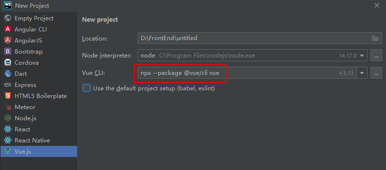
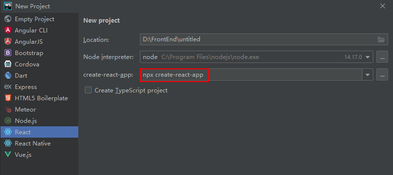

# [npm CLI](https://docs.npmjs.com/cli/commands)

## npm init

```text
npm init <package-spec> (same as `npx create-<package-spec>`)
npm init <@scope> (same as `npx <@scope>/create`)

aliases: create, innit
```

* `npm init foo` -> `npm exec create-foo`
* `npm init @usr` -> `npm exec @usr/create`
* `npm init @usr/foo` -> `npm exec @usr/create-foo`

```bash
npm init react-app my-app
npm create react-app my-app
npx create-react-app my-app

npm init vite my-app
npm create vite my-app
npx create-vite my-app

npm create vue@latest
```

## npm config

```bash
npm config set <key>=<value> [<key>=<value> ...]
npm config get [<key> [<key> ...]]
npm config delete <key> [<key> ...]
npm config list [--json]
```

## npm adduser

Create a new user in the specified registry, and save the credentials to the .npmrc file.

## npm login

```bash
# log in, linking the scope to the custom registry
npm login --scope=@mycorp --registry=https://registry.mycorp.com
```

登录报错

> npm ERR! code ENYI
> npm ERR! Web login not supported

解决方法

```bash
npm login --auth-type=legacy
```

## npm publish

```bash
# 先登录
npm login [--registry=https://registry.company-name.npme.io]

# 发布正式包
npm publish

# 发布beta包
npm publish --tag beta
```

## npm logout

```bash
# log out, removing the link and the auth token
npm logout --scope=@mycorp
```

## npm unpublish

```bash
npm unpublish [<package-spec>]
```

## npm deprecate

```text
npm deprecate <package-spec> <message>
```

## npm link/unlink

```bash
cd ~/projects/node-redis    # go into the package directory
npm link                    # creates global link
cd ~/projects/node-bloggy   # go into some other package directory.
npm link redis              # link-install the package
```


## npm cache

```bash
npm cache clean --force
```


## npx

Run a command from a local or remote npm package

* 参考博文：https://www.ruanyifeng.com/blog/2019/02/npx.html

### 调用项目安装的模板
```bash
npm i -D webpack webpack-cli
npx webpack
```

### 避免全局安装模块



