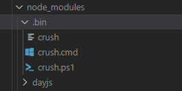
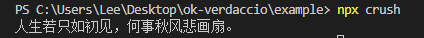
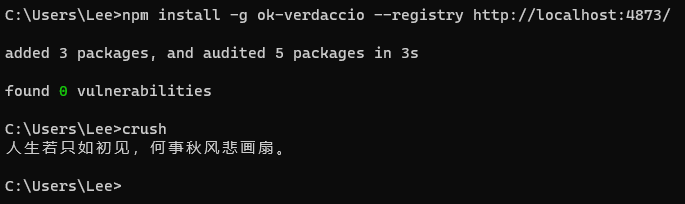
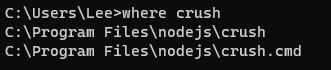

# package.json

## bin

`bin/index.js`

```js
#!/usr/bin/env node
// 注意第一行一定要指明解释器
console.log("人生若只如初见，何事秋风悲画扇。");
```

`package.json`

```json
  "bin": {
    "crush": "bin/index.js"
  },
```

项目安装依赖后，`node_modules/.bin` 下可以看到对应的命令：



命令行执行一下：

```bash
npx crush
```



如果是全局安装，则会将命令注册到环境变量




