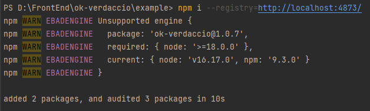

# package.json

## name

需要注意有scope的包名

## [version](./version)

## [bin](./bin)

## [peerDependencies](./peerDependencies)

## engines

```json
{
    "engines": {
    	"node": ">=18.0.0"
	}
}
```



## [module相关](./module)
