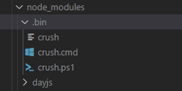
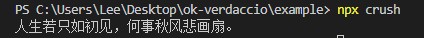
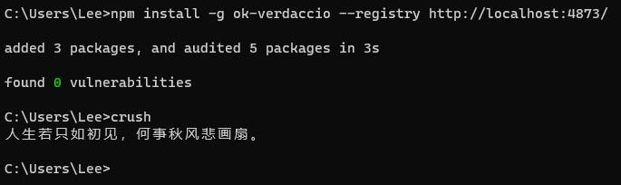
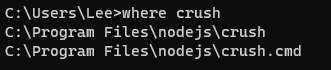
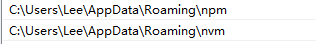
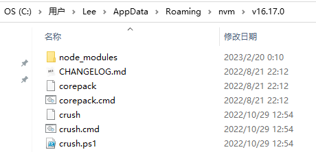
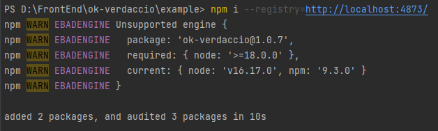

# [package.json](https://docs.npmjs.com/cli/v11/configuring-npm/package-json)

## version

### [SemVer](https://semver.org/)

* Semantic Versioning 语义化版本
* MAJOR.MINOR.PATCH 主版本号.次版本号.修订号

### 版本号比较

1.0.0 < 2.0.0 < 2.1.0 < 2.1.1

1.0.0-alpha < 1.0.0

1.0.0-alpha < 1.0.0-alpha.1 < 1.0.0-alpha.beta < 1.0.0-beta < 1.0.0-beta.2 < 1.0.0-beta.11 < 1.0.0-rc.1 < 1.0.0

### 版本号递增规则

* 主版本号：当你做了不兼容的 API 修改，
* 次版本号：当你做了向下兼容的功能性新增，
* 修订号：当你做了向下兼容的问题修正。

### npm安装规则

> 指定版本：比如 1.2.2 ，遵循“大版本.次要版本.小版本”的格式规定，安装时只安装指定版本。
>
> 波浪号（tilde）+指定版本：比如 ~1.2.2 ，表示安装 1.2.x 的最新版本（不低于1.2.2），但是不安装 1.3.x，也就是说安装时不改变大版本号和次要版本号。
>
> 插入号（caret）+指定版本：比如 ˆ1.2.2，表示安装 1.x.x 的最新版本（不低于 1.2.2），但是不安装 2.x.x，也就是说安装时不改变大版本号。需要注意的是，如果大版本号为 0，则插入号的行为与波浪号相同，这是因为此时处于开发阶段，即使是次要版本号变动，也可能带来程序的不兼容。
>
> `npm install [package]`，第一次安装是最新版本，写到 `package.json` 中版本号是插入号形式。


### 版本锁定

* package-lock.json (A manifestation of the manifest)
* yarn.lock
* pnpm-lock.yaml
* npm-shrinkwrap.json (A publishable lockfile)

### Reference

* https://segmentfault.com/a/1190000039684460
* https://semver.org/lang/zh-CN/

## scripts

> 每当执行npm run，就会自动新建一个 Shell，在这个 Shell 里面执行指定的脚本命令。因此，只要是 Shell（一般是 Bash）可以运行的命令，就可以写在 npm 脚本里面。
>
> npm run新建的这个 Shell，会将当前目录的node_modules/.bin子目录加入PATH变量，执行结束后，再将PATH变量恢复原样。
>
> 当前目录的node_modules/.bin子目录里面的所有脚本，都可以直接用脚本名调用，而不必加上路径。

为防止发布包之前忘了构建，可增加以下命令，每次发布前都会先执行构建命令。

```json
{
    "scripts": {
        "prepublishOnly": "npm run build"
    }
}
```

### Reference

* http://www.ruanyifeng.com/blog/2016/10/npm_scripts.html

## dependencies

运行时依赖

## devDependencies

开发、构建时依赖

## peerDependencies

前置依赖，例如 Element UI 依赖 vue.js

## optionalDependencies

可选依赖

## type

规定 .js 文件使用哪个模块系统，默认为 CommonJS。
不管“type”字段的值是多少，.mjs文件总是被当作ES模块，而.cjs文件总是被当作CommonJS。

```json
{
    "type": "module"
}
```

## types

定义 TypeScript 类型

## files
列出要发布的 files。可以在 `.npmignore` 指定忽略的文件，如果没有 `.npmignore` 文件，会使用 `.gitignore` 文件

## main

定义 CommonJS 入口

## module

定义 ESM 入口

## browser

> If your module is meant to be used client-side the browser field should be used instead of the main field. This is helpful to hint users that it might rely on primitives that aren't available in Node.js modules. (e.g. window)

## 给 CDN 使用的附加字段

```json
{
  "unpkg": "dist/index.umd.js",
  "jsdelivr": "dist/index.umd.js"
}
```

```json
{
  "type": "module",
  "source": "./index.js",
  "exports": {
    "require": "./dist/index.cjs",
    "default": "./dist/index.modern.js"
  },
  "main": "./dist/index.cjs",
  "module": "./dist/index.module.js",
  "browser": "./dist/index.umd.js",
  "unpkg": "./dist/index.umd.js",
  "jsdelivr": "./dist/index.umd.js",
  "files": [
    "dist",
    "index.d.ts"
  ],
  "types": "./index.d.ts"
}
```

## exports

```json
{
  "exports": {
    ".": {
      "types": "index.d.ts",
      "module": "index.js",
      "import": "index.js",
      "require": "index.cjs",
      "default": "index.js"
    }
  }
}
```

* "." 表示你的库的默认入口
* 解析过程是「从上往下」的，并在找到匹配的字段后立即停止；所以入口的顺序是非常重要的
* types 字段应始终放在第一位，帮助 TypeScript 查找类型文件
* module 是一个“非官方”字段，它被 Webpack 和 Rollup 等打包工具所支持。它应该被放在 import 和 require 之前，并且指向 esm 格式的产出 -- 如果你的源代码是纯 esm 的，它也可以指向你的源代码。正如在格式部分中指出的那样，它旨在帮助打包工具只包含你的库的一个副本，无论它是通过 import 还是 require 方式引入的。
* import 用于当有人通过 import 使用你的库时
* require 用于当有人通过 require 使用你的库时
* default 字段用于兜底，在没有任何条件匹配时使用。虽然目前可能并不会匹配到它，但为了面对“未知的未来场景”，使用它是好的


## bin

> A lot of packages have one or more executable files that they'd like to install into the PATH. npm makes this pretty easy (in fact, it uses this feature to install the "npm" executable.)
>
> To use this, supply a `bin` field in your package.json which is a map of command name to local file name. On install, npm will symlink that file into `prefix/bin` for global installs, or `./node_modules/.bin/` for local installs.

### 1.创建脚本

`bin/index.js`  文件目录、文件名随意

注意第一行一定要指明脚本解释器

```js
#!/usr/bin/env node

console.log("人生若只如初见，何事秋风悲画扇。");
```

### 2.配置脚本

`package.json`

```json
{
  "bin": {
    "crush": "bin/index.js"
  }
}
```

### 3.发布依赖

### 4.本地安装

项目安装依赖后，`node_modules/.bin` 下可以看到对应的命令：



命令行执行一下：

```bash
npx crush
```



### 5.全局安装

如果是全局安装，则会将命令添加到npm安装目录，而npm已经配置到环境变量中，所以可以直接在控制台任意目录执行`crush`命令。







如果安装了nvm管理node，目录有所变化



### crush.sh

```sh
#!/bin/sh
basedir=$(dirname "$(echo "$0" | sed -e 's,\\,/,g')")

case `uname` in
    *CYGWIN*|*MINGW*|*MSYS*) basedir=`cygpath -w "$basedir"`;;
esac

if [ -x "$basedir/node" ]; then
  exec "$basedir/node"  "$basedir/node_modules/ok-verdaccio/bin/index.js" "$@"
else 
  exec node  "$basedir/node_modules/ok-verdaccio/bin/index.js" "$@"
fi
```

### crush.cmd

```bat
@ECHO off
GOTO start
:find_dp0
SET dp0=%~dp0
EXIT /b
:start
SETLOCAL
CALL :find_dp0

IF EXIST "%dp0%\node.exe" (
  SET "_prog=%dp0%\node.exe"
) ELSE (
  SET "_prog=node"
  SET PATHEXT=%PATHEXT:;.JS;=;%
)

endLocal & goto #_undefined_# 2>NUL || title %COMSPEC% & "%_prog%"  "%dp0%\node_modules\ok-verdaccio\bin\index.js" %*
```

### Application

```json
{
  "name": "@vue/cli",
  "version": "5.0.8",
  "description": "Command line interface for rapid Vue.js development",
  "bin": {
    "vue": "bin/vue.js"
  }
}
```


## engines

```json
{
    "engines": {
    	"node": ">=18.0.0"
	}
}
```



## sideEffects

```json
{
    "sideEffects": false
}
```
