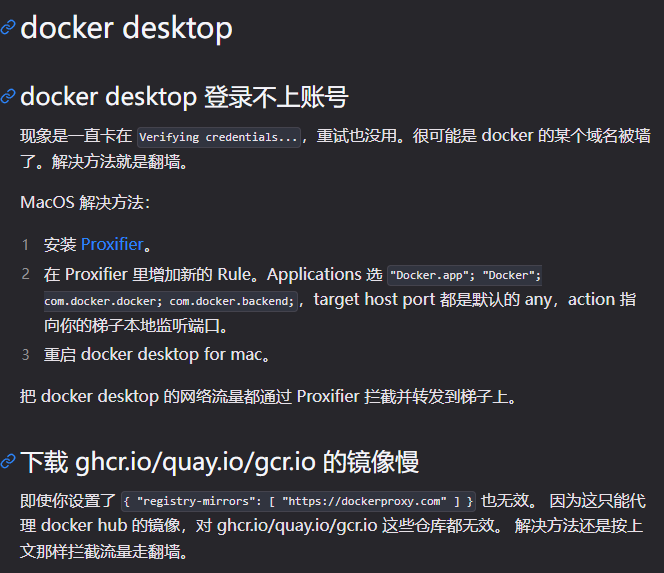
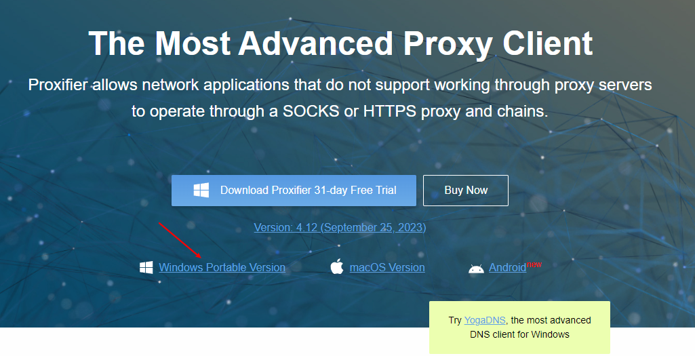
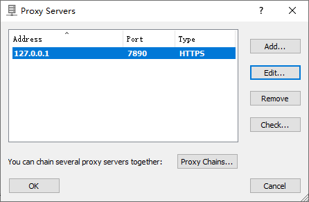

# [Docker Desktop](https://docs.docker.com/desktop/)

Docker Desktop includes the Docker daemon (`dockerd`), the Docker client (`docker`), Docker Compose, Docker Content Trust, Kubernetes, and Credential Helper.

## What's included in Docker Desktop?

- Docker Engine
- Docker CLI client
- Docker Build
- Docker Compose
- Docker Extensions
- Kubernetes

## **docker desktop 登录不上账号**

配置走clash代理（系统代理+全局代理）也没用，难道要用https？有待验证。

## 解决方法

[https://blog.csdn.net/weixin_37477009/article/details/135797296](https://blog.csdn.net/weixin_37477009/article/details/135797296)

[https://adoyle.me/Today-I-Learned/docker/docker-desktop.html](https://adoyle.me/Today-I-Learned/docker/docker-desktop.html)

## Dev Environments

Docker Dev Environments 已弃用，并从 Docker Desktop 4.42 及后续版本移除。旧版本故障截图仅适用于历史排查，不应再作为当前配置流程。需要可复现开发环境时，可使用 Compose 或 Development Containers。

- [Docker 已退役功能](https://docs.docker.com/retired/)
- [Development Containers](https://containers.dev/)
