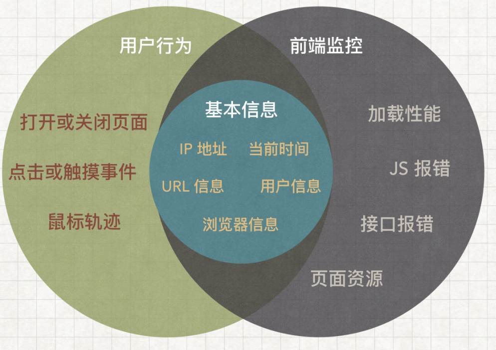

# RUM

RUM（Real User Monitoring）从真实用户浏览器采集页面性能、JavaScript 错误、网络请求和关键交互，反映实验室环境难以覆盖的设备、网络与地域差异。

## 采集内容

- 页面访问、路由切换、版本、设备和网络分布。
- Core Web Vitals、资源加载与关键交互耗时。
- JavaScript 异常、Promise 拒绝和资源加载失败。
- Fetch/XHR 成功率、延迟和后端 Trace ID。
- 登录、搜索、提交等关键业务结果。

## 隐私与成本

采集前明确用户同意、数据用途、保留期和地域要求。URL、Query、表单、Header、用户标识和错误上下文必须脱敏；使用采样、聚合和会话上限控制成本。

## 工具

- [Sentry](./sentry.md)
- [Grafana Faro](./grafana.md)
- [Google Analytics](./google-analytics.md)

RUM 与 [APM](../apm/) 通过 Trace ID 和版本关联后，才能从用户错误定位到具体后端调用和发布变更。
