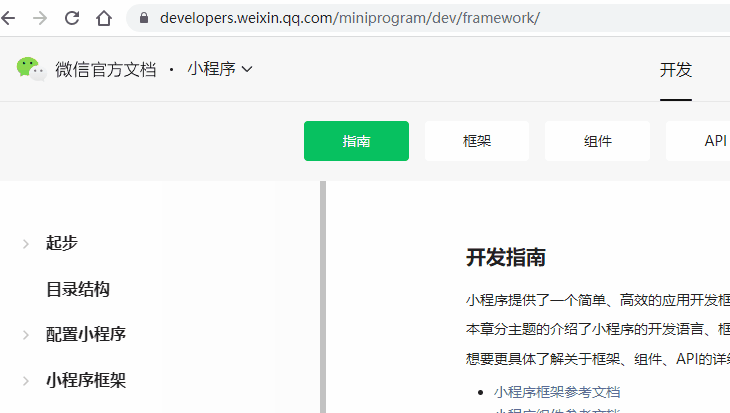

# [微信小程序](https://developers.weixin.qq.com/miniprogram/dev/framework/)

文档地址：https://developers.weixin.qq.com/miniprogram/dev/framework/ 官方文档指南和框架的两个地址配反了。。。

## 问题

* 滚动穿透，参考[社区问答](https://developers.weixin.qq.com/community/develop/article/doc/00062666530a300ed35ba552856413)，[知乎回答](https://www.zhihu.com/question/52852717)

## 开源工具

* https://github.com/wxp-ui/wxp-ui

## 跨端

* [Uniapp](https://uniapp.dcloud.io/)
* [Taro](https://taro.jd.com/)
* [Ionic](https://ionicframework.com/)
