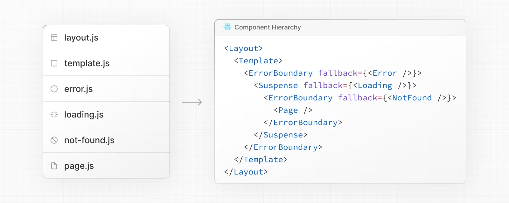

# Routing

## **Terminology**


## **Component Hierarchy**




## **Defining Routes**

**A file-system based router** 基于文件系统的路由器


## Pages

```jsx
// `app/page.tsx` is the UI for the `/` URL
export default function Page() {
  return <h1>Hello, Next.js!</h1>
}
```

```jsx
// `app/dashboard/page.tsx` is the UI for the `/dashboard` URL
export default function Page() {
  return <h1>Hello, Dashboard Page!</h1>
}
```

## Layouts

- A layout is UI that is **shared** between multiple pages.
- On navigation, layouts preserve state, remain interactive, and do not re-render.
- You can use [Route Groups](https://nextjs.org/docs/app/building-your-application/routing/route-groups) to opt specific route segments in and out of shared layouts.
- Layouts are [Server Components](https://nextjs.org/docs/app/building-your-application/rendering/server-components) by default but can be set to a [Client Component](https://nextjs.org/docs/app/building-your-application/rendering/client-components).
- Layouts can fetch data.
- Passing data between a parent layout and its children is not possible.However, you can fetch the same data in a route more than once, and React will [automatically dedupe the requests](https://nextjs.org/docs/app/building-your-application/caching#request-memoization) without affecting performance. **居然无法给子组件传数据！**

在dashboard中，左侧导航栏是固定的，内容区域随着路由切换变化。

```tsx
export default function DashboardLayout({
  children, // will be a page or nested layout
}: {
  children: React.ReactNode
}) {
  return (
    <section>
      {/* Include shared UI here e.g. a header or sidebar */}
      <nav></nav>
 
      {children}
    </section>
  )
}
```

### **Root Layout(Required)**

- The `app` directory **must** include a root layout.
- The root layout must define `<html>` and `<body>` tags.
- The root layout is a Server Component by default and can not be set to a Client Component.

原来html写在这里！

```tsx
export default function RootLayout({
  children,
}: {
  children: React.ReactNode
}) {
  return (
    <html lang="en">
      <body>{children}</body>
    </html>
  )
}
```

### **Nesting Layouts**


## Templates

Templates are similar to layouts in that they wrap each child layout or page. Unlike layouts that persist across routes and maintain state, templates create a new instance for each of their children on navigation. This means that when a user navigates between routes that share a template, a new instance of the component is mounted, DOM elements are recreated, state is **not** preserved, and effects are re-synchronized.

使用场景：

- Features that rely on `useEffect` (e.g logging page views) and `useState` (e.g a per-page feedback form).
- To change the default framework behavior. For example, Suspense Boundaries inside layouts only show the fallback the first time the Layout is loaded and not when switching pages. For templates, the fallback is shown on each navigation.

```tsx
export default function Template({ children }: { children: React.ReactNode }) {
  return <div>{children}</div>
}
```

## **Linking and Navigating**

### **`<Link>` Component**

```tsx
import Link from 'next/link'
 
export default function Page() {
  return <Link href="/dashboard">Dashboard</Link>
}
```

跳转动态路由

```tsx
<Link href={`/blog/${post.id}`}>{post.title}</Link>
```

获取当前路由

```tsx
'use client'
 
import { usePathname } from 'next/navigation'

const pathname = usePathname()
```

**Disabling scroll restoration**

前进或后退，默认滚动至历史位置，可以通过参数禁用此默认行为：

```tsx
// next/link
<Link href="/dashboard" scroll={false}>
  Dashboard
</Link>
```

```tsx
// useRouter
import { useRouter } from 'next/navigation'
 
const router = useRouter()
 
router.push('/dashboard', { scroll: false })
```

### **`useRouter()` Hook**

跟Vue差不多

```tsx
'use client'
 
import { useRouter } from 'next/navigation'
 
export default function Page() {
  const router = useRouter()
 
  return (
    <>
			<button type="button" onClick={() => router.push('/dashboard')}>
	      Dashboard
	    </button>
			<button type="button" onClick={() => router.replace('/dashboard')}>
	      Dashboard
	    </button>
		</>
  )
}
```

### [**How Routing and Navigation Works**](https://nextjs.org/docs/app/building-your-application/routing/linking-and-navigating#how-routing-and-navigation-works)

The App Router uses a hybrid approach for routing and navigation. On the server, your application code is automatically code-split by route segments. And on the client, Next.js [prefetches](https://nextjs.org/docs/app/building-your-application/routing/linking-and-navigating#1-prefetching) and [caches](https://nextjs.org/docs/app/building-your-application/routing/linking-and-navigating#2-caching) the route segments. This means, when a user navigates to a new route, the browser doesn't reload the page, and only the route segments that change re-render - improving the navigation experience and performance.

1.Prefetching

预加载的两种情况：`link` 组件出现在视口内；主动调用 `router.prefetch()`

静态路由会完整加载并缓存。合理！

动态路由，只有公共布局的部分被预加载，并且缓存30s，怎么验证？？？

2.Caching

3.Partial Rendering


4.Soft Navigation

By default, the browser performs a hard navigation between pages. This means the browser reloads the page and resets React state such as `useState` hooks in your app and browser state such as the user's scroll position or focused element. However, in Next.js, the App Router uses soft navigation. This means React only renders the segments that have changed while preserving React and browser state, and there is no full page reload.

有请ChatGPT介绍下

> **Hard Navigation vs Soft Navigation**
> 
> 1. **Hard Navigation（硬导航）：**
>     - **刷新页面或导航到新页面：** 当用户执行类似于刷新页面、点击链接跳转到新页面、或者在地址栏中输入新URL并敲击回车键时，浏览器执行硬导航。
>     - **完全重新加载：** 在硬导航中，浏览器会完全重新加载整个页面，包括所有的资源和JavaScript代码。这可能导致页面重建和重新渲染，对性能有一定影响。
> 2. **Soft Navigation（软导航）：**
>     - **通过JavaScript进行页面更新：** 在软导航中，页面的导航是通过JavaScript而不是完全重新加载整个页面来完成的。这通常是通过使用JavaScript库（例如React、Vue等）进行单页面应用程序（SPA）中的导航实现的。
>     - **只更新必要的部分：** 软导航只更新页面中发生变化的部分，而不必重新加载整个页面。这有助于提高用户体验，因为页面不会出现闪烁或重新加载的延迟。

**5. Back and Forward Navigation**

By default, Next.js will maintain the scroll position for backwards and forwards navigation, and re-use route segments in the [Router Cache](https://nextjs.org/docs/app/building-your-application/data-fetching/fetching-caching-and-revalidating#caching-data).

## **Route Groups**

创建一个目录，但不会被映射为路由的一部分

用途1：按照逻辑组织路由和文件


用途2：

## **Project Organization and File Colocation**

**Colocation**


只有 `page.js` 和 `route.js` 返回的内容才是公开的！