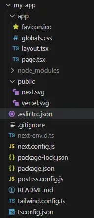

# [Next.js](https://nextjs.org/)

> Next.js is a React framework for building full-stack web applications.
>

## Main Features

Some of the main Next.js features include:

| Feature                                                      | Description                                                  |                                                              |
| ------------------------------------------------------------ | ------------------------------------------------------------ | ------------------------------------------------------------ |
| [Routing](https://nextjs.org/docs/app/building-your-application/routing) | A file-system based router built on top of Server Components that supports layouts, nested routing, loading states, error handling, and more. | 基于文件系统的路由模式。支持服务端组件。支持布局、嵌套路由、加载状态、错误处理 |
| [Rendering](https://nextjs.org/docs/app/building-your-application/rendering) | Client-side and Server-side Rendering with Client and Server Components. Further optimized with Static and Dynamic Rendering on the server with Next.js. Streaming on Edge and Node.js runtimes. | 客户端渲染、服务端渲染。 客户端组件、服务端组件。 静态渲染、动态渲染。 在边缘和Node.js运行时进行流式处理？？？不懂 |
| [Data Fetching](https://nextjs.org/docs/app/building-your-application/data-fetching) | Simplified data fetching with async/await in Server Components, and an extended fetch API for request memoization, data caching and revalidation. | 服务端组件直接获取异步数据。 扩展了fetch，支持请求缓存，数据缓存和清除 |
| [Styling](https://nextjs.org/docs/app/building-your-application/styling) | Support for your preferred styling methods, including CSS Modules, Tailwind CSS, and CSS-in-JS | 支持多种样式工程化：CSS Modules, Tailwind CSS,  CSS-in-JS    |
| [Optimizations](https://nextjs.org/docs/app/building-your-application/optimizing) | Image, Fonts, and Script Optimizations to improve your application's Core Web Vitals and User Experience. | 图片、字体、script文件都进行了优化，以提升web应用的核心指标和用户体验 |
| [TypeScript](https://nextjs.org/docs/app/building-your-application/configuring/typescript) | Improved support for TypeScript, with better type checking and more efficient compilation, as well as custom TypeScript Plugin and type checker. | ts友好，更好的类型校验、更高效的编译，自定义ts插件和类型检查器 |

## **App Router vs Pages Router**

Next.js has two different routers: the App Router and the Pages Router. The App Router is a newer router that allows you to use React's latest features, such as Server Components and Streaming. The Pages Router is the original Next.js router, which allowed you to build server-rendered React applications and continues to be supported for older Next.js applications.

总结：推荐使用App Router，可以利用React最新的特性：服务端组件和流式渲染

## **Installation**

System Requirements:

* [Node.js 18.17](https://nodejs.org/) or later.
* macOS, Windows (including WSL), and Linux are supported.

```bash
npx create-next-app@latest
```

> C:\Users\Lee>nvm use 20.9.0 Now using node v20.9.0 (64-bit)

prompts:

> What is your project named? my-app
>
> Would you like to use TypeScript? No / **Yes** 
>
> Would you like to use ESLint? No / **Yes** 
>
> Would you like to use Tailwind CSS? No / **Yes** 
>
> Would you like to use `src/` directory? **No** / Yes 
>
> Would you like to use App Router? (recommended) No / **Yes** 
>
> Would you like to customize the default import alias (@/* )? **No / **Yes
>
> What import alias would you like configured?  **@/**

Run the Development Server

```bash
npm run dev
```

visit: http://localhost:3000

## Project Structure



### Top-level folders

| [`app`](https://nextjs.org/docs/app/building-your-application/routing) | App Router                         | 推荐用这种模式。nextjs从13版本开始引入的。   |
| ------------------------------------------------------------ | ---------------------------------- | -------------------------------------------- |
| [`pages`](https://nextjs.org/docs/pages/building-your-application/routing) | Pages Router                       | 学不动了。。。                               |
| [`public`](https://nextjs.org/docs/app/building-your-application/optimizing/static-assets) | Static assets to be served         | 和vue、react不一样，没有index.html           |
| [`src`](https://nextjs.org/docs/app/building-your-application/configuring/src-directory) | Optional application source folder | 建议加上，源码的内容放在同一个目录下方便维护 |

### Top-level files

| [`next.config.js`](https://nextjs.org/docs/app/api-reference/next-config-js) | Configuration file for Next.js          |      |
| ------------------------------------------------------------ | --------------------------------------- | ---- |
| [`package.json`](https://nextjs.org/docs/getting-started/installation#manual-installation) | Project dependencies and scripts        |      |
| [`instrumentation.ts`](https://nextjs.org/docs/app/building-your-application/optimizing/instrumentation) | OpenTelemetry and Instrumentation file  |      |
| [`middleware.ts`](https://nextjs.org/docs/app/building-your-application/routing/middleware) | Next.js request middleware              |      |
| [`.env`](https://nextjs.org/docs/app/building-your-application/configuring/environment-variables) | Environment variables                   |      |
| [`.env.local`](https://nextjs.org/docs/app/building-your-application/configuring/environment-variables) | Local environment variables             |      |
| [`.env.production`](https://nextjs.org/docs/app/building-your-application/configuring/environment-variables) | Production environment variables        |      |
| [`.env.development`](https://nextjs.org/docs/app/building-your-application/configuring/environment-variables) | Development environment variables       |      |
| [`.eslintrc.json`](https://nextjs.org/docs/app/building-your-application/configuring/eslint) | Configuration file for ESLint           |      |
| `.gitignore`                                                 | Git files and folders to ignore         |      |
| `next-env.d.ts`                                              | TypeScript declaration file for Next.js |      |
| `tsconfig.json`                                              | Configuration file for TypeScript       |      |
| `jsconfig.json`                                              | Configuration file for JavaScript       |      |
