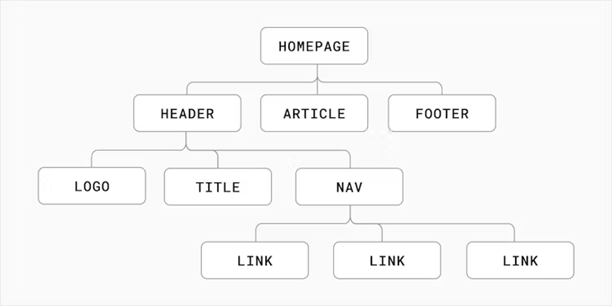

# Component

> Components let you split the UI into independent, reusable pieces, and think about each piece in isolation.

组件名称必须以大写字母开头，React 会将以小写字母开头的组件视为原生 DOM 标签。

## Component trees



## Function Components

* No this!

```jsx
function Welcome(props) {
  return <h1>Hello, {props.name}</h1>;
}
```

## Class Components

* this is a trouble!

```jsx
import React from 'react';

class Welcome extends React.Component {
  render() {
    return <h1>Hello, {this.props.name}</h1>;
  }
}
```


## Handling Events

* React事件是合成事件，不是原生事件，好处：屏蔽浏览器实现差异
* 无须使用 `addEventListener`
* 事件名使用camelCase
* 阻止默认行为必须显式调用 `e.preventDefault()`
* 阻止冒泡必须显式调用 `e.stopPropagation()`
* 通过事件委托方式处理（冒泡给根元素）（高效）
* 常用事件：
  * `onClick`
  * `onFocus onBlur`
  * `onChange onInput onSubmit`
  * `onScroll`
* 向事件处理程序传递参数

```jsx
deleteRow(id, e) {
  // e作为最后一个参数
}

<button onClick={(e) => this.deleteRow(id, e)}>Delete Row</button>
<button onClick={this.deleteRow.bind(this, id)}>Delete Row</button>
```

## Conditional Rendering

* if else
* **Logical && Operator  逻辑与，短路**
* **Conditional Operator  三目运算符**
* 组件的返回值或者表达式的值是null，react就不会渲染
* 坑：Logical AND (&&)  list.length === 0 （0不是false，也会渲染）

## Lists and Keys

* 在 map() 方法中的元素需要设置 key 属性
* key必须唯一
* 尽量不要使用索引作为key。会影响性能；会造成组件渲染错误，比如在有输入时。
* 没有指定key时，react会使用索引作为key
