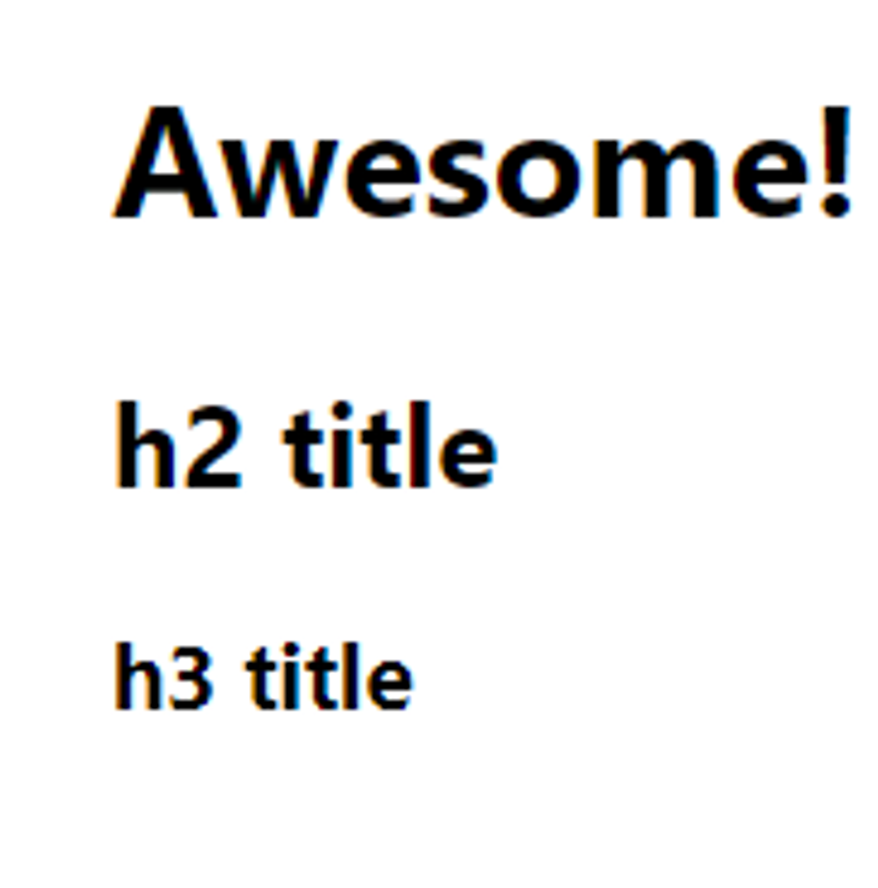
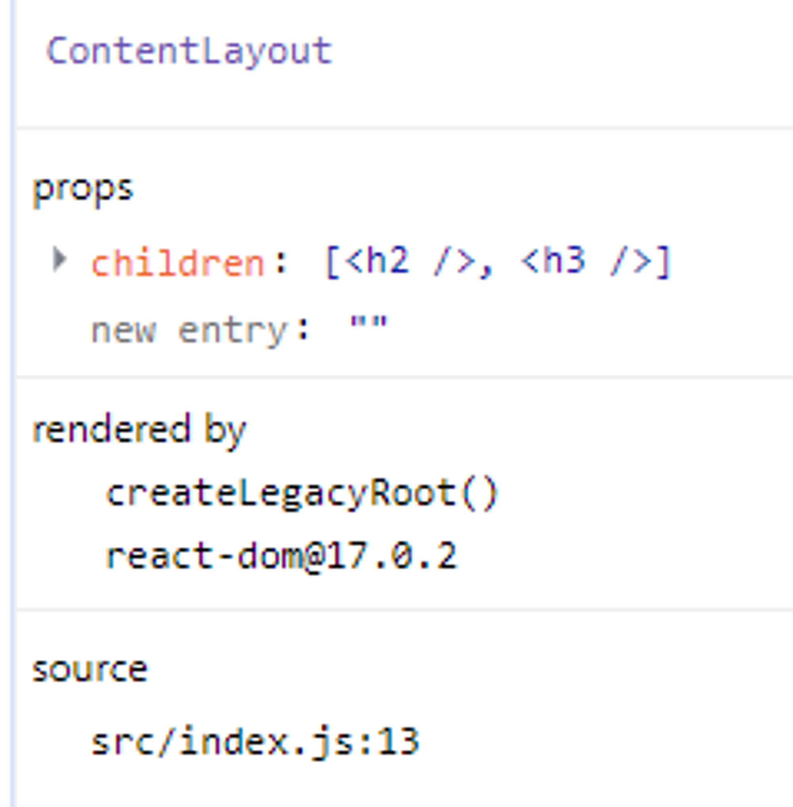
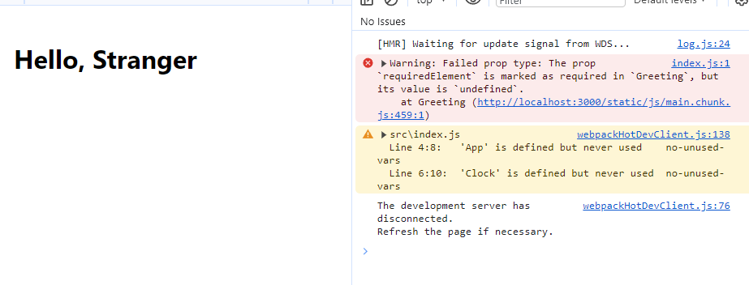

# Props

* **Read-Only**
* 所有 React 组件都必须像纯函数一样保护它们的 props 不被更改。
* 纯函数：函数不会尝试更改入参，且多次调用下相同的入参始终返回相同的结果。
* 给组件传递数据：基本类型、对象、函数、组件（react没有槽的概念）

## 特殊的Prop：children

```jsx
export default function ContentLayout(props){
  return (
    <div>
      <h1>Awesome!</h1>
      {props.children}
    </div>
  )
}

<ContentLayout>
  <h2>h2 title</h2>
  <h3>h3 title</h3>
</ContentLayout>
```





## 组件的Props校验

[Typechecking With PropTypes – React](https://legacy.reactjs.org/docs/typechecking-with-proptypes.html)

检查点：类型、必要性、默认值

类型检查库：[prop-types](https://www.npmjs.com/package/prop-types)

在类上定义静态属性：propTypes，defaultTypes

### 函数组件

```jsx
import PropTypes from 'prop-types';

function Greeting(props) {
  return (
    <h1>Hello, {props.name}</h1>
  );
}

Greeting.propTypes= {
  name: PropTypes.string,

  requiredElement: PropTypes.element.isRequired,

  optionalString: PropTypes.string,
  optionalNumber: PropTypes.number,
  optionalBool: PropTypes.bool,
  optionalArray: PropTypes.array,
  optionalObject: PropTypes.object,
  optionalFunc: PropTypes.func,

  // A React element.
  optionalElement: PropTypes.element,
  // A React element type (ie. MyComponent).
  optionalElementType: PropTypes.elementType,
}

Greeting.defaultProps= {
  name: 'Stranger'
};
```

对于函数组件，如果使用ts，可以直接定义函数的参数类型

### 类组件

```jsx
import React from 'react';
import PropTypes from 'prop-types';

export class Greeting extends React.Component {
  static propTypes = {
    name: PropTypes.string,

    requiredElement: PropTypes.element.isRequired,

    optionalString: PropTypes.string,
    optionalNumber: PropTypes.number,
    optionalBool: PropTypes.bool,
    optionalArray: PropTypes.array,
    optionalObject: PropTypes.object,
    optionalFunc: PropTypes.func,

    // A React element.
    optionalElement: PropTypes.element,
    // A React element type (ie. MyComponent).
    optionalElementType: PropTypes.elementType,
  }

  static defaultProps = {
    name: 'Stranger'
  };

  render() {
    return (
      <h1>Hello, {this.props.name}</h1>
    );
  }
}
```



## 高阶组件透传属性

```jsx
function logProps(WrappedComponent) {
  class LogProps extends React.Component {
    componentDidUpdate(prevProps) {
      console.log('old props:', prevProps);
      console.log('new props:', this.props);
    }

    render() {
      return <WrappedComponent {...this.props} />;
    }
  }

  return LogProps;
}
```


## Render Props

本质是一个函数属性，接收当前组件传入的值，返回一个组件

```jsx
import React from "react";

class Cat extends React.Component {
  render() {
    const mouse = this.props.mouse;
    return (
      
    );
  }
}

class Mouse extends React.Component {
  constructor(props) {
    super(props);
    this.handleMouseMove = this.handleMouseMove.bind(this);
    this.state = { x: 0, y: 0 };
  }

  handleMouseMove(event) {
    this.setState({
      x: event.clientX,
      y: event.clientY
    });
  }

  render() {
    return (
      <div style={{ height: '100vh' }} onMouseMove={this.handleMouseMove}>

        {/*
          Instead of providing a static representation of what <Mouse> renders,
          use the `render` prop to dynamically determine what to render.
        */}
        {this.props.render(this.state)}
      </div>
    );
  }
}

export default class MouseTracker extends React.Component {
  render() {
    return (
      <div>
        <h1>Move the mouse around!</h1>
        <Mouse render={mouse => (
          <Cat mouse={mouse} />
        )}/>
      </div>
    );
  }
}
```

```jsx
import React, { useState } from "react";

const Cat = ({ mouse }) => {
  return (
    
  );
};

const Mouse = ({ render123 }) => {
  const [mousePosition, setMousePosition] = useState({ x: 0, y: 0 });

  const handleMouseMove = (event) => {
    setMousePosition({
      x: event.clientX,
      y: event.clientY,
    });
  };

  return (
    <div style={{ height: "100vh" }} onMouseMove={handleMouseMove}>
      {render123(mousePosition)}
    </div>
  );
};

export default function MouseTracker() {
  const renderCat = (mouse) => {
    return <Cat mouse={mouse} />;
  };

  return (
    <div>
      <h1>Move the mouse around!</h1>
      <Mouse render123={renderCat} />
    </div>
  );
}
```
