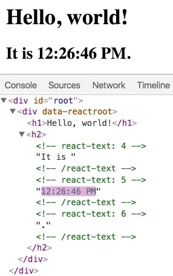

# DOM diff

```jsx
const root = ReactDOM.createRoot(document.getElementById('root'));
  
function tick() {
  const element = (
    <div>
      <h1>Hello, world!</h1>
      <h2>It is {new Date().toLocaleTimeString()}.</h2>
    </div>
  );
  root.render(element);
}

setInterval(tick, 1000);
```



每次循环，react不会重新创建整个DOM树，只会更新变化的部分！
