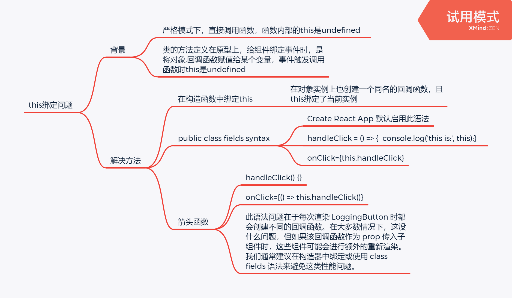

# [React](https://react.dev/)

* A JavaScript library for building user interfaces
* 一个用于构建用户界面的渐进式 JavaScript 库
* MVC中的view层

## Resources

* https://projects.wojtekmaj.pl/react-lifecycle-methods-diagram/
* https://create-react-app.dev/
* https://www.reactiflux.com/
* https://snack.expo.dev/
* https://ahooks.js.org/zh-CN/
* https://react-typescript-cheatsheet.netlify.app/
* https://piotrwitek.github.io/react-redux-typescript-guide/
* https://transform.tools/html-to-jsx


## Why

* 操作原生DOM太繁琐，效率低下

## How

* 虚拟DOM，diffing算法

* 声明式编码 -> 命令式编码

* 模块化 -> 组件化

## 安装

```html
<script src="https://cdn.bootcdn.net/ajax/libs/react/17.0.1/umd/react.development.js"></script>
<script src="https://cdn.bootcdn.net/ajax/libs/react-dom/17.0.1/umd/react-dom.development.js"></script>
<script src="https://cdn.bootcdn.net/ajax/libs/babel-standalone/7.0.0-beta.3/babel.js"></script>
```

```bash
npm init react-app my-app
# OR
yarn create react-app my-app

cd my-app
npm start
# OR
yarn start

npm run build
# OR
yarn build

# 使用 ts
npx create-react-app my-app --template typescript
```

## 核心概念

### JSX

* JavaScript XML
* A syntax extension to JavaScript.
* 在HTML中写JavaScript
* Babel 会把 JSX 转译成一个名为 React.createElement() 函数调用。
* 组件化使用 jsx 而不是模板
* 规则：
  * 只能有一个根元素，可以用根标签 \<>...\</>
  * 标签必须闭合
  * 小写字母开头，则认为是元素，大写字母开头，则认为是组件
  * className={}  onClick={}  style={{}}

* JSX 防止注入攻击

  > React DOM 在渲染所有输入内容之前，默认会进行[转义](https://stackoverflow.com/questions/7381974/which-characters-need-to-be-escaped-on-html)。它可以确保在你的应用中，永远不会注入那些并非自己明确编写的内容。所有的内容在渲染之前都被转换成了字符串。这样可以有效地防止 [XSS（cross-site-scripting, 跨站脚本）](https://en.wikipedia.org/wiki/Cross-site_scripting)攻击。

### 类式组件

* 类似JavaScript函数，它接受任意的入参（即 “props”），并返回用于描述页面展示内容的 React 元素。
* 组件由元素构成。
* 组件名称必须以大写字母开头。
* React 会将以小写字母开头的组件视为原生 DOM 标签。
* 所有 React 组件都必须像纯函数一样保护它们的 props 不被更改。纯函数：函数不会尝试更改入参，且多次调用下相同的入参始终返回相同的结果。

### 函数式组件（推荐）

* 只能用props

* 借助hook使用state

### props属性

* 给组件传递数据：基本类型、对象、函数、组件（react没有槽的概念）
* 校验：类型、必要性、默认值
* 只读，不可修改

### state属性

* 组件私有状态

* 初始化方式

  * constructor
  * public class fields syntax

* 浅合并更新

  ```js
  this.setState({})
  // 依赖于旧state
  this.setState((state)=>{})
  ```

* state改变，组件重新渲染，render方法被调用

* “自上而下”或是“单向”的数据流。任何的 state 总是所属于特定的组件，而且从该 state 派生的任何数据或 UI 只能影响树中“低于”它们的组件。

### refs属性


### 事件处理

* this绑定问题

  

* 向事件处理程序传递参数

  ```jsx
  <button onClick={(e) => this.deleteRow(id, e)}>Delete Row</button>
  <button onClick={this.deleteRow.bind(this, id)}>Delete Row</button>
  ```

* 阻止默认行为：return false没用，必须显式调用 e.preventDefault()

* 约定：事件处理函数名使用小写驼峰

### 条件渲染

* if
* 三目运算符
* 与运算符（不需要else的话）
* 阻止组件渲染：让 render 方法直接返回 null，而不进行任何渲染。

### 列表和key

* 在 map() 方法中的元素需要设置 key 属性
* 注意：
  * 尽量不要使用索引作为key
  * 没有指定key时，react会使用索引作为key

### 生命周期

| 阶段                 | 任务                     |
| -------------------- | ------------------------ |
| componentDidMount    | 发送网络请求、开启定时器 |
| componentWillUnmount | 闭定时器                 |

### 表单

* 受控组件
  * 组件的值受控于state，同时用户输入触发state变更
  * 受控输入空值
* 非受控组件
  * state与组件的值不同步

## 高级指引

### 组件通信

* 组件之间的关系：父子、兄弟、祖孙
* 通信方式：
  * props(children,render)；
  * pub-sb：消息订阅发布
  * redux：集中式
  * context：生产者、消费者模式

## 

### context

### hooks

### Ajax


## 路由


## 虚拟DOM

* 本质是普通js对象，通过 `React.createElement` 创建
* 虚拟dom比较轻量，没有真实dom那么多的属性
* 虚拟dom最终会被转换成真实dom，渲染到页面上


### diffing算法


## 部署

* 部署在网站非根路径，修改 `package.json`， 增加一行 `"homepage": "/react-deploy-gh-pages",`


You can only call Hooks at the top of your components (or other Hooks).
Why do multiple JSX tags need to be wrapped?

JSX looks like HTML, but under the hood it is transformed into plain JavaScript objects. You can’t return two objects from a function without wrapping them into an array. This explains why you also can’t return two JSX tags without wrapping them into another tag or a Fragment.
