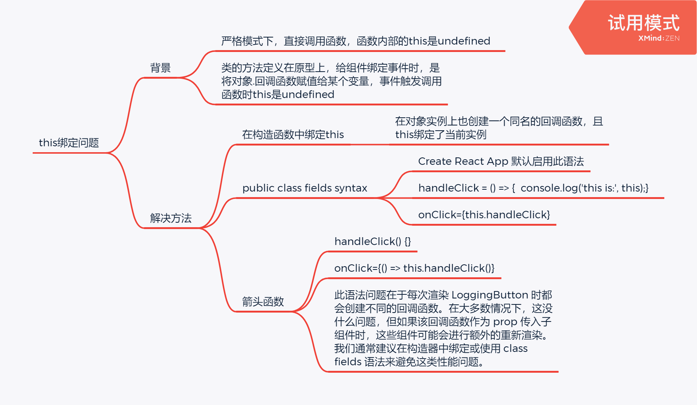

# this绑定问题



## 解决方法一

```jsx
class Toggle extends React.Component {
  constructor(props) {
    super(props);
    this.state = {isToggleOn: true};

    // This binding is necessary to make `this` work in the callback
    this.handleClick = this.handleClick.bind(this);
  }

  handleClick() {
    this.setState(prevState => ({
      isToggleOn: !prevState.isToggleOn
    }));
  }

  render() {
    return (
      <button onClick={this.handleClick}>
        {this.state.isToggleOn ? 'ON' : 'OFF'}
      </button>
    );
  }
}
```

## 解决方法二（推荐）

```jsx
class Toggle extends React.Component {
  state= {isToggleOn: true};
  // This syntax ensures `this` is bound within handleClick.
  handleClick = () => {
    this.setState(prevState=> ({
      isToggleOn: !prevState.isToggleOn
    }));
  }

  render() {
    return (
      <button onClick={this.handleClick}>
        {this.state.isToggleOn ? 'ON' : 'OFF'}
      </button>
    );
  }
}
```

## 解决方法三

```jsx
class Toggle extends React.Component {
  state= {isToggleOn: true};
  handleClick() {
    this.setState(prevState=> ({
      isToggleOn: !prevState.isToggleOn
    }));
  }

  render() {
    return (
      // This syntax ensures `this` is bound within handleCli
      <button onClick={() => this.handleClick()}>
        {this.state.isToggleOn ? 'ON' : 'OFF'}
      </button>
    );
  }
}

```
