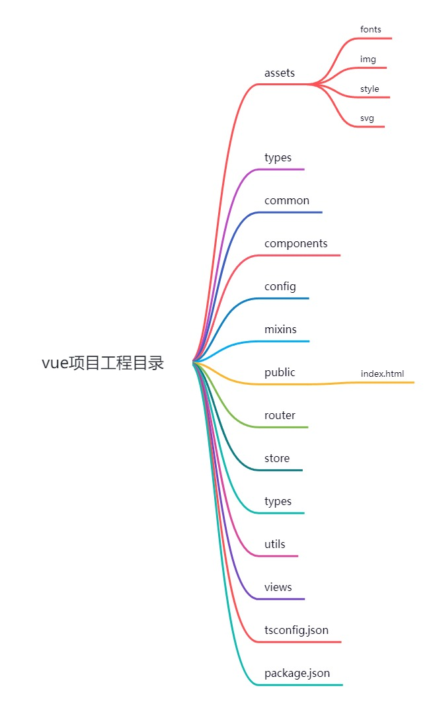

# [Vue2](https://v2.vuejs.org/)

## Resources

* [Vue Router](https://v3.router.vuejs.org/)
* [Vue Devtools](https://devtools.vuejs.org/)


## UI

* [Element](https://element.eleme.cn/#/zh-CN)  饿了么
* [Ant Design](https://1x.antdv.com/docs/vue/introduce-cn/)  阿里
* [Vant UI](https://vant-contrib.gitee.io/vant/v2/#/zh-CN/)  有赞
* [Cube UI](https://didi.github.io/cube-ui/#/zh-CN)  滴滴

## 部分语法

### v-model修饰符

```html
<!-- 在“change”时而非“input”时更新 -->
<input v-model.lazy="msg">

<input v-model.number="age" type="number">

<input v-model.trim="msg">
```

自定义prop验证函数

```js
export default {
    props: {
        status: {
          validator(value) {
            // 这个值必须匹配下列字符串中的一个
            return ['success', 'warning', 'danger'].includes(value)
          }
        }
    }
}
```

### 自定义组件的 `v-model`

一个组件上的 v-model 默认会利用名为 value 的 prop 和名为 input 的事件，但是像单选框、复选框等类型的输入控件可能会将 value attribute 用于不同的目的。model 选项可以用来避免这样的冲突：

```js
Vue.component('base-checkbox', {
  model: {
    prop: 'checked',
    event: 'change'
  },
  props: {
    checked: Boolean
  },
  template: `
    <input
      type="checkbox"
      v-bind:checked="checked"
      v-on:change="$emit('change', $event.target.checked)"
    >
  `
})
```


```html
<text-document
  :title="doc.title"
  @update:title="doc.title = $event"
></text-document>

<text-document :title.sync="doc.title"></text-document>
```

```js
this.$emit('update:title', newTitle)
```


### 事件修饰符

```html
<!-- 阻止单击事件继续传播 -->
<a v-on:click.stop="doThis"></a>

<!-- 提交事件不再重载页面 -->
<form v-on:submit.prevent="onSubmit"></form>

<!-- 修饰符可以串联 -->
<a v-on:click.stop.prevent="doThat"></a>

<!-- 只有修饰符 -->
<form v-on:submit.prevent></form>

<!-- 添加事件监听器时使用事件捕获模式 -->
<!-- 即内部元素触发的事件先在此处理，然后才交由内部元素进行处理 -->
<div v-on:click.capture="doThis">...</div>

<!-- 只当在 event.target 是当前元素自身时触发处理函数 -->
<!-- 即事件不是从内部元素触发的 -->
<div v-on:click.self="doThat">...</div>

<!-- 点击事件将只会触发一次 -->
<a v-on:click.once="doThis"></a>

<!-- 滚动事件的默认行为 (即滚动行为) 将会立即触发 -->
<!-- 而不会等待 `onScroll` 完成  -->
<!-- 这其中包含 `event.preventDefault()` 的情况 -->
<!-- 提升移动端的性能 -->
<div v-on:scroll.passive="onScroll">...</div>
```

### 表单输入绑定


注册组件

```js
Vue.component('todo-item', {
  props: ['todo'],
  template: '<li>{{ todo.text }}</li>'
})
```

## 生命周期图示


## vue项目工程目录




## 安全

你的站点上动态渲染的任意 HTML 可能会非常危险，因为它很容易导致 [XSS 攻击](https://en.wikipedia.org/wiki/Cross-site_scripting)。请只对可信内容使用 HTML 插值，**绝不要**对用户提供的内容使用插值。


**始终使用 kebab-case 的事件名**。
