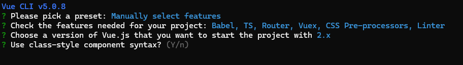
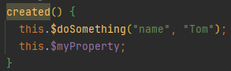

# [Vue + Typescript](https://v2.vuejs.org/v2/guide/typescript.html)

通过vue cli创建项目时可以选择是否使用类组件



Use Babel alongside TypeScript (required for modern mode, auto-detected polyfills, transpiling JSX)? Yes

## object-styled-component

代码：https://github.com/zlx01/vue2-ts-object-styled-component

Home.vue

使用 `Vue.component` 或 `Vue.extend` 定义组件

```html
<script lang="ts">
import Vue from "vue";
import HelloWorld from "@/components/HelloWorld.vue"; // @ is an alias to /src

export default Vue.extend({
  name: "Home",
  components: {
    HelloWorld,
  },
});
</script>
```

## class-styled-component

代码：https://github.com/zlx01/vue2-ts-class-styled-component

Home.vue

使用 [vue-property-decorator](https://github.com/kaorun343/vue-property-decorator) 装饰器，基于官方维护的 [vue-class-component](https://github.com/vuejs/vue-class-component) 装饰器

```html
<script lang="ts">
import { Component, Vue } from "vue-property-decorator";
import HelloWorld from "@/components/HelloWorld.vue"; // @ is an alias to /src

@Component({
  components: {
    HelloWorld,
  },
})
export default class Home extends Vue {}
</script>
```

## tsconfig.json

```json
{
  "compilerOptions": {
    "target": "esnext",
    "module": "esnext",
    "strict": true,
    "jsx": "preserve",
    "importHelpers": true,
    "moduleResolution": "node",
    "experimentalDecorators": true,
    "skipLibCheck": true,
    "esModuleInterop": true,
    "allowSyntheticDefaultImports": true,
    "sourceMap": true,
    "baseUrl": ".",
    "types": [
      "webpack-env"
    ],
    "paths": {
      "@/*": [
        "src/*"
      ]
    },
    "lib": [
      "esnext",
      "dom",
      "dom.iterable",
      "scripthost"
    ]
  },
  "include": [
    "src/**/*.ts",
    "src/**/*.tsx",
    "src/**/*.vue",
    "tests/**/*.ts",
    "tests/**/*.tsx"
  ],
  "exclude": [
    "node_modules"
  ]
}
```

## Vue类型补充定义

shims-vue.d.ts

```ts
declare module "*.vue" {
  import Vue from "vue";
  export default Vue;
}
```

shims-tsx.d.ts

```ts
import Vue, { VNode } from "vue";

declare global {
  namespace JSX {
    // tslint:disable no-empty-interface
    interface Element extends VNode {}
    // tslint:disable no-empty-interface
    interface ElementClass extends Vue {}
    interface IntrinsicElements {
      [elem: string]: any;
    }
  }
}
```

如果需要在Vue添加全局属性或方法，新建 `vue-prototype.d.ts`【详见ts[模块补充 (module augmentation)](https://www.typescriptlang.org/docs/handbook/declaration-merging.html#module-augmentation)】

```ts
// 1. 确保在声明补充的类型之前导入 'vue'
import { Vue } from 'vue-property-decorator'

// 2. 定制一个文件，设置你想要补充的类型
// 在 types/vue.d.ts 里 Vue 有构造函数类型
declare module 'vue/types/vue' {
  // 3. 声明为 Vue 补充的东西
  interface Vue {
    $myProperty: string
    $doSomething: (key: string, value: string) => void
  }
}
```

定义一下

```ts
import Vue from "vue";

Vue.prototype.$myProperty = "A property from Vue.prototype";
Vue.prototype.$doSomething = (key: string, value: string) => {
  console.log(`Do something with ${key} and ${value}`);
};
```

然后就可以在vue文件中正常访问了



## [Vue Class Component](https://class-component.vuejs.org/)

```ts
import { Component, Vue } from "vue-property-decorator";

@Component
export default class HelloWorld extends Vue {
  // Declared as component data
  message1 = "Hello World!";
  // if the initial value is undefined, the class property will not be reactive which means the changes for the properties will not be detected
  // `message2` will not be reactive value
  message2 = undefined;
  // `message3` will be reactive with `null` value
  message3 = null;
  data() {
    return {
      // `message4` will be reactive as it is declared via `data` hook.
      message4: undefined,
    };
  }

  firstName = "John";
  lastName = "Doe";

  // Declared as computed property getter
  get name(): string {
    return this.firstName + " " + this.lastName;
  }

  // Declared as computed property setter
  set name(value: string) {
    const splitted = value.split(" ");
    this.firstName = splitted[0];
    this.lastName = splitted[1] || "";
  }

  // Declare mounted lifecycle hook
  created() {
    console.log("created");
  }
  mounted() {
    console.log("mounted");
  }
  beforeDestroy() {
    console.log("beforeDestroy");
  }
}
```

### Custom Decorators

decorator.ts

```ts
import { createDecorator } from "vue-class-component";

// Declare Log decorator.
export const Log = createDecorator((options, key) => {
  if (!options.methods) {
    return;
  }
  // Keep the original method for later.
  const originalMethod = options.methods[key];

  // Wrap the method with the logging logic.
  options.methods[key] = function wrapperMethod(...args) {
    // Print a log.
    console.log(`Invoked: ${key}(`, ...args, ")");

    // Invoke the original method.
    originalMethod.apply(this, args);
  };
});
```

```ts
import { Log } from "@/utils/decorator";

export default class HelloWorld extends Vue {
  @Log
  echo(name: string): string {
    return name;
  }
}
```

### Extend and Mixins

mixins.ts

```ts
import Vue from 'vue'
import Component from 'vue-class-component'

// You can declare mixins as the same style as components.
@Component
export class Hello extends Vue {
  hello = 'Hello'
}

@Component
export class World extends Vue {
  world = 'World'
}
```

```ts
import Component, { mixins } from 'vue-class-component'
import { Hello, World } from './mixins'

// Use `mixins` helper function instead of `Vue`.
// `mixins` can receive any number of arguments.
@Component
export class HelloWorld extends mixins(Hello, World) {
  created () {
    console.log(this.hello + ' ' + this.world + '!') // -> Hello World!
  }
}
```

### Caveats of Class Component

```ts
  // DO NOT do this
  bar = () => {
    // Does not update the expected property.
    // `this` value is not a Vue instance in fact.
    this.foo = 456
  }
  
  // DO NOT do this
  constructor() {
    fetch('/posts.json')
      .then(res => res.json())
      .then(posts => {
        this.posts = posts
      })
  }
```

### `$refs` Type Extension

```html
<template>
  <input ref="input">
</template>

<script lang="ts">
import Vue from 'vue'
import Component from 'vue-class-component'

@Component
export default class InputFocus extends Vue {
  // annotate refs type.
  // The symbol `!` (definite assignment assertion)
  // is needed to get rid of compilation error.
  $refs!: {
    input: HTMLInputElement
  }

  mounted() {
    // Use `input` ref without type cast.
    this.$refs.input.focus()
  }
}
</script>
```

## [Vue Property Decorator](https://github.com/kaorun343/vue-property-decorator)

### @Prop

```ts
@Prop(Number) readonly propA: number | undefined;
@Prop({ default: "default value" }) readonly propB!: string;
@Prop([String, Boolean]) readonly propC: string | boolean | undefined;

// 简化，根据ts类型推断
@Prop() readonly msg!: string;
```

### @PropSync

```ts
@Component
export default class YourComponent extends Vue {
  @PropSync('name', { type: String }) syncedName!: string
}

export default {
  props: {
    name: {
      type: String,
    },
  },
  computed: {
    syncedName: {
      get() {
        return this.name
      },
      set(value) {
        this.$emit('update:name', value)
      },
    },
  },
}
```

```html
<custom-input5 :text.sync="searchText5"></custom-input5>

<template>
  <input type="text" v-model="innerValue" />
</template>

<script lang="ts">
import { Component, PropSync, Vue } from "vue-property-decorator";

@Component
export default class CustomInput5 extends Vue {
  @PropSync("text", { type: String })
  innerValue!: string;
}
</script>
```

### @VModel

```ts
@Component
export default class YourComponent extends Vue {
  @VModel({ type: String }) name!: string
}

export default {
  props: {
    value: {
      type: String,
    },
  },
  computed: {
    name: {
      get() {
        return this.value
      },
      set(value) {
        this.$emit('input', value)
      },
    },
  },
}
```

### @Model

```ts
@Component
export default class YourComponent extends Vue {
  @Model('change', { type: Boolean }) readonly checked!: boolean
}

export default {
  model: {
    prop: 'checked',
    event: 'change',
  },
  props: {
    checked: {
      type: Boolean,
    },
  },
}
```

### @ModelSync

```ts
@Component
export default class YourComponent extends Vue {
  @ModelSync('checked', 'change', { type: Boolean })
  readonly checkedValue!: boolean
}

export default {
  model: {
    prop: 'checked',
    event: 'change',
  },
  props: {
    checked: {
      type: Boolean,
    },
  },
  computed: {
    checkedValue: {
      get() {
        return this.checked
      },
      set(value) {
        this.$emit('change', value)
      },
    },
  },
}
```

### @Emit

```ts
@Component
export default class YourComponent extends Vue {
  count = 0

  @Emit()
  addToCount(n: number) {
    this.count += n
  }

  @Emit('reset')
  resetCount() {
    this.count = 0
  }

  @Emit()
  returnValue() {
    return 10
  }

  @Emit()
  onInputChange(e) {
    return e.target.value
  }

  @Emit()
  promise() {
    return new Promise((resolve) => {
      setTimeout(() => {
        resolve(20)
      }, 0)
    })
  }
}

export default {
  data() {
    return {
      count: 0,
    }
  },
  methods: {
    addToCount(n) {
      this.count += n
      this.$emit('add-to-count', n)
    },
    resetCount() {
      this.count = 0
      this.$emit('reset')
    },
    returnValue() {
      this.$emit('return-value', 10)
    },
    onInputChange(e) {
      this.$emit('on-input-change', e.target.value, e)
    },
    promise() {
      const promise = new Promise((resolve) => {
        setTimeout(() => {
          resolve(20)
        }, 0)
      })

      promise.then((value) => {
        this.$emit('promise', value)
      })
    },
  },
}
```

### @Watch

```ts
@Component
export default class YourComponent extends Vue {
  @Watch('child')
  onChildChanged(val: string, oldVal: string) {}

  @Watch('person', { immediate: true, deep: true })
  onPersonChanged1(val: Person, oldVal: Person) {}

  @Watch('person')
  onPersonChanged2(val: Person, oldVal: Person) {}

  @Watch('person')
  @Watch('child')
  onPersonAndChildChanged() {}
}
```

### @Ref

```ts
import { Vue, Component, Ref } from 'vue-property-decorator'

import AnotherComponent from '@/path/to/another-component.vue'

@Component
export default class YourComponent extends Vue {
  @Ref() readonly anotherComponent!: AnotherComponent
  @Ref('aButton') readonly button!: HTMLButtonElement
}

export default {
  computed() {
    anotherComponent: {
      cache: false,
      get() {
        return this.$refs.anotherComponent as AnotherComponent
      }
    },
    button: {
      cache: false,
      get() {
        return this.$refs.aButton as HTMLButtonElement
      }
    }
  }
}
```

### @Provide/@Inject

```ts
import { Component, Inject, Provide, Vue } from 'vue-property-decorator'

@Component
export class MyComponent extends Vue {
  // 当前组件的data会多一个 foo 和 barr
  @Provide() foo = "foo value";
  @Provide("bar") barr = "bar value";
}

export const MyComponent = Vue.extend({
  data() {
    return {
      foo: 'foo value',
      barr: 'bar value',
    }
  },
  provide() {
    return {
      foo: this.foo,
      bar: this.barr,
    }
  },
})
```

```ts
@Component
export class MyComponent extends Vue {
  @Inject() readonly foo!: string;
  // 从bar注入
  @Inject("bar") readonly barrr!: string;
  // 可以设置默认值，如果没有找到对应的provide，就会使用默认值
  @Inject({ from: "optional", default: "default value" })
  readonly optional!: string;
}

export const MyComponent = Vue.extend({
  inject() {
    foo: 'foo',
    barrr: 'bar',
    optional: { from: 'optional', default: 'default value' },
  },
})
```

### @ProvideReactive

>  `provide` 和 `inject` 绑定并不是可响应的。这是刻意为之的。然而，如果你传入了一个可监听的对象，那么其对象的 property 还是可响应的。

```ts
  @ProvideReactive()
  phone = "18611111111";

  @InjectReactive() phone!: string;
```

### Demo1: CustomInput

```html
<custom-input v-model="searchText"></custom-input>
```

通常做法1：使用 v-model 的本质等于 value + input

```html
<template>
  <input type="text" :value="value" @input="onInput" />
</template>

<script lang="ts">
import { Component, Emit, Prop, Vue } from "vue-property-decorator";

@Component
export default class CustomInput1 extends Vue {
  @Prop()
  readonly value!: string;

  @Emit("input")
  onInput(event: InputEvent): string {
    return (event.target as HTMLInputElement).value;
  }
}
</script>
```

通常做法2：使用 computed 的 get 和 set

```html
<template>
  <input type="text" v-model="_value" />
</template>

<script lang="ts">
import { Component, Prop, Vue } from "vue-property-decorator";

@Component
export default class CustomInput2 extends Vue {
  @Prop({ type: String, default: "" })
  readonly value!: string;

  get _value(): string {
    return this.value;
  }

  // 这里不能用 @Emit("input")，因为 set 不能返回值
  set _value(val: string) {
    this.$emit("input", val);
  }
}
</script>
```

使用 @ModelSync

```html
<template>
  <input type="text" v-model="innerValue" />
</template>

<script lang="ts">
import { Component, ModelSync, Vue } from "vue-property-decorator";

@Component
export default class CustomInput3 extends Vue {
  @ModelSync("value", "input", { type: String, default: "" })
  innerValue!: string;
}
</script>
```

使用 @VModel

```html
<template>
  <input type="text" v-model="innerValue" />
</template>

<script lang="ts">
import { Component, VModel, Vue } from "vue-property-decorator";

@Component
export default class CustomInput4 extends Vue {
  @VModel({ type: String })
  innerValue!: string;
}
</script>
```

### Demo2: CustomCheckbox

```html
<custom-checkbox v-model="checked"></custom-checkbox>
```

options对象写法

```html
<template>
  <input
    type="checkbox"
    :checked="checked"
    @change="$emit('change', $event.target.checked)"
  />
</template>

<script>
export default {
  name: "CustomCheckbox1",
  model: {
    prop: "checked",
    event: "change",
  },
  props: {
    checked: {
      type: Boolean,
    },
  },
};
</script>
```

使用 @Model

```html
<template>
  <input type="checkbox" :checked="checked" @change="onChange" />
</template>

<script lang="ts">
import { Component, Emit, Model, Vue } from "vue-property-decorator";

@Component
export default class CustomCheckbox2 extends Vue {
  @Model("change", { type: Boolean })
  readonly checked!: boolean;

  @Emit("change")
  onChange(event: InputEvent): boolean {
    return (event.target as HTMLInputElement).checked;
  }
}
</script>
```

使用 @ModelSync

```html
<template>
  <input type="checkbox" v-model="checkedValue" />
</template>

<script lang="ts">
import { Component, ModelSync, Vue } from "vue-property-decorator";

@Component
export default class CustomCheckbox3 extends Vue {
  @ModelSync("checked", "change", { type: Boolean })
  private checkedValue!: boolean;
}
</script>
```

## vuex-class

```ts
import Vue from "vue";
import Vuex from "vuex";

Vue.use(Vuex);

export default new Vuex.Store({
  state: {
    count: 0,
  },
  getters: {
    doubleCount(state) {
      return state.count * 2;
    },
  },
  mutations: {
    increment(state) {
      state.count++;
    },
  },
  actions: {
    incrementAsync(context) {
      setTimeout(() => {
        context.commit("increment");
      }, 1000);
    },
  },
  modules: {
    account: {
      state: {
        name: "Alice",
      },
      mutations: {
        setName(state, name) {
          state.name = name;
        },
      },
      actions: {
        setNameAsync(context, name) {
          setTimeout(() => {
            context.commit("setName", name);
          }, 1000);
        },
      },
    },
    login: {
      namespaced: true,
      state: {
        isLogin: false,
      },
      mutations: {
        login(state) {
          state.isLogin = true;
        },
        logout(state) {
          state.isLogin = false;
        },
      },
      actions: {
        loginAsync(context) {
          setTimeout(() => {
            context.commit("login");
          }, 1000);
        },
        logoutAsync(context) {
          setTimeout(() => {
            context.commit("logout");
          }, 1000);
        },
      },
    },
  },
});
```

```html
<script lang="ts">
import { Vue, Component } from "vue-property-decorator";
import { Action, Getter, Mutation, namespace, State } from "vuex-class";

const Login = namespace("login");

@Component({})
export default class VuexTest extends Vue {
  @State("count") count!: number;

  @Getter("doubleCount") doubleCount!: number;

  @Mutation("increment") increment!: () => void;

  @Action("incrementAsync") incrementAsync!: () => void;

  // region account 没有使用 namespace，绑定失败，有bug？
  @State("name") name!: string;

  @Mutation("setName") setName!: (name: string) => void;

  @Action("setNameAsync") setNameAsync!: (name: string) => void;
  // endregion

  @Login.State("isLogin") isLogin!: boolean;

  @Login.Mutation("login") login!: () => void;

  @Login.Action("loginAsync") loginAsync!: () => void;

  @Login.Mutation("logout") logout!: () => void;

  @Login.Action("logoutAsync") logoutAsync!: () => void;
}
</script>
```


## tsx

```ts
render(): VNode {
    return <div>Hello World!</div>;
}
```

