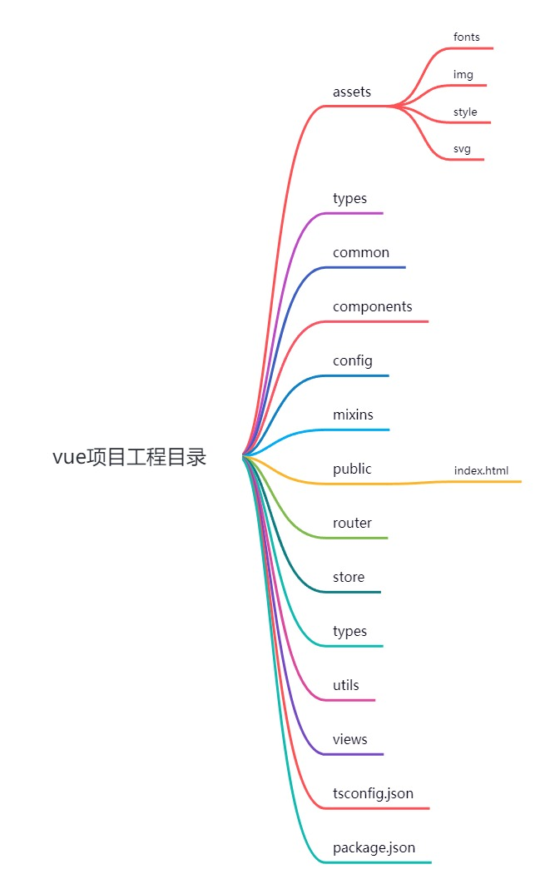
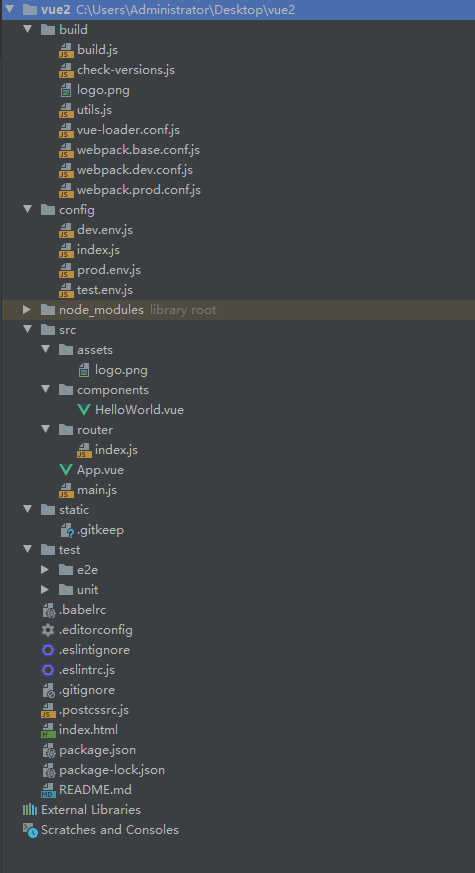

# [Vue CLI](https://cli.vuejs.org/)

> Vue CLI is in Maintenance Mode!
>
> For new projects, please use [create-vue](https://github.com/vuejs/create-vue) to scaffold [Vite](https://vitejs.dev/)-based projects. Also refer to the [Vue 3 Tooling Guide](https://vuejs.org/guide/scaling-up/tooling.html) for the latest recommendations.

Install:

```sh
npm install -g @vue/cli
# OR
yarn global add @vue/cli
```

Check version:

```sh
vue -V
# OR
vue --version
```

Update:

```sh
npm update -g @vue/cli
# OR
yarn global upgrade --latest @vue/cli
```

Create a project:

```sh
vue create my-project
# OR
vue ui
```

Installing Plugins in an Existing Project

```sh
vue add vue-router
vue add vuex
vue add eslint
```

## WebStorm创建Vue项目

- npx --package @vue/cli vue 是局部安装vue-cli
- 可以取消勾选使用默认项目配置babel、eslint，在命令行窗口自定义项目配置


## vue项目工程目录




## HTML 和静态资源

* 模板插值：除了被 html-webpack-plugin 暴露的默认值之外，所有客户端环境变量也可以直接使用。
* resouce hint: preload  prefetch
* 放置在 public 目录下或通过绝对路径被引用。这类资源将会直接被拷贝，而不会经过 webpack 的处理。需要通过绝对路径来引用它们。如果应用没有部署在根路径，引用时需要加上前缀：
  * html  `<%= BASE_URL %>`
  * template  `process.env.BASE_URL`

## CSS预处理器

```bash
# Sass
npm install -D sass-loader node-sass

# Less
npm install -D less-loader less

# Stylus
npm install -D stylus-loader stylus
```

> PostCSS, Autoprefixer and CSS Modules are supported by default

## 调整 webpack 配置

```js
// vue.config.js
module.exports = {
  configureWebpack: {
    plugins: [
      new MyAwesomeWebpackPlugin()
    ]
  }
  // 需要区分环境
  configureWebpack: config => {
    if (process.env.NODE_ENV === 'production') {
      // 为生产环境修改配置...
    } else {
      // 为开发环境修改配置...
    }
  }
  // 链式调用  
  chainWebpack: config => {
     config.module
      .rule('vue')
      .use('vue-loader')
        .tap(options => {
          // 修改它的选项...
          return options
        }) 
  }
}
```

## 模式和环境变量

### 模式

* `development` 模式用于 `vue-cli-service serve`
* `test` 模式用于 `vue-cli-service test:unit`
* `production` 模式用于 `vue-cli-service build` 和 `vue-cli-service test:e2e`

当运行 `vue-cli-service` 命令时，所有的环境变量都从对应的[环境文件](https://cli.vuejs.org/zh/guide/mode-and-env.html#环境变量)中载入。如果文件内部不包含 `NODE_ENV` 变量，它的值将取决于模式。

### 配置文件

> .env                # 在所有的环境中被载入
> .env.[mode]         # 只在指定的模式中被载入

### 使用环境变量

只有 `NODE_ENV`，`BASE_URL` 和以 `VUE_APP_` 开头的变量将通过 `webpack.DefinePlugin` 静态地嵌入到客户端侧的代码中。这是为了避免意外公开机器上可能具有相同名称的私钥。

* `NODE_ENV` - 会是 `"development"`、`"production"` 或 `"test"` 中的一个。取决于应用运行的模式。
* `BASE_URL` - 会和 `vue.config.js` 中的 `publicPath` 选项相符，即你的应用会部署到的基础路径。

## 部署

通常都是部署到nginx上，参考[指引](https://cli.vuejs.org/zh/guide/deployment.html#docker-nginx)

## vue.config.js

* publicPath，默认 /，部署在非根路径时需要配置

* configureWebpack，配置webpack

  ```js
    configureWebpack: {
      resolve: {
        alias: {
          assets: "@/assets",
        },
      },
    },
  ```

* chainWebpack，配置webpack

  ```js
    chainWebpack: (config) => {
      config.resolve.alias.set("assets", path.join(__dirname, "src/assets"));
    },
  ```

* devServer，配置代理，跨域

  ```js
    devServer: {
      proxy: {
        '/api': {
          target: '<url>',
          ws: true,
          changeOrigin: true
        },
        '/foo': {
          target: '<other_url>'
        }
      }
    }
  ```


## Migrate from Vue CLI to Vite

* https://github.com/zlx01/vue-cli-2-vite

## vue-cli@2.9.6项目结构


