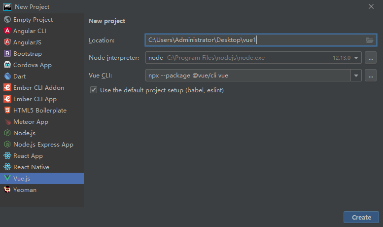
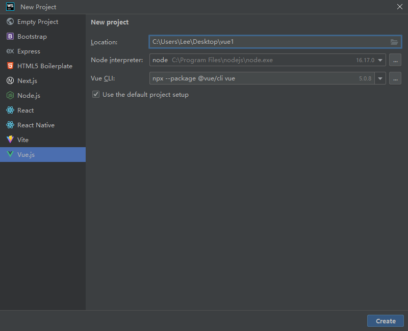
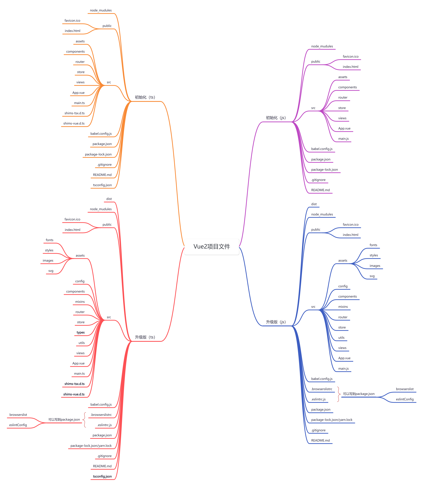

# [Vue CLI](https://cli.vuejs.org/)

> 🛠️ Standard Tooling for Vue.js Development

:::warning
Vue CLI is in Maintenance Mode!
:::

思维导图：https://www.processon.com/view/link/67cd59ab8e76b629773737cf?cid=66d30df82a28ba0777bf6ea8

## Installation

```sh
npm install -g @vue/cli
# OR
yarn global add @vue/cli
```

### Check version

```sh
vue -V
# OR
vue --version
```

### Upgrading

```sh
npm update -g @vue/cli
# OR
yarn global upgrade --latest @vue/cli
```

### preset

* a JSON object that contains pre-defined options and plugins
* `~/.vuerc`

## Usage

Create a project:

```sh
vue create my-project
# OR
vue ui
```

Installing Plugins in an Existing Project

```sh
vue add vue-router
vue add vuex
vue add eslint
```

## WebStorm创建Vue项目

- `npx --package @vue/cli vue` 是局部安装`vue cli`
- 可以取消勾选使用默认项目配置（babel、eslint），在命令行窗口自定义项目配置





## Vue项目文件



https://www.processon.com/view/link/66f04ee2d587e65a53d81de8?cid=66dc1b3081a15819c9014521

## vue-cli-service

入口文件默认是 `src/main.js` 或者 `src/main.ts`，可以指定别的入口文件

```bash
vue-cli-service serve ./src/dev.js
vue-cli-service build ./src/main.js
```

## HTML and Static Assets

* 模板插值：除了被 html-webpack-plugin 暴露的默认值之外，所有客户端环境变量也可以直接使用。
* resource hint: preload  prefetch
* 放置在 public 目录下或通过绝对路径被引用。这类资源将会直接被拷贝，而不会经过 webpack 的处理。需要通过绝对路径来引用它们。如果应用没有部署在根路径，引用时需要加上前缀：
  * html  `<%= BASE_URL %>`
  * template  `process.env.BASE_URL`
* index.html 会带有注入的资源和 resource hint
* 第三方库会被分到一个独立包以便更好的缓存
* 小于 8KiB 的静态资源会被内联在 JavaScript 中
* public 中的静态资源会被复制到输出目录中

## CSS Pre-Processors

```bash
# Sass
npm install -D sass-loader sass

# Less
npm install -D less-loader less

# Stylus
npm install -D stylus-loader stylus
```

> PostCSS, Autoprefixer and CSS Modules are supported by default

## Working with Webpack

```js
// vue.config.js
module.exports = {
  configureWebpack: {
    plugins: [
      new MyAwesomeWebpackPlugin()
    ]
  }
  // 需要区分环境
  configureWebpack: config => {
    if (process.env.NODE_ENV === 'production') {
      // 为生产环境修改配置...
    } else {
      // 为开发环境修改配置...
    }
  }
  // 链式调用  
  chainWebpack: config => {
     config.module
      .rule('vue')
      .use('vue-loader')
        .tap(options => {
          // 修改它的选项...
          return options
        }) 
  }
}
```

## Modes and Environment Variables

### Mode

* `development` 模式用于 `vue-cli-service serve`
* `test` 模式用于 `vue-cli-service test:unit`
* `production` 模式用于 `vue-cli-service build` 和 `vue-cli-service test:e2e`

当运行 `vue-cli-service` 命令时，所有的环境变量都从对应的[环境文件](https://cli.vuejs.org/zh/guide/mode-and-env.html#环境变量)中载入。如果文件内部不包含 `NODE_ENV` 变量，它的值将取决于模式。

### Configuration File

> .env                # 在所有的环境中被载入
> .env.[mode]         # 只在指定的模式中被载入

### Use Environment Variables

只有 `NODE_ENV`，`BASE_URL` 和以 `VUE_APP_` 开头的变量将通过 `webpack.DefinePlugin` 静态地嵌入到客户端侧的代码中。这是为了避免意外公开机器上可能具有相同名称的私钥。

* `NODE_ENV` - 会是 `"development"`、`"production"` 或 `"test"` 中的一个。取决于应用运行的模式。
* `BASE_URL` - 会和 `vue.config.js` 中的 `publicPath` 选项相符，即你的应用会部署到的基础路径。

## Browser Compatibility

### @vue/babel-preset-app

* babel-preset-env
* JSX 支持
* browserslist
* useBuiltIns: 'usage'

* 如果该依赖基于一个目标环境不支持的 ES 版本撰写: 将其添加到 vue.config.js 中的 transpileDependencies 选项。

* 如果该依赖交付了 ES5 代码并显式地列出了需要的 polyfill

  ```js
  // babel.config.js
  module.exports = {
    presets: [
      ['@vue/app', {
        polyfills: [
          'es.promise',
          'es.symbol'
        ]
      }]
    ]
  }
  ```

  

* 如果该依赖交付 ES5 代码，但使用了 ES6+ 特性且没有显式地列出需要的 polyfill

  * useBuiltIns: 'entry'
  * 在入口文件添加 import 'core-js/stable'; import 'regenerator-runtime/runtime';
  * 这会根据 browserslist 目标导入所有 polyfill
  * 因为包含了一些没有用到的 polyfill 所以最终的包大小可能会增加

### Modern Mode

* vue-cli-service build --modern
* 一个现代版的包，面向支持 ES modules 的现代浏览器，另一个旧版的包，面向不支持的旧浏览器。
* 现代版的包会通过 \<script type="module"> 在被支持的浏览器中加载；它们还会使用 \<link rel="modulepreload"> 进行预加载。
* 旧版的包会通过 \<script nomodule> 加载，并会被支持 ES modules 的浏览器忽略。
* \<script type="module"> 需要配合始终开启的 CORS 进行加载。这意味着你的服务器必须返回诸如 Access-Control-Allow-Origin: * 的有效的 CORS 头。

## Build Targets

### App

* `index.html` with asset and resource hints injection
* vendor libraries split into a separate chunk for better caching
* static assets under 8KiB are inlined into JavaScript
* static assets in `public` are copied into output directory

### Library

* `vue-cli-service build --target lib --name myLib [entry]`
* `dist/myLib.common.js`
* `dist/myLib.umd.js`
* `dist/myLib.umd.min.js`
* `dist/myLib.css`
* 请注意导入 CSS 是具有副作用的。请确保在 package.json 中移除 "sideEffects": false，否则 CSS 代码块会在生产环境构建时被 webpack 丢掉。
* 给 @vue/babel-preset-app 传入 useBuiltIns: false 选项。打包 polyfills 应当是最终使用你的库的应用的责任。 


## Deployment

* Nginx
* GitHub Pages
* GitLab Pages
* Vercel
* Netlify
* Docker(Nginx)
* https://github.com/zlx01/vue-deploy
* https://github.com/zlx01/vuepress-deploy1
* https://github.com/zlx01/vuepress-deploy2
* https://github.com/zlx01/vue2-deploy-gh-pages


## vue.config.js

```js
/**
* @type {import('@vue/cli-service').ProjectOptions}
*/
module.exports = {
  // 选项...
}
```

```js
const { defineConfig } = require('@vue/cli-service')

module.exports = defineConfig({
  // 选项
})
```

### publicPath

* 默认情况下，Vue CLI 会假设你的应用是被部署在一个域名的根路径上
* 默认 /，部署在非根路径时需要配置  https://www.my-app.com/
* /my-app/   https://www.my-app.com/my-app/
* 这个值也可以被设置为空字符串 ('') 或是相对路径 ('./')，这样所有的资源都会被链接为相对路径，这样打出来的包可以被部署在任意路径

### Pages

* 多页面应用
* entry
* template
* filename
* title
* chunks

### transpileDependencies

* 默认情况下 babel-loader 会忽略所有 node_modules 中的文件。
* true: 对所有的依赖都进行转译
* 列出需要转译的第三方包包名或正则表达式

### configureWebpack

* 对象 或 函数
* webpack-merge

```js
  configureWebpack: {
    resolve: {
      alias: {
        assets: "@/assets",
      },
    },
  },
```

### chainWebpack

```js
  chainWebpack: (config) => {
    config.resolve.alias.set("assets", path.join(__dirname, "src/assets"));
  },
```

### devServer

* proxy,  http-proxy-middleware
* cors
* web socket

```js
  devServer: {
    proxy: {
      '/api': {
        target: '<url>',
        ws: true,
        changeOrigin: true
      },
      '/foo': {
        target: '<other_url>'
      }
    }
  }
```

### parallel

* 是否为 Babel 或 TypeScript 使用 thread-loader
* 打包出现thread相关错误时，可以通过禁用此选项解决

## Git Hook

`@vue/cli-service` 也会安装 [yorkie](https://github.com/yyx990803/yorkie) 

package.json

```json
{
  "gitHooks": {
    "pre-commit": "lint-staged"
  },
   "lint-staged": {
    "*.{js,vue}": "vue-cli-service lint"
  }
}
```


## Migrate from v4 to v5

最新版：**v4.5.19** --> **v5.0.8**

```bash
npm install -g @vue/cli
# OR
yarn global add @vue/cli
```

Upgrade All Plugins at Once

```bash
vue upgrade
```

### `@vue/cli-service`

* **webpack: v4 --> v5**
* **webpack-dev-server: v3 --> v4**
* node-sass --> sass
* url-loader/file-loader --> Asset Modules

## Migrate from Vue CLI to Vite

* https://github.com/zlx01/vue-cli-2-vite
