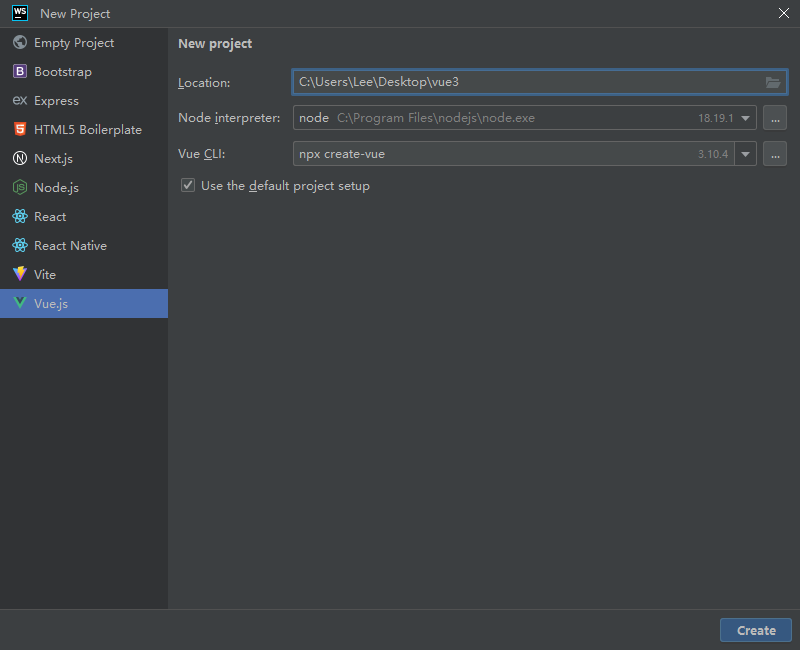
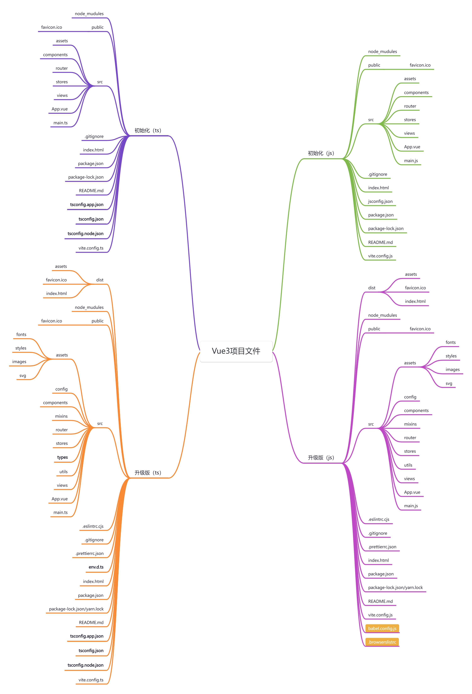

# [create-vue](https://github.com/vuejs/create-vue)

> 🛠️ The recommended way to start a Vite-powered Vue project

## Usage

```sh
# create a new Vue project
npm create vue@latest

# support IE11, create a Vue 2 project
npm create vue@legacy
```

## WebStorm创建Vue项目



## Vue项目文件



https://www.processon.com/view/link/67cd5e526610e05cfc3696f4
