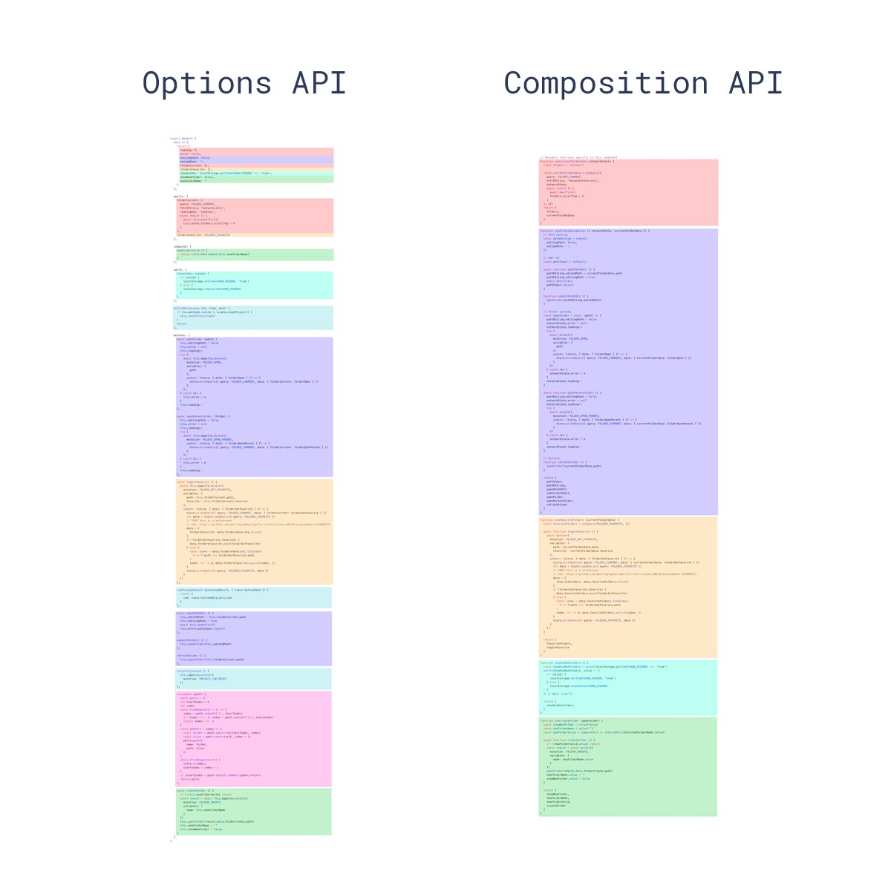
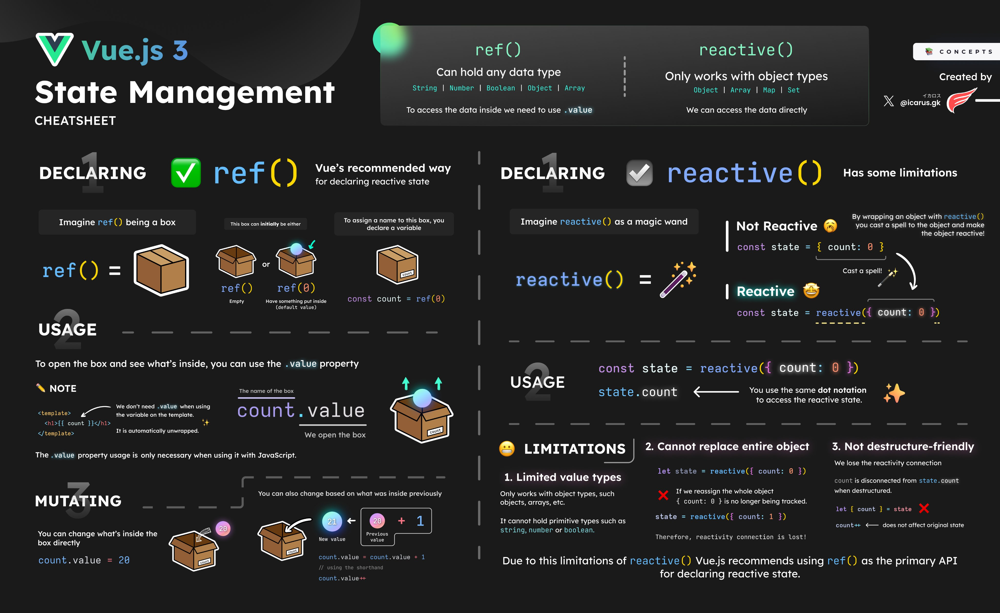
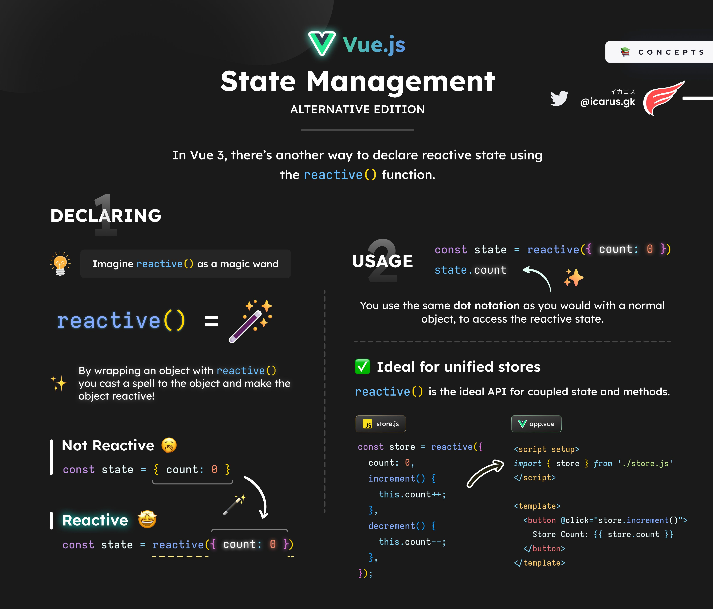
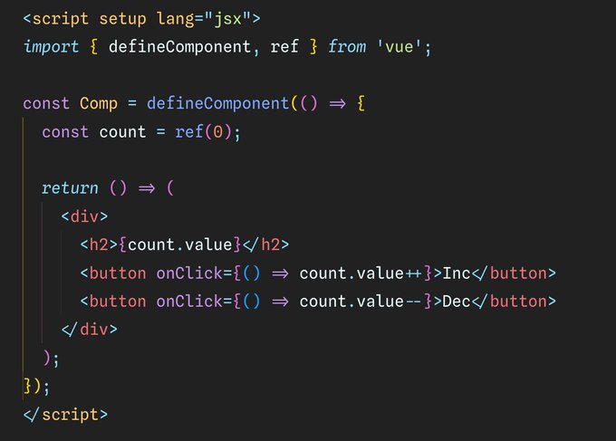

# [Vue3](https://vuejs.org/)

## Resources

* [Vue Router](https://router.vuejs.org/)
* [vitejs.dev](https://vitejs.dev/)
* [Vue Devtools](https://devtools.vuejs.org/)
* https://vueuse.org/
* https://play.vueuse.org/
* Vue Apollo GraphQL: https://apollo.vuejs.org/

## Install

```bash
npm create vue@latest
```

## Usage

```html
<div id="app"></div>
```

```js
import { createApp } from 'vue'
import App from './App.vue'

const app = createApp(App)
app.mount('#app')
```

## Composition API



## Reactivity

State Management






## 部分语法

### DOM 更新时机

当你修改了响应式状态时，DOM 会被自动更新。但是需要注意的是，DOM 更新不是同步的。Vue 会在“next tick”更新周期中缓冲所有状态的修改，以确保不管你进行了多少次状态修改，每个组件都只会被更新一次。

要等待 DOM 更新完成后再执行额外的代码，可以使用 [nextTick()](https://cn.vuejs.org/api/general.html#nexttick) 全局 API：

js

```
import { nextTick } from 'vue'

async function increment() {
  count.value++
  await nextTick()
  // 现在 DOM 已经更新了
}
```


### 事件修饰符


在网站上动态渲染任意 HTML 是非常危险的，因为这非常容易造成 [XSS 漏洞](https://zh.wikipedia.org/wiki/跨網站指令碼)。请仅在内容安全可信时再使用 `v-html`，并且**永远不要**使用用户提供的 HTML 内容。


你可以将 ref 看作是一个像这样的对象：

```js
// 伪代码，不是真正的实现
const myRef = {
  _value: 0,
  get value() {
    track()
    return this._value
  },
  set value(newValue) {
    this._value = newValue
    trigger()
  }
}
```

### jsx



## [UI](./ui)
