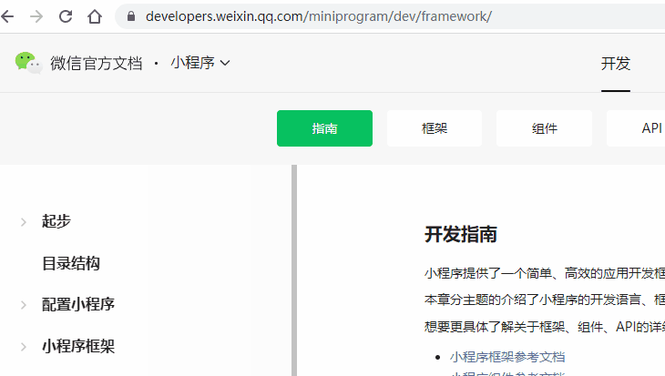

# [微信小程序](https://developers.weixin.qq.com/miniprogram/dev/framework/)

## 简介

> 当微信中的 WebView 逐渐成为移动 Web 的一个重要入口时，微信就有相关的 JS API 了。JS-SDK 解决了移动【**网页能力不足**】的问题，通过暴露微信的接口使得 Web 开发者能够拥有更多的能力，然而在更多的能力之外，JS-SDK 的模式并没有解决使用移动网页遇到的体验不良的问题。用户在访问网页的时候，在浏览器开始显示之前都会有一个【白屏】的过程，在移动端，受限于设备性能和网络速度，白屏会更加明显。

## 渲染层和逻辑层

> 小程序的运行环境分成渲染层和逻辑层，其中 WXML 模板和 WXSS 样式工作在渲染层，JS 脚本工作在逻辑层。
>
> 小程序的渲染层和逻辑层分别由2个线程管理：渲染层的界面使用了WebView 进行渲染；逻辑层采用JsCore线程运行JS脚本。一个小程序存在多个界面，所以渲染层存在多个WebView线程，这两个线程的通信会经由微信客户端（下文中也会采用Native来代指微信客户端）做中转，逻辑层发送网络请求也经由Native转发，小程序的通信模型下图所示。

## 渲染模式

* WebView
* Skyline

## Skyline

小程序新一代原生渲染引擎

文档地址：https://developers.weixin.qq.com/miniprogram/dev/framework/ 官方文档指南和框架的两个地址配反了。。。

## 问题

* 滚动穿透，参考[社区问答](https://developers.weixin.qq.com/community/develop/article/doc/00062666530a300ed35ba552856413)，[知乎回答](https://www.zhihu.com/question/52852717)

## 开源工具

* https://github.com/wxp-ui/wxp-ui

## Donut

* 文档：https://dev.weixin.qq.com/docs/
* 

## 跨端

* [Uniapp](https://uniapp.dcloud.io/)
* [Taro](https://docs.taro.zone/docs/)
* [MPX](https://mpxjs.cn/)
