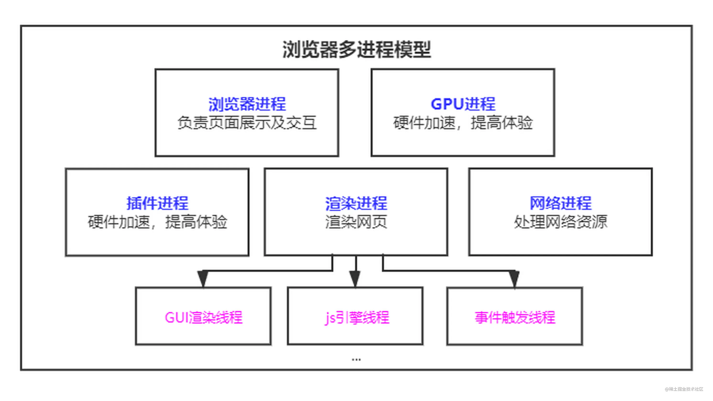

# Browser

* Chrome
* Firefox
* Opera
* Safari
* Edge
* IE
* Headless Browser
* WebView

## 多进程模型

## Engine

### In Mobile Phone

在 iOS 上，Web 渲染引擎始终是 WebKit，与 Safari 和 Chrome 相同。iOS 上的 Chrome 实际上使用了 WebKit。

在 Android 上的渲染引擎通常是 Blink，与 Chrome 相同。

## 其他

### 浏览器的状态栏

