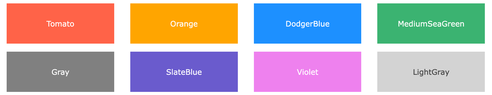

# 颜色空间模型

## RGB

RGB（Red Green Blue）是一种基于光的颜色模型，使用红、绿、蓝三种颜色的不同强度来表示各种颜色。在RGB模型中，每种颜色的强度通常用0到255之间的整数表示，或者用0%到100%之间的百分比表示。例如，纯红色可以表示为`rgb(255, 0, 0)`或`rgb(100%, 0%, 0%)`。

## HSL(hue, saturation, lightness)

Hue is a degree on the color wheel from 0 to 360. 0 is red, 120 is green, and 240 is blue.

Saturation is a percentage value. 0% means a shade of gray, and 100% is the full color.

Lightness is also a percentage value. 0% is black, and 100% is white.

