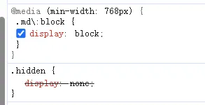
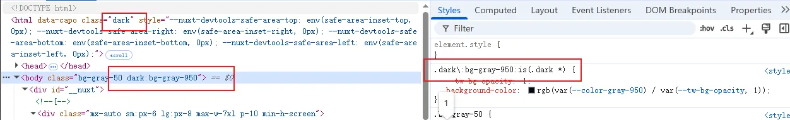

# [tailwindcss](https://tailwindcss.com/)

## Vue中使用

```html
<style scoped>
.quote {
  @apply bg-gray-100 dark:bg-gray-800 border border-gray-200 dark:border-gray-700 rounded-lg p-4 my-6 max-w-xl text-lg;
}
</style>
```


## 根据媒体查询决定是否显示

```html
<span
	class="md:block hidden"
	v-text="org"
/>
```



## 明暗主题切换



