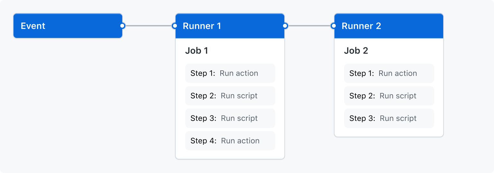

# [GitHub Actions](https://github.com/features/actions)

## Price

> GitHub Actions is free for public repositories.

## The components of GitHub Actions




## `.github/workflows`

### name

```yaml
name: "Tests of push & pull"
```

### on

```yaml
on:
  push:
    branches: [ master ]
  pull_request:
    branches: [ master ]
```

### jobs

```yaml
jobs:
  tests:
    name: 'Validate README.md changes'
    runs-on: ubuntu-latest
    steps:
      - name: Checkout repository
        uses: actions/checkout@v2

      - name: Set up Python
        uses: actions/setup-python@v2
        with:
          python-version: '3.8'

      - name: Install dependencies
        run: python -m pip install -r scripts/requirements.txt

      - name: Validate Markdown format
        run: python scripts/validate/format.py ${FILENAME}

      - name: Validate pull request changes
        run: scripts/github_pull_request.sh ${{ github.repository }} ${{ github.event.pull_request.number }} ${FILENAME}
        if: github.event_name == 'pull_request'

      - name: Checking if push changes are duplicated
        run: python scripts/validate/links.py ${FILENAME} --only_duplicate_links_checker
        if: github.event_name == 'push'
```

```yaml
jobs:
  unittest:
    name: 'Run tests of validate package'
    runs-on: ubuntu-latest

    steps:
    - name: Checkout repository
      uses: actions/checkout@v2

    - name: Set up Python
      uses: actions/setup-python@v2
      with:
        python-version: '3.8'
    
    - name: Install dependencies
      run: python -m pip install -r scripts/requirements.txt

    - name: Run Unittest
      run: |
        cd scripts
        python -m unittest discover tests/ --verbose
```

### env

```yaml
env:
  FILENAME: README.md
```

## [Marketplace](https://github.com/marketplace?type=actions)

- [build-and-push-docker-images](https://github.com/marketplace/actions/build-and-push-docker-images)


## [GitHub Packages](https://github.com/orgs/community/packages)

docker npm maven仓库 
