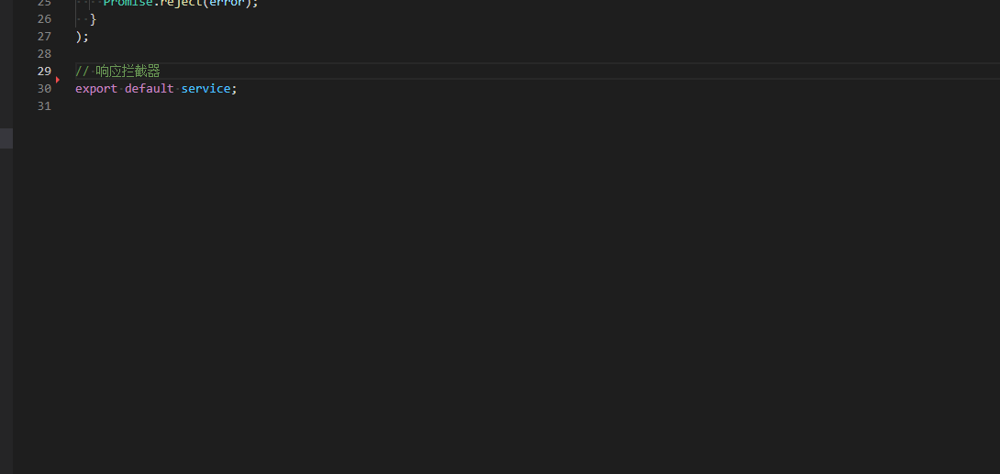

# [GitHub Copilot](https://github.com/features/copilot)

## [Copilot CLI](https://github.com/features/copilot/cli)

```bash
copilot
```

## [Copilot App](https://github.com/features/ai/github-app)

## Price

~~10\$/month, 100\$/year~~

## 补全示例



## 使用教程

* GitHub Copilot Chat 在 VS Code 中的使用：https://zhuanlan.zhihu.com/p/663573079
* Github Copilot 备忘清单：https://github.com/jaywcjlove/reference/blob/main/docs/github-copilot.md
