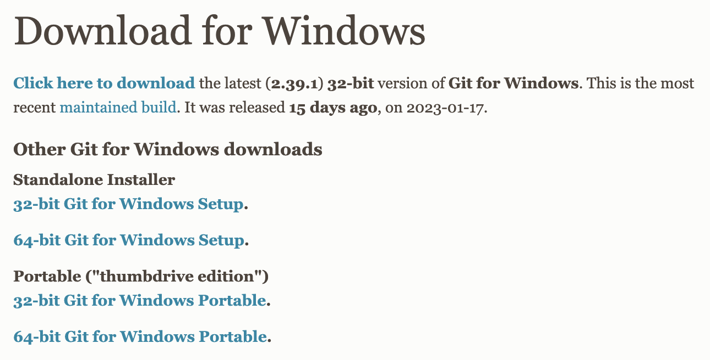

# Installing Git

## Windows

[Git - Downloading Package](https://git-scm.com/download/win)



## Linux

```bash
# ubuntu
sudo apt install git-all
```

## MacOS

```bash
brew install git
```

---

### 检查是否安装成功

```bash
git
# or
git --version
```

---

### 配置Git

- 项目级别签名

```bash
git config --local user.name "username"
git config --local user.email "useremail"
```

- 用户级签名 👍  （配置文件位于 `~/.gitconfig` ）

```bash
git config --global user.name "username"
git config --global user.email "useremail"
```
