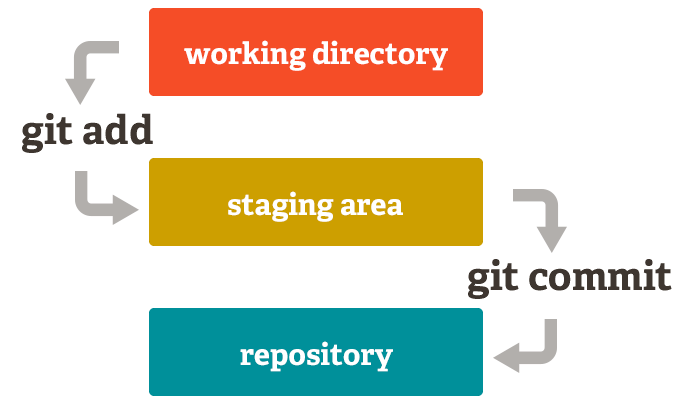

# Git工作机制

## **三大区域**

### 工作流

### 重要概念

- 分区：**工作区、暂存区、版本库**
- 文件分类：**tracked，untracked，ignored**；**staged，unstaged**
- 会忽略的文件：.gitignore文件中指定的文件、空目录

### 数据管理机制

- SVN
    - 增量式，每个版本保存变化的部分
- Git
    - 快照流，每个版本保存所有文件的一个快照，如果文件没有修改，文件指针会指向上一个版本的对应文件

### 哈希算法

- 是一类加密算法：明文->密文
- 同种哈希算法，不管输入量多大，加密的结果长度一致
- 同种哈希算法，只要输入有一点变化，加密结果就会有很大的变化
- 哈希算法不可逆
- 哈希算法可用于文件校验
- Git底层使用**SHA-1**算法，40个16进制位

### 提交的表示

- 散列id
- **HEAD始终指向当前分支的最新提交**
- HEAD^ HEAD~ HEAD^~ HEAD^1 HEAD~1 HEAD^1~1 均表示HEAD的第一个父提交
- HEAD^m 控制回退到哪个分支（当HEAD指向的当前提交由多个分支合并而来时）
- HEAD~n 控制回退的步数
- HEAD^2表示 HEAD的第二个父提交
- HEAD~2表示HEAD的第一个父提交的第一个父提交
