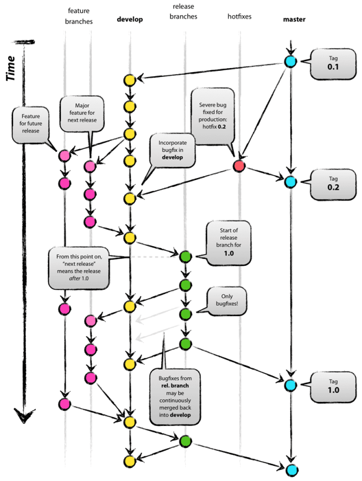
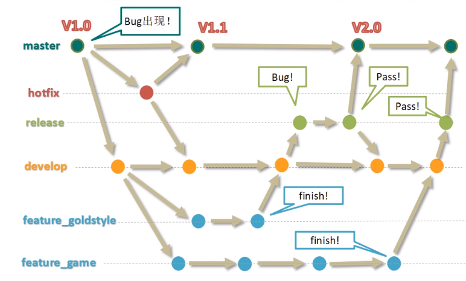

# 工作流

都是["功能驱动式开发"](https://en.wikipedia.org/wiki/Feature-driven_development)（Feature-driven development，FDD），具体参考[博客](http://www.ruanyifeng.com/blog/2015/12/git-workflow.html)

## [Git Flow](https://nvie.com/posts/a-successful-git-branching-model/)

长期分支：master，develop

短期分支：feature, release, hotfix

## [GitHub Flow](https://guides.github.com/introduction/flow/)

1. Create a branch
2. Make changes
3. Create a pull request
4. Address review comments
5. Merge your pull request
6. Delete your branch

## [GitLab Flow](https://docs.gitlab.com/ee/topics/gitlab_flow.html#introduction-to-gitlab-flow)

- Merge Request

## 协同开发

**pull request** 合并不同仓库代码，适合**开源**项目
**merge request** 合并同个仓库不同分支，适合**团队内部**项目
