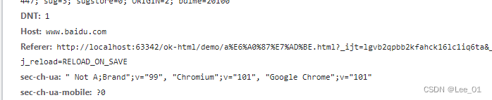

# \<a>

* 常用属性：href、target、rel、title、download
* href除了支持https协议，还支持 **javascript**、**mailto**、**tel**等协议，移动端网页开发可能会用到。
* download属性只在链接与网址同源时，才会生效，可以设置下载文件名（通常是服务器的 HTTP 响应头Content-Disposition字段设置文件名）

## href

值不仅可以是http协议，还可以是 javascript协议

```html
<a href="javascript:alert('回到过去')">past</a>
<a href="javascript:">无事</a>
```

因此在当前页面渲染不可信内容，一定要过滤处理，避免注入问题。

还可以是 tel:协议、mailto协议

```html
<a href="mailto:contact@example.com">联系我们</a>
```

href还可以实现锚点功能

```html
<!--点击下面的链接会定位到id为C4的链接处-->
<p><a href="#C4">查看 Chapter 4</a></p>
```


## rel

### nofollow

* 告诉搜索引擎忽略该链接

> 搜索引擎基本的 PageRank 算法，其基本假设是：更重要的页面往往更多地被其他页面引用。所以我们可以使用 nofollow 来告知 Google 不要跟踪链接到的网页，这样就不会分走我们页面的权重。

### noreferrer

* Do not send a HTTP Referer header.
* 隐藏点击来源

### noopener

* 不让链接窗口通过 JavaScript 的window.opener属性引用原始窗口

### target=”_blank”的安全问题

* 参考文章：[https://kebingzao.com/2020/05/14/a-target-blank/](https://kebingzao.com/2020/05/14/a-target-blank/)
* 测试地址：[https://mathiasbynens.github.io/rel-noopener/](https://mathiasbynens.github.io/rel-noopener/)
* 测试结果：未复现，现代浏览器（chrome，edge，firefox）做了限制。

个人测试代码：

a.html
```html
<ul>
  <li>
    <a href="b.html" target="_blank">访问b网站</a>
  </li>
  <li>
    <a href="b.html" target="_blank" rel="noopener">访问b网站(noopener)</a>
  </li>
  <li>
    <a href="b.html" target="_blank" rel="noreferrer">访问b网站(noreferer)</a>
  </li>
  <li>
    <a href="b.html" target="_blank" rel="noopener noreferrer">访问b网站(noopener noreferrer)</a>
  </li>
</ul>
```
b.html
```html
<body>
  <p>这里是b网站</p>
  <script>
    console.log('window.opener', window.opener)
    if (window.opener) {
      window.opener.location.href = 'evil.html';
    }
  </script>
</body>
```
evil.html
```html
<body>
  <p>
    这里有好康的！
  </p>
</body>
```

## referrerpolicy

HTTP 头信息的referer字段，表示当前请求是从哪里来的。
> * no-referrer：不发送referer字段。
> * origin：referer字段的值是\<a>元素的origin属性，即协议 + 主机名 + 端口。
> * unsafe-url：referer字段的值是origin属性再加上路径，但不包含#片段。这种格式提供的信息最详细，可能存在信息泄漏的风险。

* no-referrer
```html
<a id="no-referrer" href="https://www.baidu.com" referrerpolicy="no-referrer" target="_self">no-referrer</a>
```


* origin
```html
<a id="origin" href="https://www.baidu.com" referrerpolicy="origin" target="_self">origin</a>
```

* unsafe-url
```html
<a id="unsafe-url" href="https://www.baidu.com" referrerpolicy="unsafe-url" target="_self">unsafe-url</a>
```


## download属性

* download属性只在链接与网址同源时，才会生效。
* 可以设置下载文件名（通常是服务器的 HTTP 响应头Content-Disposition字段设置）


