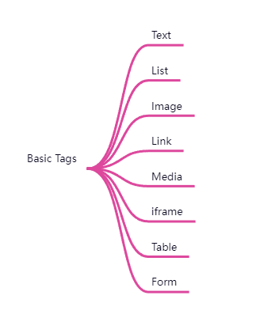

# HTML

## What

* Hypertext Markup Language
* 超文本标记语言

## Tutorial

* https://wangdoc.com/html/index.html

## History

* 1993-6 first version
* 2014-10 H5

## Basic Tags

## Notes

### URL编码

### 字符编码

* 数字表示法
* 实体表示法 :+1:

### data-xxx

* 存放额外数据

### use in markdown（personal）

* \<code>
* \<kbd>

### 用户禁用了script

* \<noscript>

