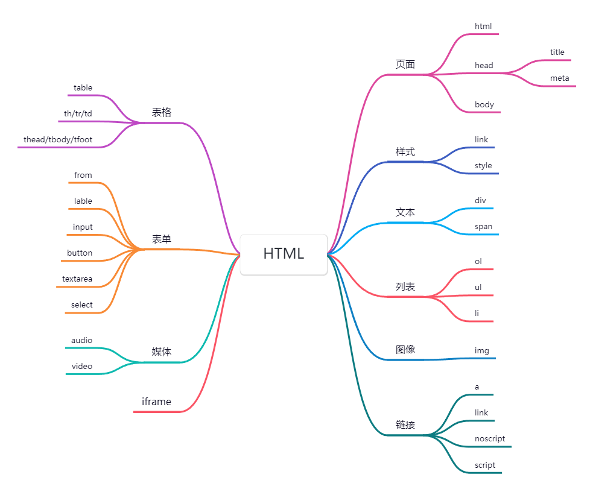

# HTML

## What

* Hypertext Markup Language
* 超文本标记语言

## Tutorial

* https://developer.mozilla.org/en-US/docs/Web/HTML
* https://wangdoc.com/html/index.html

## History

* 1993-06 first version
* 2014-10 H5

## Hello World

```html
<!DOCTYPE html>
<html lang="en">
  <head>
    <meta charset="UTF-8">
    <title>Hello World!</title>
  </head>
  <body>
    Hello world!
  </body>
</html>
```

## Glossary

* Tag（标签）
* Element（元素）
* Attribute（属性）

## Common tags

* Text: div, span, p, br, hr
* List: ol, ul, li
* Image: img
* Link: link, script, noscript, a
* Media: video, audio
* Table: table, thead, tbody, tfoot, th, tr, td
* Form: form, label, input, button, textarea
* Iframe: iframe
* "block-level" elements: div, p
* "inline" elements:  span, img, a



### **`<!doctype>`**

有些面经一直介绍这玩意相关的**怪异模式和标准模式**，了解即可，IE早已入土为安。

### \<html>

* 应用1：设置**font-size**作为基本字体大小，打包时再配合css处理插件**将px转成rem**，以此实现**页面自适应**，移动端页面常用。

* 应用2：设置class或data-theme，配合CSS样式（变量、权重、优先级）实现**主题色切换**功能；具体例子可以打开vue官方文档，F12看下。

### \<style>

设置全局样式。配合css预处理器才能发挥更大作用，后面css部分再介绍。

### [\<link>](./link)

### \<div>、\<span>

分别是**块级元素**和**行内元素**的扛把子，div应该使用的最多的元素了，一做**布局**、二做**容器**。

有些开发者喜欢div一把梭，知乎有把div当button的讨论，推荐围观。原因有很多，一个需求**UI复杂**，用原生button难以实现；还有更重要的一点是button有**浏览器实现的差异**，需要更多代码去抹平。现在用框架基本是**组件化**开发，组件名“代替”了“**语义化**”，不过在某些场景下，语义化还是有必要的，后面的笔记讨论。

### \<ol>、\<ul>、\<li>

浏览器自带样式，语义化场景下建议使用，需要**清空默认样式（指示符，内外边距）**

### [\](./img)

### [\<a>](./a)

### \<noscript>

* 用于在**不支持脚本**或**禁用脚本**的情况下显示替代内容，例如提示用户开启脚本功能，或者显示一些静态内容。
* 这个标签还是在学习vue的时候第一次遇到。

### [\<form>](./form)

### \<table>、\<tr>、\<td>

用于展示**表格数据**，不要用于布局。很少直接用原生的table标签，通常会用到一些UI库的表格组件。

### \<audio> \<video>

* 属性不多，能满足基本的播放需求。只是通常都不能业务要求的视觉样式、交互逻辑，需要结合css、js来处理，例如自定义进度条，倍速播放等等。
* 音视频处理这一块的知识深挖还挺复杂的，自研成本较高的话可以考虑使用一些成熟的、开源的播放器。
* 实践过程还会发现一些坑：例如safari禁止音视频自动播放的问题、视频编码格式不支持、视频预加载失败等问题，只能拿真机、查文档慢慢调试了。。。

### [\<iframe>](./iframe)

## URL encoding

url合法字符：

* 26个英语字母（包括大写和小写）
* 10个阿拉伯数字
* 连词号（`-`）
* 句点（`.`）
* 下划线（`_`）

其他字符转义方法：使用这些字符的十六进制 UTF-8 编码，每两位算作一组，然后每组头部添加百分号（`%`）。

## Character encoding

* 数字表示法，`&#字符的码点`
* 实体表示法 :+1:  `&amp;`  `&nbsp;`  `&lt;`  `&gt;`

## data-xxx 属性

存放额外数据

```html
<div class="test" data-content="This is the div content" data-tip="tip...">内容：</div>
```

```css
.test[data-role="mobile"] {
  display: inline-block;
}
.test:after {
  content: attr(data-content);
}
```

```js
const test = document.querySelector('.test');
console.log(test.dataset)
console.log(test.dataset.content)
console.log(test.dataset.tip)
console.log(Object.prototype.toString.call(test.dataset).slice(8, -1)); // DOMStringMap
```


