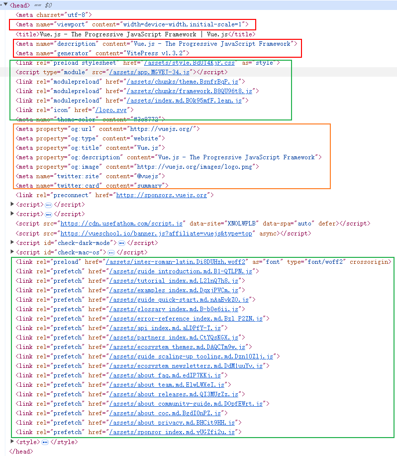

# [\<link>](https://developer.mozilla.org/en-US/docs/Web/HTML/Element/link)

* 应用1：引入外部样式
* 应用2：设置网站图标
* 应用3：**预加载资源，**进行**网站性能优化、提升用户体验**的技巧之一。可以看下vue官网使用案例。

## 引入css样式表

```html
<link href="style.css" rel="stylesheet" />
```

## media属性

```html
<link
  href="desktop.css"
  rel="stylesheet"
  media="screen and (min-width: 600px)" />
<link
```

## 网站图标

```html
<link rel="icon" href="/favicon.ico" type="image/x-icon">
<link rel="apple-touch-icon" sizes="180x180" href="apple-touch-icon.png">
<link rel="icon" type="image/png" sizes="32x32" href="favicon-32x32.png">
<link rel="icon" type="image/png" sizes="16x16" href="favicon-16x16.png">
```

## 预加载

### [preload](https://developer.mozilla.org/en-US/docs/Web/HTML/Attributes/rel/preload)

> <link rel="preload">告诉浏览器尽快下载并缓存资源（如脚本或样式表），该指令优先级较高，浏览器肯定会执行。当加载页面几秒钟后需要该资源时，它会很有用。下载后，浏览器不会对资源执行任何操作，脚本未执行，样式表未应用。它只是缓存，当其他东西需要它时，它立即可用。

### prefetch

* 只能用于 https
* 标识预加载资源，非强制

> 如果后续的页面需要某个资源，并且希望预加载该资源，以便加速页面渲染。该指令不是强制性的，优先级较低，浏览器不一定会执行。

### preconnect

* 要求浏览器提前与某个域名建立 TCP 连接。

### dns-prefetch

* 要求浏览器提前执行某个域名的 DNS 解析。

### prerender

* 要求浏览器加载某个网页，并且提前渲染它。用户点击指向该网页的链接时，就会立即呈现该页面。如果确定用户下一步会访问该页面，这会很有帮助。


