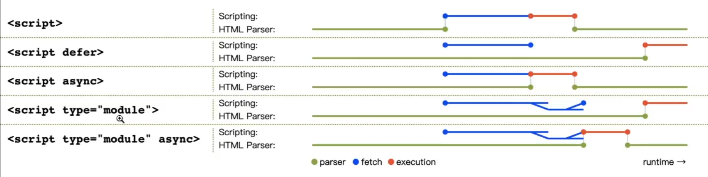
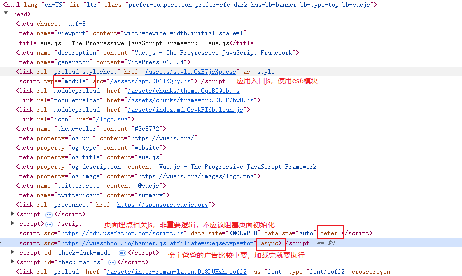

# \<script>

* 推荐看《JavaScript高级程序设计》第二章，对这个标签介绍得很详细。
* type属性，平时都是用`type="text/javascript"`比较多，ES6模块则用`type="module"`
* crossorigin，对于**跨域CDN资源**的加载，通常会设置为anonymous。假设有个业务页面域名是A.example.com，引入的CDN资源是cdn.example.com，这时候遇到两个问题：1.跨域的js资源运行出错的话，`window.onerror` 捕获的时候，内部的`error.message`只能看到`Script error.`看不到完整的错误内容; 2.请求js资源通常是不需要携带用户的身份凭据的（通常是cookie）这时候就需要设置crossorigin属性为anonymous。
* 还有两个安全相关的属性：integrity、nonce。如果安全要求较高，可以考虑使用。

* defer 立即下载，推迟执行
* async 异步下载，立即执行（并阻塞）

